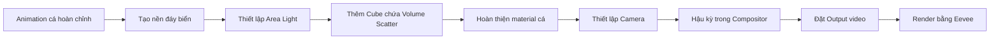
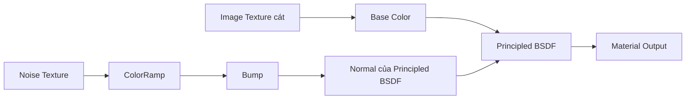
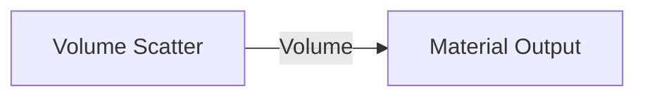
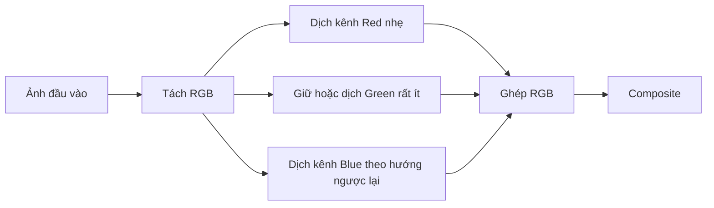
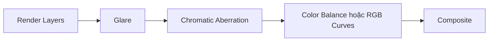
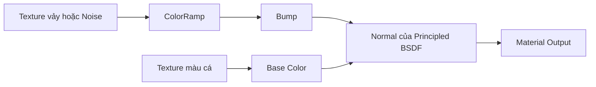

# 08 — Bước 6: Đưa cá trở lại đại dương

| Thuộc tính       | Nội dung                                                                                             |
| ---------------- | ---------------------------------------------------------------------------------------------------- |
| **Video**        | *The Secret to Easy Fish Animation in Blender!*                                                      |
| **Đoạn**         | Step six — bước cuối                                                                                 |
| **Thời điểm**    | 08:00–09:26                                                                                          |
| **Chủ đề chính** | Dựng môi trường đáy biển, Volume Scatter, hiệu ứng ống kính dưới nước, vật liệu cá, camera và render |

---

## 1. Mục tiêu bài học

Sau khi hoàn thành chương này, người học có thể:

* Dựng nhanh một môi trường đáy đại dương có độ thuyết phục bằng texture miễn phí và hệ thống ánh sáng đơn giản.
* Sử dụng **Volume Scatter** để mô phỏng độ đục, sương mù và chiều sâu của môi trường dưới nước.
* Chọn hiệu ứng hậu kỳ dựa trên **logic quay phim thực tế**, thay vì thêm hiệu ứng một cách tùy ý.
* Hoàn thiện vật liệu cá bằng **Subsurface Scattering**, độ bóng và Bump.
* Thiết lập camera, định dạng đầu ra và render animation cuối cùng bằng **Eevee**.
* Biết phân bổ thời gian hợp lý, tập trung vào những chi tiết mang lại hiệu quả thị giác rõ ràng nhất.

---

## 2. Tổng quan quy trình hoàn thiện cảnh



Có thể chia bước cuối thành bốn nhóm chính:

1. **Môi trường:** đáy biển, ánh sáng và độ đục của nước.
2. **Chủ thể:** vật liệu da, vảy và vây cá.
3. **Máy quay:** bố cục, góc nhìn và cảm giác quay dưới nước.
4. **Hậu kỳ và xuất hình:** Glare, sai lệch màu, chỉnh màu và render.

---

## 3. Dựng nền đáy biển

Tác giả sử dụng một **texture cát nhìn từ trên không** tải miễn phí từ **PolyHaven**. Texture này thuộc nhóm tài nguyên có giấy phép sử dụng rộng rãi và phù hợp để tạo bề mặt đáy biển nhanh chóng.

Texture được chọn vì có:

* Các mảng sáng tối tự nhiên.
* Họa tiết cát tương đối phẳng.
* Sự biến thiên màu sắc đủ để tạo cảm giác hữu cơ.
* Khả năng bao phủ một mặt phẳng lớn mà không cần dựng địa hình phức tạp.

### 3.1. Vì sao không nên để mặt đáy quá phẳng?

Một mặt phẳng chỉ có một texture lặp lại thường dễ lộ cảm giác giả vì:

* Hoa văn bị lặp theo chu kỳ.
* Độ cao bề mặt gần như bằng nhau.
* Ánh sáng phản ứng đồng đều trên toàn bộ mặt đất.
* Không có vùng cát lồi, lõm hoặc đổi hướng.

Do đó, cần thêm một lượng biến thiên vừa phải bằng một hoặc nhiều cách:

* Thay đổi tỷ lệ và góc xoay của texture.
* Trộn thêm Noise Texture.
* Dùng Bump để tạo gợn cát nhỏ.
* Dùng Displacement nhẹ nếu hiệu năng cho phép.
* Tạo một số vùng cao thấp lớn bằng Proportional Editing hoặc Sculpt.

> Mục tiêu không phải là tạo một đáy biển cực kỳ chi tiết, mà là phá vỡ cảm giác của một mặt phẳng hoàn toàn đồng nhất.

### 3.2. Cấu trúc material nền gợi ý



---

## 4. Thiết lập ánh sáng dưới nước

Thiết lập ánh sáng được giữ tối giản với một **Area Light lớn đặt phía trên cảnh**.

Cách bố trí này mô phỏng ánh sáng mặt trời:

* Chiếu từ trên xuống.
* Bị khuếch tán khi đi qua mặt nước.
* Tạo bóng mềm.
* Không tạo ra các vùng sáng quá sắc hoặc quá nhân tạo.

### 4.1. Vì sao dùng Area Light?

So với Point Light hoặc Spot Light, Area Light phù hợp hơn vì:

* Nguồn sáng có diện tích lớn.
* Bóng đổ mềm hơn.
* Ánh sáng bao phủ đều.
* Dễ mô phỏng ánh sáng khuếch tán từ mặt nước.

### 4.2. Thiết lập thực hành

1. Chọn:

   `Shift + A > Light > Area`

2. Đặt đèn phía trên con cá và đáy biển.

3. Tăng kích thước của Area Light để bóng mềm hơn.

4. Điều chỉnh công suất sao cho cá vẫn nổi bật nhưng không bị cháy sáng.

5. Có thể thêm sắc xanh lam hoặc xanh ngọc rất nhẹ cho ánh sáng.

> Không cần sử dụng quá nhiều đèn. Một nguồn sáng chính tốt thường thuyết phục hơn nhiều nguồn sáng không có vai trò rõ ràng.

---

## 5. Tạo độ đục dưới nước bằng Volume Scatter

Để mô phỏng môi trường nước có độ đục, tác giả tạo một **Cube lớn bao trùm toàn bộ cảnh** và gán cho Cube một vật liệu thể tích.

Khác với material thông thường được nối vào cổng **Surface**, vật liệu này sử dụng **Volume Scatter** và được nối vào cổng **Volume** của Material Output.

### 5.1. Cấu trúc node



### 5.2. Các bước thực hiện

1. Thêm một Cube:

   `Shift + A > Mesh > Cube`

2. Phóng to Cube để bao phủ:

   * Con cá.
   * Camera.
   * Đáy biển.
   * Vùng chuyển động của toàn bộ animation.

3. Tạo material mới cho Cube.

4. Xóa hoặc không sử dụng Surface Shader nếu không cần.

5. Thêm node:

   `Shader Editor > Add > Shader > Volume Scatter`

6. Nối đầu ra của Volume Scatter vào cổng **Volume** của Material Output.

7. Bắt đầu với Density thấp, sau đó tăng dần đến khi đạt độ đục mong muốn.

### 5.3. Vai trò của Volume Scatter

Volume Scatter khiến ánh sáng bị phân tán trong không gian, tạo ra:

* Cảm giác có vật chất trong nước.
* Độ mờ tăng theo khoảng cách.
* Sự phân lớp giữa tiền cảnh và hậu cảnh.
* Các vùng sáng thể tích.
* Cảm giác chiều sâu rõ hơn.

```text
Camera
   │
   ▼
Cá ở gần ─────────► rõ hơn
   │
   ▼
Đáy biển ở xa ───► mờ hơn, ít tương phản hơn
```

### 5.4. Đánh đổi về hiệu năng

Hiệu ứng thể tích có thể làm thời gian render tăng đáng kể, đặc biệt khi:

* Cube quá lớn.
* Density quá cao.
* Số lượng sample thể tích lớn.
* Có nhiều nguồn sáng chiếu xuyên qua volume.
* Camera nhìn qua một khoảng thể tích rất dài.

Để tối ưu:

* Chỉ để Cube lớn vừa đủ bao phủ vùng camera nhìn thấy.
* Giữ Density ở mức thấp.
* Giảm chất lượng volume khi preview.
* Chỉ tăng thiết lập chất lượng khi render cuối.
* Tránh đặt nhiều ánh sáng không cần thiết trong volume.

---

## 6. Hậu kỳ dựa trên logic quay phim thực tế

Một trong những ý tưởng quan trọng của tác giả là xem cảnh 3D như một **cảnh quay dưới nước thật**.

Trong thực tế, camera dưới nước thường được đặt bên trong một **underwater housing** — lớp vỏ bảo vệ chống nước có thêm kính phía trước ống kính.

Điều này có thể làm tăng các hiện tượng quang học như:

* Lóe sáng.
* Màu sắc bị tách nhẹ ở vùng viền.
* Giảm tương phản.
* Hình ảnh nghiêng về tông lạnh.
* Highlight bị khuếch tán nhiều hơn.

Từ logic đó, tác giả thêm một số hiệu ứng trong **Compositor**.

---

## 7. Hiệu ứng Glare

**Glare** tạo vùng lóe hoặc phát sáng quanh những khu vực có cường độ sáng cao.

Hiệu ứng này phù hợp với cảnh dưới nước vì:

* Ánh sáng bị tán xạ qua nước.
* Camera có thêm lớp kính bảo vệ.
* Highlight thường không sắc như khi quay trên cạn.
* Vùng sáng có thể lan nhẹ vào khu vực xung quanh.

### 7.1. Thêm Glare

1. Mở **Compositor Editor**.

2. Bật **Use Nodes**.

3. Thêm node:

   `Shift + A > Filter > Glare`

4. Đặt Glare giữa Render Layers và Composite.


### 7.2. Lưu ý

Không nên đẩy Glare quá mạnh. Nếu hiệu ứng quá lớn:

* Da cá mất chi tiết.
* Các vùng sáng bị cháy.
* Hình ảnh có cảm giác giả.
* Người xem bị phân tâm khỏi chuyển động chính.

Glare nên hoạt động như một lớp hiệu ứng tinh tế, chỉ dễ nhận thấy ở những vùng highlight mạnh.

---

## 8. Chromatic Aberration

**Chromatic Aberration** là hiện tượng các kênh màu không hội tụ hoàn toàn tại cùng một vị trí, tạo ra viền đỏ, xanh hoặc tím nhẹ quanh cạnh vật thể.

Trong cảnh dưới nước, hiệu ứng này được lý giải bởi:

* Ánh sáng đi qua nước.
* Ánh sáng đi qua kính của underwater housing.
* Góc khúc xạ giữa nhiều môi trường khác nhau.
* Các bước xử lý hình ảnh của camera.

Blender không nhất thiết có một node duy nhất mang tên Chromatic Aberration trong mọi phiên bản, nhưng có thể mô phỏng bằng cách:

1. Tách ảnh thành các kênh màu.
2. Dịch chuyển hoặc scale từng kênh một lượng rất nhỏ.
3. Ghép các kênh trở lại.

### Sơ đồ mô phỏng



> Chỉ nên dịch chuyển một lượng rất nhỏ. Sai lệch màu quá mạnh sẽ khiến cảnh giống hiệu ứng kỹ thuật số hơn là một hiện tượng quang học tự nhiên.

---

## 9. Chỉnh màu tổng thể

Sau Glare và Chromatic Aberration, cảnh được phủ một lớp màu lạnh để củng cố cảm giác dưới nước.

Các hướng chỉnh màu phổ biến:

* Giảm nhẹ sắc đỏ.
* Tăng xanh lam hoặc xanh lục lam.
* Giảm saturation ở hậu cảnh.
* Nâng nhẹ vùng tối nếu hình ảnh quá nặng.
* Giảm tương phản ở các vật thể xa.
* Giữ chủ thể chính rõ hơn môi trường xung quanh.

### Pipeline hậu kỳ gợi ý



Thứ tự node có thể được thay đổi tùy theo hình ảnh mong muốn, nhưng điều quan trọng là mỗi hiệu ứng phải có một vai trò cụ thể.

---

## 10. Hoàn thiện vật liệu cá

Vật liệu cá được tinh chỉnh bằng ba thành phần chính:

1. **Subsurface Scattering**
2. **Glossy hoặc Specular**
3. **Bump**

### 10.1. Subsurface Scattering

Subsurface Scattering mô phỏng ánh sáng:

* Đi vào bề mặt.
* Tán xạ bên trong vật liệu.
* Thoát ra ở một vị trí lân cận.

Hiệu ứng này phù hợp với:

* Vây mỏng.
* Da cá.
* Mô mềm.
* Các vùng được chiếu ngược sáng.

Tuy nhiên, SSS chỉ nên được sử dụng nhẹ. Nếu quá mạnh, cá có thể trông giống:

* Nhựa mềm.
* Sáp.
* Da người.
* Một vật thể phát sáng từ bên trong.

### 10.2. Độ bóng và Roughness

Da cá thường có bề mặt ẩm, vì vậy cần một lượng phản xạ nhất định.

Nguyên tắc:

* **Roughness thấp hơn:** bề mặt bóng, highlight sắc hơn.
* **Roughness cao hơn:** bề mặt mờ, highlight rộng và mềm hơn.

Không nên để toàn bộ cơ thể có cùng độ bóng. Có thể tạo biến thiên:

* Vây mờ hơn thân.
* Vảy có highlight nhỏ.
* Mắt bóng hơn da.
* Miệng và mang có phản xạ khác nhau.

### 10.3. Bump

Bump tạo cảm giác bề mặt có độ gồ ghề mà không làm tăng số lượng polygon.

Có thể dùng Bump để mô phỏng:

* Vảy cá.
* Các rãnh nhỏ trên da.
* Gân vây.
* Độ nhám không đồng đều.



Cường độ Bump nên nhỏ. Bump quá mạnh có thể khiến cá trông giống đá hoặc da bò sát.

---

## 11. Chuyển động vây bằng Shape Keys — tùy chọn

Tác giả gợi ý có thể sử dụng **Shape Keys** để làm các vây chuyển động nhẹ.

Ví dụ:

* Vây lưng uốn nhẹ.
* Vây hậu môn rung theo nhịp.
* Vây ngực quạt nhẹ.
* Đuôi có thêm biến dạng phụ.

Tuy nhiên, đây không phải bước bắt buộc.

### 11.1. Vì sao có thể bỏ qua?

Trong một cảnh chuyển động nhanh:

* Vây có thể chiếm ít diện tích trên màn hình.
* Motion Blur che bớt biến dạng nhỏ.
* Camera có thể không quay đủ gần.
* Người xem tập trung nhiều hơn vào chuyển động toàn thân.
* Thời gian tạo Shape Keys có thể lớn hơn giá trị thị giác nhận lại.

### 11.2. Nguyên tắc phân bổ công sức

```text
Hiệu quả thị giác cao
        ▲
        │    Chuyển động toàn thân
        │    Ánh sáng và môi trường
        │    Material chính
        │
        │    Chuyển động vây nhỏ
        └────────────────────────► Thời gian thực hiện
```

Bài học quan trọng ở đây là:

> Không phải chi tiết nào có thể làm cũng là chi tiết cần phải làm.

Trong một quy trình giới hạn thời gian, nên ưu tiên những yếu tố mà người xem có thể nhận ra rõ ràng.

---

## 12. Thiết lập camera

Sau khi hoàn thiện môi trường và vật liệu, tác giả thêm camera để xác định bố cục cuối cùng.

### 12.1. Các yếu tố cần kiểm tra

* Cá có nằm trong vùng nhìn của camera trong toàn bộ animation hay không.
* Camera có cắt mất đuôi hoặc vây ở các đoạn chuyển động mạnh hay không.
* Đáy biển có đủ diện tích để không lộ mép mặt phẳng hay không.
* Cube Volume có bao phủ toàn bộ camera hay không.
* Hướng sáng có làm nổi bật hình dáng cá hay không.
* Khoảng cách camera có đủ gần để thấy material nhưng không làm mất cảm giác môi trường hay không.

### 12.2. Bố cục gợi ý

```text
       Hướng ánh sáng
             ↓

   Không gian nước phía trên

           🐟  → Hướng bơi

       Camera
          ◉

────────────────────────
        Đáy biển
```

Có thể đặt camera hơi thấp hơn hoặc ngang thân cá để:

* Nhìn thấy silhouette rõ hơn.
* Tạo cảm giác camera đang ở trong môi trường nước.
* Tránh góc nhìn quá giống một cảnh quan sát từ bên ngoài bể cá.

---

## 13. Thiết lập Output và render

Render engine được giữ là **Eevee**, đúng với mục tiêu ban đầu của kỹ thuật:

* Nhanh.
* Có thể preview gần thời gian thực.
* Phù hợp với animation ngắn.
* Không yêu cầu hệ thống quá mạnh.
* Dễ thử nghiệm nhiều phiên bản.

### 13.1. Đặt định dạng video

Trong **Output Properties**:

1. Chọn thư mục lưu.

2. Đặt độ phân giải.

3. Kiểm tra Frame Rate.

4. Đặt Frame Start và Frame End.

5. Chọn:

   `File Format > FFmpeg Video`

6. Trong Encoding, chọn codec phù hợp với mục đích sử dụng.

### 13.2. Render animation

Sử dụng:

`Ctrl + F12`

Blender sẽ render lần lượt tất cả frame trong khoảng animation.

> Với dự án quan trọng, render ra chuỗi ảnh PNG thường an toàn hơn render trực tiếp thành video. Nếu quá trình render bị dừng giữa chừng, có thể tiếp tục từ frame còn thiếu mà không phải render lại toàn bộ.

---

## 14. Quy trình thực hành từng bước

### Bước 1 — Tạo nền đáy biển

* Thêm một Plane lớn.
* Gán texture cát từ PolyHaven.
* Điều chỉnh UV để texture không bị kéo giãn.
* Thêm Noise hoặc Bump để tạo biến thiên.
* Kiểm tra và hạn chế hiện tượng texture lặp.

### Bước 2 — Thêm ánh sáng chính

* Thêm một Area Light.
* Đặt phía trên cảnh.
* Tăng kích thước đèn để tạo bóng mềm.
* Điều chỉnh công suất và màu sắc.
* Đảm bảo cá nổi bật so với nền.

### Bước 3 — Tạo môi trường thể tích

* Thêm Cube.
* Phóng to Cube bao trùm cảnh.
* Tạo material Volume Scatter.
* Đặt Density thấp.
* Kiểm tra độ rõ của cá và hậu cảnh.

### Bước 4 — Hoàn thiện vật liệu cá

* Thêm SSS nhẹ.
* Điều chỉnh Specular và Roughness.
* Thêm Bump cho vảy hoặc bề mặt da.
* Kiểm tra material dưới ánh sáng thực tế của cảnh.

### Bước 5 — Thiết lập camera

* Chọn góc nhìn phù hợp.
* Kiểm tra toàn bộ chuyển động trong Camera View.
* Đảm bảo cá không ra khỏi khung.
* Kiểm tra foreground và background.

### Bước 6 — Hậu kỳ

* Bật Use Nodes trong Compositor.
* Thêm Glare.
* Mô phỏng Chromatic Aberration.
* Chỉnh màu tổng thể sang tông lạnh.
* So sánh trước và sau hậu kỳ.

### Bước 7 — Xuất animation

* Xác nhận Eevee vẫn là render engine.
* Kiểm tra Frame Range và FPS.
* Đặt định dạng đầu ra.
* Render thử một vài frame.
* Render toàn bộ animation.

---

## 15. Phím tắt và công cụ liên quan

| Thao tác                          | Phím tắt hoặc vị trí                            |
| --------------------------------- | ----------------------------------------------- |
| Thêm Plane làm đáy biển           | `Shift + A > Mesh > Plane`                      |
| Thêm Cube chứa volume             | `Shift + A > Mesh > Cube`                       |
| Thêm Area Light                   | `Shift + A > Light > Area`                      |
| Thêm Volume Scatter               | `Shader Editor > Add > Shader > Volume Scatter` |
| Nối Volume Shader                 | Volume Scatter → Material Output: Volume        |
| Mở Compositor                     | Chuyển Editor Type sang Compositor              |
| Bật hệ thống node                 | Compositor > **Use Nodes**                      |
| Thêm Glare                        | `Shift + A > Filter > Glare`                    |
| Thêm Camera                       | `Shift + A > Camera`                            |
| Căn Camera theo góc nhìn hiện tại | `Ctrl + Alt + NumPad 0`                         |
| Xem qua Camera                    | `NumPad 0`                                      |
| Đặt định dạng video               | Output Properties > File Format > FFmpeg Video  |
| Render một frame                  | `F12`                                           |
| Render toàn bộ animation          | `Ctrl + F12`                                    |

---

## 16. Lỗi thường gặp và cách khắc phục

### 16.1. Cảnh quá đục, không nhìn rõ cá

**Nguyên nhân:**

* Density của Volume Scatter quá cao.
* Khoảng cách giữa camera và cá quá lớn.
* Ánh sáng quá yếu.
* Màu volume quá tối.

**Cách khắc phục:**

* Giảm Density.
* Đưa camera gần cá hơn.
* Tăng nhẹ công suất Area Light.
* Giảm độ bão hòa của màu volume.
* Giới hạn kích thước Cube.

---

### 16.2. Cảnh trông giống sương mù trên cạn

**Nguyên nhân:**

* Màu sắc chưa có tông nước.
* Đáy biển quá khô hoặc quá sắc nét.
* Ánh sáng không chiếu từ trên xuống.
* Không có sự giảm tương phản theo khoảng cách.

**Cách khắc phục:**

* Thêm tông xanh lam hoặc xanh ngọc.
* Giảm contrast ở hậu cảnh.
* Dùng Area Light từ phía trên.
* Làm mềm highlight bằng Glare nhẹ.
* Tăng độ đục theo chiều sâu.

---

### 16.3. Texture nền bị lặp rõ ràng

**Nguyên nhân:**

* UV quá đều.
* Texture có họa tiết đặc trưng lặp lại.
* Plane quá lớn nhưng texture có độ phân giải thấp.

**Cách khắc phục:**

* Trộn thêm Noise Texture.
* Xoay hoặc scale texture.
* Dùng nhiều texture với Mapping khác nhau.
* Che vùng lặp bằng đá, rong biển hoặc biến dạng địa hình.

---

### 16.4. Glare quá mạnh

**Biểu hiện:**

* Cá mất chi tiết.
* Highlight lan ra toàn khung.
* Cảnh giống hiệu ứng mơ hoặc fantasy.
* Vùng sáng bị cháy trắng.

**Cách khắc phục:**

* Tăng Threshold.
* Giảm cường độ hiệu ứng.
* Chỉ để Glare tác động lên các vùng sáng nhất.
* Kiểm tra kết quả ở độ phân giải render thật.

---

### 16.5. Chromatic Aberration trông giả

**Nguyên nhân:**

* Các kênh màu bị dịch quá xa.
* Hiệu ứng xuất hiện cả ở trung tâm ảnh.
* Mức độ sai lệch không liên quan đến khoảng cách khỏi tâm ống kính.

**Cách khắc phục:**

* Giảm mức dịch chuyển các kênh màu.
* Ưu tiên hiệu ứng ở vùng rìa ảnh.
* Giữ trung tâm ảnh tương đối sắc nét.
* Xem hiệu ứng như một chi tiết phụ, không phải điểm nhấn chính.

---

### 16.6. Vật liệu cá trông giống nhựa

**Nguyên nhân:**

* Roughness quá thấp.
* Specular quá mạnh.
* SSS quá cao.
* Bump quá đều hoặc quá mạnh.

**Cách khắc phục:**

* Tăng Roughness.
* Giảm SSS.
* Tạo variation cho độ bóng.
* Giảm Strength của Bump.
* Tách material mắt, thân và vây.

---

### 16.7. Render Eevee khác viewport

**Nguyên nhân:**

* Viewport dùng chế độ Material Preview thay vì Rendered.
* World Lighting khác với thiết lập render.
* Compositor chỉ xuất hiện khi render.
* Các thiết lập volume hoặc shadow chưa được bật đầy đủ.

**Cách khắc phục:**

* Preview bằng chế độ Rendered.
* Render thử một frame bằng `F12`.
* Kiểm tra World, Light và Compositor.
* So sánh kết quả render thật trước khi chạy toàn bộ animation.

---

## 17. Nguyên tắc ưu tiên khi thời gian có hạn

| Mức ưu tiên | Hạng mục                     | Lý do                                          |
| ----------: | ---------------------------- | ---------------------------------------------- |
|       **1** | Chuyển động toàn thân của cá | Là yếu tố người xem nhận ra đầu tiên           |
|       **2** | Ánh sáng và Volume Scatter   | Quyết định cảm giác môi trường dưới nước       |
|       **3** | Camera và bố cục             | Quyết định khả năng quan sát chuyển động       |
|       **4** | Material cá                  | Tăng độ chân thực khi camera đủ gần            |
|       **5** | Hậu kỳ nhẹ                   | Giúp thống nhất hình ảnh                       |
|       **6** | Shape Keys cho vây           | Hiệu quả có thể nhỏ so với thời gian thực hiện |

Nguyên tắc chung:

> Hoàn thiện các yếu tố lớn trước, sau đó chỉ thêm chi tiết nhỏ khi chúng thực sự xuất hiện rõ trong khung hình.

---

## 18. Checklist thực hành

### Môi trường

* [ ] Đã tạo mặt phẳng đáy biển.
* [ ] Đã áp texture cát phù hợp.
* [ ] Đã thêm variation để hạn chế texture lặp.
* [ ] Đáy biển không lộ mép trong Camera View.

### Ánh sáng

* [ ] Đã thêm Area Light phía trên.
* [ ] Ánh sáng đủ mềm.
* [ ] Cá nổi bật khỏi nền.
* [ ] Không có vùng bị cháy sáng nghiêm trọng.

### Volume

* [ ] Đã tạo Cube bao trùm cảnh.
* [ ] Đã nối Volume Scatter vào cổng Volume.
* [ ] Density không quá cao.
* [ ] Hậu cảnh mờ hơn chủ thể.
* [ ] Thời gian render vẫn nằm trong giới hạn chấp nhận được.

### Material cá

* [ ] Đã điều chỉnh Roughness và Specular.
* [ ] Đã thêm SSS nhẹ.
* [ ] Đã thêm Bump hoặc Normal cho vảy.
* [ ] Mắt, thân và vây có phản xạ hợp lý.
* [ ] Cá không trông giống nhựa hoặc sáp.

### Camera và hậu kỳ

* [ ] Cá nằm trong khung hình trong toàn bộ animation.
* [ ] Đã bật Use Nodes trong Compositor.
* [ ] Đã thêm Glare nhẹ.
* [ ] Đã mô phỏng Chromatic Aberration ở mức tinh tế.
* [ ] Đã chỉnh màu tổng thể theo tông lạnh.
* [ ] Hiệu ứng không che mất chi tiết chuyển động.

### Render

* [ ] Render engine vẫn là Eevee.
* [ ] Đã kiểm tra Frame Start và Frame End.
* [ ] Đã kiểm tra FPS.
* [ ] Đã đặt thư mục lưu.
* [ ] Đã chọn định dạng đầu ra phù hợp.
* [ ] Đã render thử một số frame trước khi render toàn bộ.
* [ ] Đã render animation bằng `Ctrl + F12`.

---

## 19. Tóm tắt bài học

Bước cuối cùng đưa animation cá từ một chuyển động kỹ thuật đơn lẻ thành một cảnh dưới nước hoàn chỉnh.

Quy trình sử dụng:

* Texture cát miễn phí để tạo đáy biển.
* Một Area Light lớn để mô phỏng ánh sáng từ mặt nước.
* Cube kết hợp Volume Scatter để tạo độ đục và chiều sâu.
* Glare, Chromatic Aberration và chỉnh màu để mô phỏng đặc điểm của máy quay dưới nước.
* SSS, độ bóng và Bump để tăng độ chân thực cho vật liệu cá.
* Camera và Eevee để hoàn thiện và render animation nhanh chóng.

Bên cạnh kỹ thuật Blender, chương này còn truyền tải một nguyên tắc sản xuất quan trọng:

> Một cảnh tốt không nhất thiết phải chứa mọi chi tiết có thể làm. Điều quan trọng là chọn đúng những chi tiết tạo ra tác động thị giác lớn nhất và biết dừng lại khi mục tiêu đã đạt được.

Nhờ cách tiếp cận đó, toàn bộ kỹ thuật vẫn giữ được tinh thần ban đầu: **nhanh, đơn giản, không cần rig phức tạp nhưng vẫn tạo ra chuyển động cá tự nhiên và một cảnh dưới nước đủ sức thuyết phục**.

---

# Bài luyện tập

## Mục tiêu


## Đề bài


## Yêu cầu hoàn thành

- [ ] 
- [ ] 
- [ ] 

## Kết quả / lời giải


## Ghi chú
