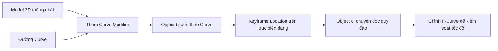
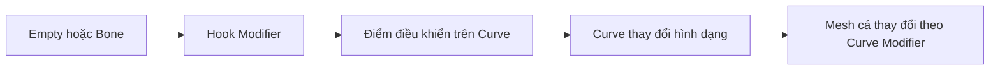

# 09 — Bonus: Ứng dụng khác của Curve Modifier & Lời kết

| Thuộc tính       | Nội dung                                                                 |
| ---------------- | ------------------------------------------------------------------------ |
| **Video**        | *The Secret to Easy Fish Animation in Blender!*                          |
| **Đoạn**         | Bonus & Outro                                                            |
| **Thời điểm**    | 09:26–11:09                                                              |
| **Chủ đề chính** | Mở rộng ứng dụng của Curve Modifier, điều kiện sử dụng và tổng kết video |

---

## 1. Mục tiêu bài học

Sau chương này, người học có thể:

* Nhận ra rằng **Curve Modifier** không chỉ được dùng để animate cá mà còn là một công cụ biến dạng tổng quát trong Blender.
* Hiểu cách áp dụng lại kỹ thuật **object di chuyển và uốn theo Curve** cho nhiều loại scene khác.
* Nắm được điều kiện quan trọng khi sử dụng kỹ thuật: model nên được tổ chức thành **một object thống nhất**.
* Biết hướng phát triển nâng cao với **Hook**, **Curve Handle** và các rig điều khiển Curve.

---

## 2. Nội dung chính

Sau khi hoàn thành animation cá, tác giả giới thiệu thêm một scene khác đã được tạo bằng thiết lập gần như tương tự.

Điểm quan trọng được nhấn mạnh là:

> **Curve Modifier đảm nhiệm phần lớn công việc di chuyển và làm biến dạng object theo hình dạng của Curve.**

Trong project cá, Curve Modifier giúp:

* Làm thân cá bám theo đường bơi.
* Uốn cong mesh theo hình dạng quỹ đạo.
* Tạo chuyển động lắc thân mà không cần dựng một hệ thống Armature phức tạp.
* Cho phép điều khiển chuyển động bằng cách keyframe vị trí object trên trục biến dạng.

Cùng một nguyên lý này có thể được áp dụng cho nhiều loại object và chuyển động khác.

---

## 3. Nguyên lý tổng quát của kỹ thuật

Quy trình hoạt động có thể được mô tả như sau:



Kỹ thuật gồm ba thành phần chính:

1. **Object cần biến dạng**
2. **Curve dùng làm quỹ đạo**
3. **Keyframe vị trí trên trục Deform Axis**

Curve Modifier không trực tiếp tạo animation. Nó chỉ quy định cách object bị uốn theo Curve.

Chuyển động thực tế được tạo bằng cách thay đổi vị trí của object trên trục biến dạng, thường là:

* `X`
* `-X`
* `Y`
* `-Y`
* `Z`
* `-Z`

Trục được chọn phải phù hợp với hướng chiều dài ban đầu của model.

---

## 4. Điều kiện quan trọng: Model phải thống nhất

Để toàn bộ model uốn cong đồng bộ, model nên được tổ chức thành **một object duy nhất**.

Ví dụ, một model cá có thể ban đầu gồm nhiều object:

```text
Fish_Body
Fish_Tail
Fish_Dorsal_Fin
Fish_Pectoral_Fin_L
Fish_Pectoral_Fin_R
Fish_Eyes
```

Nếu mỗi bộ phận là một object riêng, việc chỉ thêm Curve Modifier vào thân cá sẽ không tự động làm các phần còn lại biến dạng theo cùng một cách.

Giải pháp đơn giản là:

1. Chọn tất cả các object thuộc model.
2. Chọn object chính sau cùng để nó trở thành **Active Object**.
3. Nhấn:

```text
Ctrl + J
```

Sau khi Join:

```text
Fish_Body
Fish_Tail
Fish_Fins
Fish_Eyes
        │
        ▼
   Fish_Complete
```

Toàn bộ model lúc này có thể nhận cùng một Curve Modifier và uốn theo Curve một cách đồng bộ.

> **Lưu ý:** Join object không có nghĩa là toàn bộ vertex đã được hàn thành một mesh liên tục. Tuy nhiên, tất cả các phần sẽ được quản lý trong cùng một object và chịu tác động của cùng một Modifier.

---

## 5. Các ứng dụng khác của Curve Modifier

Kỹ thuật này có thể được sử dụng cho bất kỳ chuyển động nào có thể mô tả bằng một object dài di chuyển và uốn theo một đường dẫn.

### 5.1. Rắn hoặc sinh vật dạng dài

Một model rắn có thể được uốn theo Curve và di chuyển về phía trước bằng cách keyframe vị trí trên trục chiều dài.

```text
Curve hình chữ S
        +
Model rắn thẳng
        ↓
Rắn trườn theo quỹ đạo
```

---

### 5.2. Lươn, cá chình hoặc sinh vật biển

Các sinh vật có thân dài rất phù hợp với Curve Modifier vì chuyển động chính của chúng đến từ sự uốn cong toàn bộ cơ thể.

Có thể kết hợp:

* Curve Modifier
* Shape Keys
* Displace Modifier
* F-Curve Modifier
* Noise Modifier

để tạo chuyển động tự nhiên hơn.

---

### 5.3. Dây leo phát triển

Một đoạn dây leo hoặc thân cây có thể:

* Uốn theo Curve.
* Di chuyển dọc theo Curve.
* Kết hợp với Geometry Nodes hoặc Mask để tạo cảm giác đang mọc dài ra.

---

### 5.4. Dải ruy băng hoặc vải dài

Một dải mesh phẳng có thể được uốn theo Curve để tạo:

* Ruy băng bay trong gió.
* Luồng năng lượng.
* Dải ánh sáng.
* Đường chuyển động cách điệu.
* Motion graphics.

---

### 5.5. Tàu hoặc phương tiện trên đường ray

Đối với phương tiện cứng như tàu lượn, thường nên dùng **Follow Path Constraint** thay vì làm biến dạng toàn bộ phương tiện.

Tuy nhiên, Curve Modifier vẫn hữu ích cho:

* Đường ray.
* Đoàn tàu dạng mềm hoặc cách điệu.
* Dây cáp.
* Ống dẫn.
* Các bộ phận cần uốn cong theo đường ray.

---

### 5.6. Ống, dây điện và cáp

Một object hình trụ dài có thể được uốn theo Curve để tạo:

* Dây điện.
* Ống nước.
* Dây cáp.
* Vòi mềm.
* Xúc tu.
* Đuôi sinh vật.

---

## 6. Curve Modifier và Follow Path khác nhau như thế nào?

| Đặc điểm                         | Curve Modifier             | Follow Path Constraint        |
| -------------------------------- | -------------------------- | ----------------------------- |
| Di chuyển object theo Curve      | Có thể thực hiện gián tiếp | Có                            |
| Uốn cong mesh theo Curve         | **Có**                     | Không                         |
| Giữ nguyên hình dạng object      | Không nhất thiết           | Có                            |
| Phù hợp với cá, rắn, dây, ống    | **Rất phù hợp**            | Hạn chế                       |
| Phù hợp với xe, camera, tàu cứng | Có thể không phù hợp       | **Rất phù hợp**               |
| Điều khiển bằng Offset/Location  | Location trên Deform Axis  | Offset Factor/Evaluation Time |

Có thể hiểu ngắn gọn:

```text
Follow Path
→ Di chuyển toàn bộ object theo đường dẫn
→ Object vẫn giữ nguyên hình dạng

Curve Modifier
→ Uốn trực tiếp hình dạng object
→ Object thích nghi với độ cong của đường dẫn
```

Đối với animation cá trong video, Curve Modifier phù hợp hơn vì thân cá cần **cong và lắc theo quỹ đạo**, chứ không chỉ di chuyển như một khối cứng.

---

## 7. Quy trình thực hành gợi ý

### Bài tập 1 — Kiểm tra model cá

1. Mở Outliner.
2. Kiểm tra toàn bộ model cá.
3. Xác nhận các bộ phận chính đã nằm trong cùng một object.
4. Kiểm tra Curve Modifier vẫn đang hoạt động.
5. Scrub Timeline để quan sát chuyển động.

---

### Bài tập 2 — Thử với một ống trụ

1. Tạo một Cylinder:

```text
Shift + A → Mesh → Cylinder
```

2. Scale Cylinder theo một trục để tạo object dài.
3. Apply Scale:

```text
Ctrl + A → Scale
```

4. Thêm nhiều loop cut để mesh có đủ độ phân giải khi uốn.
5. Tạo một Bezier Curve.
6. Thêm Curve Modifier vào Cylinder.
7. Chọn Curve làm **Curve Object**.
8. Chọn đúng **Deform Axis**.
9. Di chuyển Cylinder trên trục biến dạng.
10. Keyframe Location tại frame đầu và frame cuối.

---

### Bài tập 3 — Tạo chuyển động không đều

Trong Graph Editor:

1. Chọn F-Curve của trục di chuyển.
2. Thêm một số keyframe trung gian.
3. Điều chỉnh handle để tạo các giai đoạn:

```text
Tăng tốc → Trôi chậm → Tăng tốc → Trôi chậm
```

Đây chính là nguyên lý **burst-and-coast** đã được sử dụng cho animation cá.

---

## 8. Thiết lập mở rộng với Hook và Curve Handle

Ở cấp độ nâng cao hơn, có thể dùng **Hook Modifier** để điều khiển các điểm của Curve bằng Empty hoặc Bone.

Ví dụ:



Thay vì trực tiếp chọn và di chuyển các Control Point của Curve, người dùng có thể điều khiển chúng bằng:

* Empty
* Bone
* Controller Shape
* Custom Property
* Driver

Cách này giúp rig dễ sử dụng hơn, đặc biệt khi cần:

* Điều khiển nhiều đoạn thân.
* Tạo animation phức tạp.
* Tái sử dụng rig cho nhiều scene.
* Chuyển giao file cho animator khác.

Tác giả cho biết các tệp project nâng cao có chứa thiết lập **Hook + Curve Handle** được chia sẻ thông qua Patreon.

Đây là nội dung bổ sung, không bắt buộc để hoàn thành kỹ thuật chính trong video.

---

## 9. Phím tắt và công cụ liên quan

| Thao tác                   | Phím tắt hoặc vị trí               |
| -------------------------- | ---------------------------------- |
| Gộp nhiều object thành một | `Ctrl + J`                         |
| Apply Transform            | `Ctrl + A`                         |
| Thêm Modifier              | Modifier Properties                |
| Thêm Curve                 | `Shift + A → Curve`                |
| Chèn keyframe              | `I`                                |
| Mở Graph Editor            | Chọn loại Editor → Graph Editor    |
| Di chuyển object           | `G`                                |
| Di chuyển theo một trục    | `G`, sau đó nhấn `X`, `Y` hoặc `Z` |
| Đặt Handle Type            | `V` trong Edit Mode của Curve      |
| Tạo Hook                   | `Ctrl + H` trong Edit Mode         |

---

## 10. Lưu ý và lỗi thường gặp

### 10.1. Các bộ phận không uốn cùng nhau

**Nguyên nhân:**

* Model vẫn gồm nhiều object riêng.
* Curve Modifier chỉ được thêm vào một bộ phận.
* Một số object có transform khác nhau.

**Cách xử lý:**

* Join các bộ phận bằng `Ctrl + J`.
* Apply Rotation và Scale.
* Kiểm tra lại Modifier Stack.

---

### 10.2. Object bị méo hoặc xoắn mạnh

**Nguyên nhân:**

* Deform Axis không đúng.
* Rotation hoặc Scale chưa được Apply.
* Chiều dài model không nằm trên trục đã chọn.
* Curve có Tilt không mong muốn.

**Cách xử lý:**

```text
Ctrl + A → Rotation & Scale
```

Sau đó thử lại các giá trị Deform Axis.

Nếu Curve bị xoắn, kiểm tra:

```text
Curve Edit Mode → Alt + T
```

Lệnh này dùng để xóa Tilt của các điểm trên Curve.

---

### 10.3. Mesh bị gãy khúc khi uốn

**Nguyên nhân:**

* Mesh có quá ít vertex dọc theo chiều uốn.
* Curve có độ phân giải thấp.

**Cách xử lý:**

* Thêm Loop Cut hoặc Subdivision cho mesh.
* Tăng `Resolution Preview U` của Curve.
* Cân bằng giữa độ mượt và hiệu suất viewport.

---

### 10.4. Object di chuyển sai hướng

**Nguyên nhân:**

* Chọn sai Deform Axis.
* Hướng local axis của model bị ngược.

**Cách xử lý:**

Thử lần lượt:

```text
X
-X
Y
-Y
Z
-Z
```

Chọn trục làm object uốn đúng hướng và di chuyển đúng chiều mong muốn.

---

### 10.5. Join làm mất Modifier hoặc Material

Khi dùng `Ctrl + J`, Blender giữ lại một số thuộc tính dựa trên **Active Object**.

Vì vậy:

1. Chọn tất cả các phần cần Join.
2. Chọn object chính sau cùng.
3. Đảm bảo object chính có Modifier và thiết lập cần giữ.
4. Sau đó mới nhấn `Ctrl + J`.

---

## 11. Checklist thực hành

* [ ] Đã xác nhận model cá là một object thống nhất.
* [ ] Đã hiểu Curve Modifier vừa di chuyển gián tiếp vừa làm biến dạng mesh.
* [ ] Đã phân biệt Curve Modifier với Follow Path Constraint.
* [ ] Đã xác định đúng Deform Axis của object.
* [ ] Đã Apply Rotation và Scale trước khi thêm Modifier.
* [ ] Đã thử áp dụng kỹ thuật cho một object khác.
* [ ] Đã kiểm tra mesh có đủ số lượng vertex để uốn mượt.
* [ ] Đã hiểu vai trò của Hook và Curve Handle trong rig nâng cao.
* [ ] Đã nhận ra tài nguyên Patreon chỉ là nội dung bổ sung, không bắt buộc.

---

## 12. Lời kết của video

Video kết thúc bằng lời cảm ơn và lời kêu gọi người xem nhấn **Like** nếu thấy nội dung hữu ích.

Tác giả cũng giới thiệu kênh hỗ trợ trên **Patreon**, đặc biệt là gói:

> **Advanced Project Files**

Gói này chứa các tệp project nâng cao dành cho người muốn tìm hiểu sâu hơn về animation, bao gồm thiết lập **Hook Rig và Curve Handle** đã được nhắc đến trong phần nghiên cứu kỹ thuật.

Thông tin chi tiết được đặt trong phần mô tả của video gốc trên YouTube.

---

## 13. Tóm tắt

Curve Modifier không chỉ là một “mẹo animate cá”, mà là một công cụ mạnh để tạo ra các object:

* Di chuyển theo quỹ đạo.
* Uốn cong theo đường dẫn.
* Biến dạng liên tục trong thời gian thực.
* Có thể điều khiển tốc độ thông qua keyframe và Graph Editor.

Công thức tổng quát của kỹ thuật là:

```text
Model thống nhất
    +
Mesh có đủ độ phân giải
    +
Curve làm quỹ đạo
    +
Curve Modifier
    +
Keyframe Location
    +
Chỉnh tốc độ trong Graph Editor
    =
Chuyển động uốn theo đường dẫn
```

Từ một con cá bơi, kỹ thuật này có thể được mở rộng sang:

* Rắn trườn.
* Lươn bơi.
* Xúc tu chuyển động.
* Dây leo phát triển.
* Ruy băng bay.
* Dây cáp và ống mềm.
* Các hiệu ứng motion graphics.

Giá trị lớn nhất của video không chỉ nằm ở kết quả cuối cùng, mà ở việc cung cấp một phương pháp đơn giản, nhanh và có thể tái sử dụng cho nhiều dạng animation khác nhau trong Blender.

---

# Bài luyện tập

## Mục tiêu


## Đề bài


## Yêu cầu hoàn thành

- [ ] 
- [ ] 
- [ ] 

## Kết quả / lời giải


## Ghi chú
