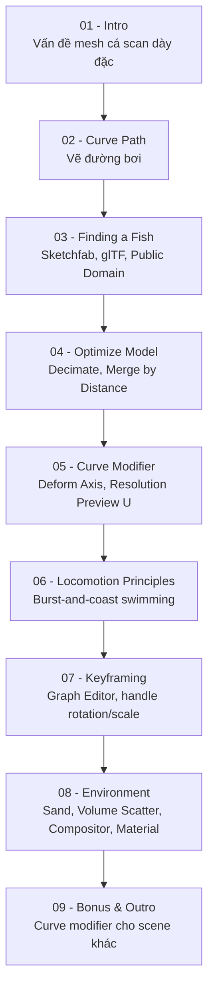

# The Secret to Easy Fish Animation in Blender!

Video ngắn (~11 phút) của kênh **Polyfjord**, trình bày một kỹ thuật nhanh — không cần add-on, không cần asset trả phí, chạy real-time trong Eevee — để animate một con cá đã được scan 3D (mesh dày đặc, khó rig bằng phương pháp thông thường) bơi một cách tự nhiên dọc theo một đường Curve. Đây chính là video được nhắc tới trong phần mở đầu của mega-tutorial *"Learn How to Animate and Render a Fish in Blender!"* (xem ghi chú tại [../animate-and-render-a-fish-in-blender/](../../animate-and-render-a-fish-in-blender/)) — video đó đi sâu và mở rộng đúng kỹ thuật cốt lõi được giới thiệu ở đây.

- **Kênh:** Polyfjord
- **Thời lượng:** ~11 phút 9 giây
- **Công cụ:** Blender, render engine **Eevee** (real-time)
- **Yêu cầu:** không add-on, không asset trả phí (model từ Sketchfab, texture từ PolyHaven)
- **Nguồn ghi chú:** bản dịch máy (tiếng Việt) của transcript/phụ đề gốc video, do người dùng cung cấp — vì vậy các thuật ngữ kỹ thuật Blender bị dịch sai/lạ đã được diễn giải lại đúng theo ngữ cảnh (ví dụ "khung khóa" = keyframe, "phím hình dạng" = Shape Keys, "cánh tản nhiệt" = vây cá/fins do lỗi dịch máy). Nhờ có transcript thật, ghi chú ở đây bám sát nội dung video hơn so với ghi chú của mega-tutorial (vốn chỉ dựa trên tiêu đề chương).

## Cấu trúc video (theo các bước tác giả trình bày)

| # | Bài học | Thời điểm | Nội dung |
|---|---|---|---|
| [01](01%20-%20Intro%20and%20Problem%20Statement.md) | Intro & Problem Statement | 00:00–00:52 | Vấn đề: mesh cá scan dày đặc, khó rig; lời hứa kỹ thuật 10 phút |
| [02](02%20-%20Step%201%20Adding%20a%20Curve%20Path.md) | Bước 1 — Thêm Curve làm đường bơi | 00:52–01:10 | Tạo Curve, vẽ đường đi đơn giản |
| [03](03%20-%20Step%202%20Finding%20a%20Fish%20Model.md) | Bước 2 — Tìm model cá | 01:10–01:30 | Sketchfab, giấy phép Public Domain, định dạng glTF |
| [04](04%20-%20Step%203%20Optimizing%20the%20Fish%20Model.md) | Bước 3 — Tối ưu model cá | 01:30–02:09 | Decimate, Merge by Distance, Apply modifier |
| [05](05%20-%20Step%204%20Curve%20Modifier%20Setup.md) | Bước 4 — Gắn Curve Modifier | 02:09–02:38 | Curve modifier, Deform Axis, Resolution Preview U |
| [06](06%20-%20Step%205a%20Fish%20Locomotion%20Principles.md) | Bước 5a — Nguyên lý vận động của cá | 02:38–04:27 | Các kỹ thuật đã thử & thất bại; burst-and-coast swimming |
| [07](07%20-%20Step%205b%20Animating%20Burst-and-Coast%20Swimming.md) | Bước 5b — Keyframe chuyển động | 04:27–08:00 | Graph Editor, keyframe Location X, chỉnh handle tạo nhịp bơi |
| [08](08%20-%20Step%206%20Environment%20Lighting%20and%20Material.md) | Bước 6 — Đưa cá về đại dương | 08:00–09:26 | Texture đáy biển, Volume Scatter, Compositor, material cá, camera & render |
| [09](09%20-%20Bonus%20and%20Outro.md) | Bonus & Outro | 09:26–11:09 | Ứng dụng khác của Curve modifier; lời kết, Patreon |

## Lộ trình học

## Các kỹ thuật cốt lõi rút ra được

- **Curve modifier** (không phải Follow Path constraint) làm "công cụ nặng" chính: object mesh tự uốn theo hình dạng Curve khi di chuyển dọc trục biến dạng (Deform Axis) — chỉ cần model là **một object duy nhất**.
- **Decimate + Merge by Distance + Apply** là cách nhanh và "bẩn" (quick & dirty) để mesh scan dày đặc trở nên đủ nhẹ để biến dạng mượt trong thời gian thực.
- **Burst-and-coast swimming**: nguyên lý sinh học thực tế — cá bơi bằng các cú "bùng nổ" (wiggle ngắn) rồi lướt (coast) để tiết kiệm năng lượng, thay vì lắc đuôi liên tục đều đặn.
- Nhịp burst-and-coast được tạo hoàn toàn bằng cách **keyframe Location X và chỉnh dạng đường cong trong Graph Editor** (rotate/scale handle tại các keyframe với pivot Individual Origins) — không cần Shape Keys, Armature hay simulation.
- Chi tiết môi trường (Volume Scatter, hiệu ứng ống kính dưới nước trong Compositor, vật liệu có Subsurface Scattering) là các lớp hoàn thiện cuối, không phải yêu cầu bắt buộc để có chuyển động thuyết phục.

## Cách sử dụng thư mục ghi chú này

- Mỗi file `NN - Tên bài.md` tương ứng với một bước/đoạn trong video, có cấu trúc: mục tiêu, nội dung chính, quy trình thực hành gợi ý, phím tắt/công cụ liên quan, lưu ý & lỗi thường gặp, checklist, tóm tắt.
- Vì có transcript thật (dù qua dịch máy), nội dung bám sát những gì tác giả thực sự làm/nói hơn là suy đoán — tuy nhiên một số cụm từ chuyên ngành có thể bị dịch sai và đã được diễn giải lại theo đúng thuật ngữ Blender chuẩn dựa trên ngữ cảnh; nên đối chiếu với video gốc (phụ đề tiếng Anh) nếu cần độ chính xác tuyệt đối ở một chi tiết cụ thể.
- Nên xem qua video một lần trước, sau đó dùng ghi chú này để tra cứu lại từng bước khi thực hành trong Blender của riêng bạn.

## Checklist tổng thể

- [ ] Hiểu vấn đề cốt lõi: mesh cá scan dày đặc khó rig bằng phương pháp thông thường.
- [ ] Dựng được một Curve đơn giản làm đường bơi.
- [ ] Tìm và tải được một model cá scan miễn phí (Sketchfab, định dạng glTF).
- [ ] Tối ưu model bằng Decimate + Merge by Distance, Apply modifier.
- [ ] Gắn Curve modifier để mesh tự uốn theo đường Curve khi di chuyển.
- [ ] Hiểu nguyên lý burst-and-coast swimming và vì sao các kỹ thuật khác (Simple Deform, Lattice, Cloth, Hook rig) không tối ưu cho trường hợp này.
- [ ] Keyframe được Location X và tạo nhịp bơi tự nhiên bằng cách chỉnh handle trong Graph Editor.
- [ ] Dựng được môi trường đại dương đơn giản (đáy cát, ánh sáng, sương mù thể tích) và hoàn thiện material cá.
- [ ] Render được kết quả cuối cùng trong Eevee.
