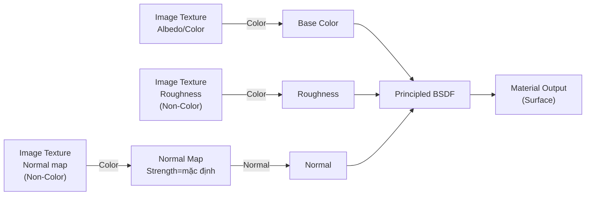
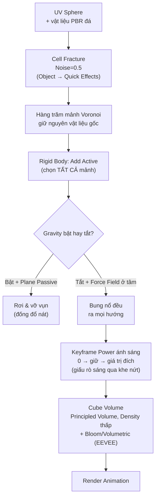
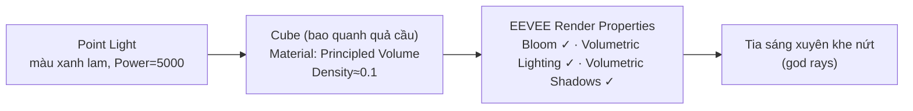

# 01 — Blender 2.8 Tutorial: Cell Fracture Explosion

## Thông tin bài học

| Thuộc tính       | Nội dung                                                                                     |
| ---------------- | --------------------------------------------------------------------------------------------- |
| **Video**        | *Blender 2.8 Tutorial - Cell Fracture Explosion*                                              |
| **Tác giả**      | tự giới thiệu là "Alex" trong video, đại diện cộng đồng **BlenderMania3D.com** (cuối video nhắc lại "chia sẻ kết quả trên blendermania3d.com trên diễn đàn") |
| **Công cụ**      | Blender 2.8, add-on tích hợp sẵn **Cell Fracture**, **Rigid Body**, **Force Field**, render engine **EEVEE** (Bloom + Volumetrics) |
| **Thời lượng**   | ~17 phút 53 giây                                                                                |
| **Chủ đề**       | Dựng vụ nổ vỡ mảnh procedural: Cell Fracture chia mesh → Rigid Body → Force Field đẩy nổ từ tâm → keyframe ánh sáng để giấu khe nứt → Bloom/Volumetric cho hiệu ứng tia sáng |

> **Về nguồn ghi chú:** dựa trên bản dịch máy (tiếng Việt) của transcript/phụ đề gốc video, do người dùng cung cấp. Một số cụm bị dịch sai/lạ do là thuật ngữ Blender chuyên ngành, đã diễn giải lại đúng theo ngữ cảnh bên dưới:
> - **"Core Bard từ Blender Mania 3D Comm"** → không rõ nghĩa chính xác, nhiều khả năng là lỗi dịch máy của một câu tự giới thiệu tên riêng ("Alex") + tên cộng đồng **BlenderMania3D.com** (câu cuối video nói rõ "chia sẻ kết quả trên blendermania3d.com trên diễn đàn") — **không chắc chắn hoàn toàn về "Core Bard"**, có thể là biệt danh, tên kênh, hoặc chỉ là nhiễu dịch máy.
> - **"phần bổ sung tự gãy xương"** → add-on **Cell Fracture** (dịch nghĩa đen "tự làm gãy xương" từ "Cell Fracture" = "vỡ tế bào/ô", add-on chia mesh thành nhiều mảnh kiểu Voronoi có sẵn trong Blender).
> - **"Go Do Textures Dot-Com"** → trang web **Textures.com** (kho texture PBR, có gói tài khoản miễn phí).
> - **"hạt nhân"** / **"biểu tượng trông như quả bóng bãi biển"** → tab **Material Properties** (icon hình quả cầu caro giống quả bóng bãi biển).
> - **"thay vì chủ thể là SDF"** → nhiều khả năng nghe nhầm/dịch nhầm chữ **"Surface"** (loại shader mặc định "Surface → Principled BSDF" trong Material Properties/Shader Editor), không phải một thuật ngữ "SDF" (Signed Distance Field) nào.
> - **"thể tích nguyên tắc"** → node/shader **Principled Volume**.
> - **"dưới mức âm lượng các chỉ số / Về phần đo thể tích"** → mục **Volumetrics** (các tuỳ chọn Volumetric Lighting/Volumetric Shadows) trong Render Properties của EEVEE.
> - **"trọng lực IT"** → có thể chỉ là tiếng đệm/nhiễu dịch máy trước câu nói về **Gravity** (trọng lực), không mang nghĩa riêng.
> - Một số con số nghe được qua dịch máy có độ chắc chắn thấp — đặc biệt: giá trị Strength cuối cùng của Force Field (nghe ra "210", nhưng đoạn ngay sau đó nói "trả lại mười" gây mâu thuẫn — xem ghi chú ở mục 8), và giá trị Power thứ hai đặt cho Light ở mục 12 (nghe ra "chia năm ăn hai ba năm nghìn", khả năng cao là quay về một giá trị như **2500** — bằng nửa của 5000 đặt trước đó). Luôn coi các con số này là điểm khởi đầu, tinh chỉnh lại bằng mắt trong Rendered viewport.

---

## 1. Mục tiêu bài học

Sau bài này, người học cần:

* Dựng được một vật liệu PBR thủ công từ 3 texture tải về (Albedo/Color, Roughness, Normal) cho một quả cầu UV, dùng làm "vật thể sẽ nổ".
* Bật và sử dụng được add-on **Cell Fracture**: chạy một lệnh duy nhất để chia mesh thành hàng trăm mảnh dạng Voronoi bất quy tắc (điều khiển bằng tham số **Noise**), giữ nguyên vật liệu gốc cho từng mảnh.
* Gán **Rigid Body Active** cho toàn bộ mảnh vỡ, hiểu sự khác biệt giữa để trọng lực làm chúng rơi (đống đổ nát, cần thêm mặt phẳng **Rigid Body Passive** làm sàn) và tắt trọng lực để dùng **Force Field** đẩy bung ra đều từ tâm (vụ nổ thật sự).
* Biết cách đặt vị trí và chỉnh **Strength** của Force Field để kiểm soát tốc độ/độ mạnh của vụ nổ.
* Keyframe **Power** của nguồn sáng chính để giấu hiện tượng ánh sáng "rò" qua các khe nứt li ti trước khi mảnh vỡ thật sự tách ra.
* Dựng được hiệu ứng **Volumetric** (tia sáng xuyên khe nứt) bằng một khối Cube mang vật liệu **Principled Volume**, kết hợp **Bloom** trong EEVEE.

---

## 2. Giới thiệu & mục tiêu tổng quan (00:00–00:52)

Alex (đại diện cộng đồng BlenderMania3D.com) giới thiệu sẽ hướng dẫn cách tạo hoạt hình vụ nổ bằng add-on **Cell Fracture**, **Force Field** và một số kỹ thuật khác. Video minh hoạ trước vài ví dụ có thể làm được với cùng kỹ thuật này: một bức tường nổ tung, một sàn nhà nổ tung, hoặc một hành tinh bùng nổ — nhấn mạnh rằng đây là một kỹ thuật nền tảng, áp dụng được cho bất kỳ hình dạng khởi điểm nào tuỳ trí tưởng tượng.

---

## 3. Chuẩn bị cảnh & texture PBR thủ công (00:52–05:19)

### 3.1. Dựng đối tượng gốc

* Tạo file mới.
* **X** → **Delete** để xoá khối lập phương mặc định.
* **Shift+A** → **Mesh** → **UV Sphere** — đây sẽ là vật thể bị nổ tung.

### 3.2. Tải texture từ Textures.com

* Truy cập **Textures.com**, tạo tài khoản miễn phí, tìm texture loại **Rock** (đá) — có thể chọn bất kỳ texture đá nào bạn thích, không bắt buộc đúng texture trong video.
* Tải về đủ 3 bản đồ: **Medium Albedo** (hoặc Color map), **Medium Normal**, **Medium Roughness**.

### 3.3. Gán vật liệu cho quả cầu

* Chọn quả cầu → tab **Material Properties** (icon quả cầu caro) → **New**.
* Chuyển sang **Shader Editor** (kéo tách viewport hoặc đổi loại editor) để dựng node bằng tay thay vì dùng panel đơn giản.
* Nhấn **End** để fit toàn bộ graph vào khung nhìn.
* Thêm 3 node **Image Texture** (Shift+A → Texture → Image Texture, hoặc Shift+D sao chép 2 lần từ node đầu).

**Texture 1 — Albedo/Color:**
* **Open** → chọn ảnh Albedo/Color map.
* Nối output **Color** vào **Base Color** của Principled BSDF.
* Chuyển Viewport Shading sang **Rendered** để xem trước kết quả.
* Chuột phải trên mesh → **Shade Smooth** (bề mặt đang gồ ghề dạng khối vì UV Sphere mặc định là Flat Shade).

**Texture 2 — Roughness:**
* Nhận xét: sau khi thêm Albedo, bề mặt bóng đều toàn bộ (giống như phủ một lớp bóng cố định lên trên) — cần bản đồ độ nhám để Blender biết chỗ nào bóng, chỗ nào mờ.
* **Open** → chọn ảnh Roughness map.
* Nối output **Color** vào input **Roughness** của Principled BSDF.
* Đổi **Color Space** của node Image Texture này thành **Non-Color** (vì đây là dữ liệu độ nhám đen-trắng, không phải màu thật).
* Kết quả: bề mặt giờ có chỗ bóng chỗ mờ theo đúng texture, không còn đồng nhất.

**Texture 3 — Normal:**
* **Open** → chọn ảnh Normal map.
* Thêm node **Vector → Normal Map**, đặt giữa Image Texture và Principled BSDF.
* Đổi **Color Space** của Image Texture Normal map này thành **Non-Color**.
* Nối output **Color** của Image Texture vào input **Color** của node Normal Map.
* Nối output **Normal** của node Normal Map vào input **Normal** của Principled BSDF.
* Kiểm tra Rendered viewport: bề mặt đã có chiều sâu, gồ ghề, khe hở giả — dù chưa thêm bất kỳ hình học (geometry) nào.
* Tham số **Strength** của node Normal Map quyết định độ mạnh hiệu ứng: kéo lên cao → gồ ghề như "mận khô"; về 0 → phẳng lì hoàn toàn. Video giữ nguyên giá trị mặc định.

---

## 4. Nguyên lý cốt lõi: Cell Fracture → Rigid Body → Force Field

Ý tưởng cốt lõi: thay vì animate tay từng mảnh vỡ bay đi đâu, video dùng **Cell Fracture** để tự động chia mesh thành nhiều mảnh Voronoi, sau đó giao toàn bộ chuyển động cho **hệ mô phỏng vật lý** (Rigid Body + Force Field) tính toán — chỉ cần đặt đúng vị trí và cường độ của một Force Field duy nhất tại tâm khối, tắt trọng lực, là có ngay một vụ nổ tự nhiên, ngẫu nhiên, không lặp lại.

---

## 5. Bật add-on Cell Fracture (05:28–05:52)

* **Edit → Preferences → Add-ons**.
* Tìm kiếm `cell fracture` trong ô search.
* Tick bật add-on **Object: Cell Fracture** (add-on tích hợp sẵn trong Blender, chỉ cần bật, không cần cài thêm file).

---

## 6. Chạy Cell Fracture trên quả cầu (05:52–06:38)

* Chọn quả cầu (đã có vật liệu) → **Object → Quick Effects → Cell Fracture**.
* Hộp thoại tuỳ chọn hiện ra với rất nhiều tham số (Point Source, Recursion, Sharp Edges, Smooth, Interior, v.v.) — video không đi sâu vào từng cái, nhưng lưu ý bạn có thể tự thử nghiệm các thiết lập này trên một file khác để xem chúng ảnh hưởng thế nào đến số lượng mảnh, độ sắc/mịn của cạnh vỡ, có tạo mặt trong (interior) hay không.
* Tham số được chỉnh trong video: **Noise** — tăng từ mặc định lên **0.5**. Noise thêm nhiễu ngẫu nhiên vào ranh giới các mảnh, làm hình dạng vỡ bất quy tắc hơn thay vì đều tăm tắp.
* Nhấn **OK**. Quá trình tính toán mất một chút thời gian, sau đó quả cầu được thay bằng hàng trăm mảnh riêng biệt.

### Dọn dẹp sau khi fracture

* Cell Fracture **giữ lại đối tượng gốc** (quả cầu nguyên vẹn) bên cạnh các mảnh mới sinh ra.
* Chọn lại quả cầu gốc → **X → Delete** vì không còn cần nữa.
* Chuyển sang chế độ đổ bóng có texture: các mảnh đã tự động thừa hưởng vật liệu đá từ mesh gốc — không cần gán lại UV/texture cho từng mảnh.
* Có thể click chọn từng mảnh riêng lẻ và xoá thử để kiểm tra (kiểu "cắn một miếng bánh") — xác nhận mỗi mảnh là một object độc lập.

---

## 7. Rigid Body cho các mảnh vỡ (07:27–08:15)

* Kéo chọn (box select) **toàn bộ** các mảnh vỡ. **Lưu ý:** rất dễ sót một mảnh lẻ nằm ngoài vùng kéo chọn — kiểm tra kỹ số lượng đối tượng đã chọn trước khi qua bước sau, chọn lại nếu thiếu.
* **Object → Rigid Body → Add Active** — gán Rigid Body kiểu **Active** cho tất cả các mảnh cùng lúc.
* Nhấn **phím cách (Space)** để phát thử: các mảnh chỉ đơn giản rơi sụp xuống do trọng lực mặc định — chưa có gì thú vị, cần thêm bước tiếp theo.

### Thêm mặt sàn (tuỳ chọn, cho hiệu ứng đống đổ nát)

* **Shift+A → Mesh → Plane**.
* **G, Z** để đưa mặt phẳng xuống dưới quả cầu, làm sàn.
* Chọn Plane → **Object → Rigid Body → Add Passive** — mặt phẳng trở thành vật cản thụ động (không di chuyển, chỉ va chạm).
* Phát thử: các mảnh rơi xuống và va đập lên sàn, văng ra ngẫu nhiên — hiệu ứng này phù hợp cho **đống đổ nát**, không phải mục tiêu chính của bài (nổ tung), nhưng là một nhánh kỹ thuật đáng biết.

---

## 8. Tắt trọng lực + Force Field để tạo vụ nổ (08:51–11:23)

### 8.1. Tắt Gravity

* Vào tab **Scene Properties** → tắt (uncheck) mục **Gravity**.
* Phát thử: không có gì xảy ra — các mảnh đứng yên tại chỗ (không rơi vì không còn trọng lực, không bung ra vì chưa có lực nào khác tác động).
* Minh hoạ phụ: nếu đặt Gravity thành giá trị **âm nhỏ** (ví dụ -0.5) rồi phát, các mảnh rơi chậm rãi kiểu slow-motion — chỉ để minh hoạ, sau đó tắt hẳn Gravity trở lại để tiếp tục bài.

### 8.2. Thêm Force Field

* **Shift+A → Force Field → Force** — tạo một Empty mang thiết lập Force Field kiểu **Force** (loại lực đẩy toả ra từ một điểm).
* Vào **Physics Properties** của Force Field, tham số chính cần quan tâm là **Strength**.
* Phát thử ngay: lực đang đẩy các mảnh bay lên theo một hướng thay vì toả đều — vì vị trí hiện tại của Force Field chưa nằm đúng tâm khối.

### 8.3. Căn giữa Force Field

* Chọn Force Field → **G, Z** → di chuyển lên đúng **tâm** quả cầu ban đầu.
* Phát thử: giờ các mảnh bung ra **đều theo mọi hướng** từ tâm — đúng cảm giác một vụ nổ, không còn lệch về một phía.

### 8.4. Chỉnh Strength cho tốc độ nổ mong muốn

* Đặt **Strength = 10** → nhấn mũi tên trái (hoặc Shift+Left Arrow) để về khung hình đầu → phát: vụ nổ nhẹ.
* Đặt **Strength = 100** → phát: vụ nổ lớn, rõ ràng ("boom").
* Chốt giá trị cuối cùng ở khoảng **Strength = 210** cho video này (giá trị cụ thể tuỳ độ mạnh bạn muốn — không có công thức đúng/sai, chỉnh bằng mắt).

> **Ghi chú về đoạn minh hoạ phụ (11:23):** ngay sau khi chốt Strength, video có một đoạn nói về việc nếu muốn hiệu ứng **đống đổ nát** (thay vì nổ bay xa), bạn có thể bật lại Gravity (khoảng **-9.8**) — với lực yếu, trọng lực gần như không đáng kể so với Force Field mạnh; nhưng với Force Field ở mức **100**, trọng lực bắt đầu có ảnh hưởng rõ hơn kết hợp cùng lực đẩy. Đoạn transcript sau đó nói "trả lại mười" — **không rõ đây có phải ý nói quay lại Strength=10 để minh hoạ tiếp, hay là lỗi nghe nhầm của số 210** đã chốt trước đó. Vì bài học tiếp tục với hiệu ứng **nổ tung** (không phải đổ nát), khả năng cao nhất là: đoạn này chỉ là minh hoạ phụ, cuối cùng Gravity **vẫn giữ tắt** và Strength trở lại giá trị đã chốt để nổ (≈210) cho phần còn lại của video — bạn nên tự quyết định giá trị cuối theo hiệu ứng bạn muốn khi tự dựng lại.

---

## 9. Thêm ánh sáng chính vào tâm vụ nổ (12:01–12:46)

* Chọn Force Field (đang ở đúng tâm) → **Shift+S → Cursor to Selected** (đưa 3D Cursor về đúng vị trí Force Field).
* **Shift+A → Light → Point** — thêm đèn Point Light ngay tại tâm (nhờ 3D Cursor vừa di chuyển tới).
* Đổi **Color** của đèn này thành **màu xanh lam**.
* Xoá đèn mặc định còn sót lại từ lúc tạo file mới (chọn đèn đó → **X → Delete**) — chỉ giữ lại đèn Point Light vừa thêm.
* Tăng **Power** của đèn lên **1000**.

---

## 10. World background & dọn cảnh (12:51–13:14)

* Vào **World Properties** → đổi màu **Background** → cuộn/kéo xuống để làm tối hẳn (gần như đen).
* Xoá mặt phẳng sàn (Plane) đã thêm ở mục 7 nếu không cần cho hiệu ứng nổ (không phải đống đổ nát) — video xoá bỏ ở bước này.

---

## 11. Bloom + Volumetric trong EEVEE (13:14–14:44)

### 11.1. Bật hiệu ứng render

* **Render Properties** → bật **Bloom**.
* Bật thêm mục **Volumetrics** (Volumetric Lighting/Volumetric Shadows) trong cùng panel Render Properties của EEVEE.

### 11.2. Khối Cube làm "vùng thể tích"

* **Shift+A → Mesh → Cube**.
* **S** để phóng to khối lập phương này sao cho bao trọn toàn bộ quả cầu, nới rộng thêm một chút biên.
* Với Cube đang chọn → tab **Material Properties** → **New**.
* Thay vì dùng shader **Surface** mặc định (Principled BSDF), đổi sang mục **Volume** và chọn **Principled Volume** — biến Cube thành một vật thể thể tích (volume object) vô hình thay vì khối rắn có bề mặt.
* Kết quả ban đầu: sương/khói quá dày đặc do **Density** mặc định cao.
* Giảm **Density** xuống khoảng **0.1** → xuất hiện hiệu ứng tia sáng đẹp mắt (god rays) vì Cube giờ tương tác với ánh sáng qua Volumetrics vừa bật.
* Có thể đổi màu của Volume tuỳ thích; video giữ tông **xanh nhạt**.

### 11.3. Tăng cường độ đèn chính

* Với đèn chính đã thêm ở mục 9, thử tăng **Power** lên **5000** và tăng thêm mức đóng góp Volumetric của chính đèn đó (thông số **Volume**/cường độ tán xạ thể tích trong Light Properties) để tia sáng rõ hơn.

---

## 12. Keyframe ánh sáng để giấu rò sáng qua khe nứt (14:56–16:44)

### 12.1. Phát hiện vấn đề

* **Shift+Left Arrow** để về khung hình đầu, phát animation.
* Vấn đề: ngay ở đầu clip, khi các mảnh vỡ Cell Fracture **chưa thật sự tách rời**, ánh sáng vẫn "rò" qua các khe nứt li ti giữa các mảnh — trông thiếu tự nhiên vì lẽ ra khối phải kín hoàn toàn trước khi nổ.

### 12.2. Giải pháp: animate Power của Light

* Về **khung hình 1**: đặt **Power = 0** cho đèn chính, di chuột vào ô giá trị, nhấn **I** để chèn keyframe.
* Chuyển sang chế độ **Solid** shading để dễ quan sát chính xác lúc nào các khe nứt bắt đầu mở/tách ra rõ trong animation (thay vì đoán mò trên Rendered).
* Tại **khung hình 6**: vẫn đặt **Power = 0**, nhấn **I** để chèn thêm một keyframe — giữ đèn tắt lâu hơn một chút, tránh bật đột ngột ngay khi vừa có dấu hiệu tách.
* Tại **khung hình 15**: tăng dần lên giá trị đích (video làm mượt hơn thay vì bật ngay ở khung 7) — nhấn **I** để chèn keyframe với giá trị Power đích (xem ghi chú độ chắc chắn thấp về con số cụ thể ở đầu bài — khả năng cao là quay về khoảng **2500**, tức nửa của 5000 đã đặt ở mục 11.3).

### 12.3. Kiểm tra kết quả

* Chuyển sang chế độ đổ bóng **Rendered** (EEVEE), **Shift+Left Arrow** về khung hình đầu.
* Xác nhận: ở khung hình đầu không còn ánh sáng rò qua khe nứt; khi phát animation, ánh sáng chỉ bắt đầu "xuyên" qua đúng lúc các mảnh thật sự tách ra — hiệu ứng trông tự nhiên và ấn tượng hơn hẳn.

---

## 13. Đèn phụ & hoàn thiện (16:44–17:53)

* **Shift+A → Light → Point** — thêm một đèn Point Light thứ hai, đóng vai trò như ánh sáng bên/phụ (không hẳn là 3-point lighting đầy đủ vì cảnh chỉ có 2 đèn, nhưng vẫn thêm được chiều sâu và cá tính cho ánh sáng tổng thể).
* Đặt **Power = 500** ban đầu cho đèn này.
* Chọn **Camera**, di chuyển đèn phụ tới gần hướng camera (đảm bảo đèn chính vẫn ở một bên để tạo tương phản sáng/tối).
* Phát thử toàn bộ animation — kết quả đẹp; giảm **Power** đèn phụ xuống **200** để cân bằng lại độ sáng tổng thể.

### Kết thúc video

* Alex mời người xem chia sẻ kết quả của mình trên diễn đàn **blendermania3d.com**.
* Nhấn mạnh có thể chỉnh sửa/remix kỹ thuật trong bài theo bất kỳ ý tưởng nào — tường nổ tung, hành tinh nổ tung, v.v.

---

## 14. Phím tắt & thiết lập liên quan

| Phím/Thiết lập                     | Công dụng                                                                 |
| ------------------------------------ | ---------------------------------------------------------------------------- |
| **X**                                 | Xoá đối tượng/node đang chọn                                                 |
| **Shift+A**                           | Thêm mesh mới / vật thể lực / ánh sáng / node mới (tuỳ context)              |
| **G**, **G Z**                        | Grab (di chuyển) đối tượng; kèm trục Z để giới hạn theo trục lên/xuống       |
| **S**                                 | Scale (phóng to/thu nhỏ) đối tượng đang chọn                                 |
| **I**                                 | Chèn keyframe cho giá trị đang trỏ chuột tới                                 |
| **Shift+Left Arrow**                  | Nhảy về khung hình đầu tiên (Jump to Start Frame)                            |
| **Space**                             | Phát/dừng animation trong viewport                                           |
| **Shift+S → Cursor to Selected**      | Đưa 3D Cursor về đúng vị trí đối tượng đang chọn — dùng để đặt object mới đúng chỗ |
| **Object → Quick Effects → Cell Fracture** | Chia một mesh thành nhiều mảnh Voronoi bất quy tắc (cần bật add-on trước)  |
| **Cell Fracture — Noise**             | Mức nhiễu ngẫu nhiên cho ranh giới mảnh vỡ — càng cao càng lởm chởm, bất quy tắc |
| **Object → Rigid Body → Add Active**  | Gán vật lý Rigid Body chủ động (di chuyển được, phản ứng va chạm/lực)       |
| **Object → Rigid Body → Add Passive** | Gán vật lý Rigid Body thụ động (đứng yên, chỉ làm vật cản va chạm)          |
| **Scene Properties → Gravity**        | Bật/tắt và chỉnh cường độ trọng lực toàn cảnh                                |
| **Force Field (Type: Force)**         | Toả lực đẩy/hút đều từ một điểm — dùng Strength để chỉnh cường độ            |
| **Principled Volume** (Volume, không phải Surface) | Shader thể tích cho vật thể vô hình mang sương/khói/tia sáng (Density = độ dày) |
| **Render Properties → Bloom**         | Hiệu ứng loé sáng quanh vùng cực sáng trong EEVEE                            |
| **Render Properties → Volumetrics**   | Bật Volumetric Lighting/Shadows để ánh sáng tương tác được với vật thể Volume |

---

## 15. Lưu ý & lỗi thường gặp

### 15.1. Quên chọn hết mảnh vỡ trước khi Add Active Rigid Body

Sau khi Cell Fracture tạo ra hàng trăm object riêng biệt, việc box-select rất dễ **sót một vài mảnh** nằm khuất hoặc ở rìa vùng chọn. Nếu Add Active Rigid Body chỉ áp cho một phần, các mảnh bị sót sẽ đứng yên tuyệt đối giữa vụ nổ — cần đếm lại số object đã chọn (hoặc dùng Select All bằng phím **A** sau khi đã xoá mesh gốc) trước khi gán Rigid Body.

### 15.2. Không xoá mesh gốc sau khi Cell Fracture

Add-on giữ lại đối tượng gốc song song với các mảnh mới. Nếu quên xoá, mesh gốc (nguyên vẹn, không có Rigid Body) sẽ hiện xuyên qua/che khuất các mảnh đang nổ, hoặc bị nhầm là một trong các mảnh khi box-select.

### 15.3. Force Field không đặt đúng tâm

Nếu Force Field kiểu Force không nằm đúng tâm hình học của khối đã vỡ, lực sẽ đẩy các mảnh lệch về một hướng thay vì toả đều — trông giống bị "thổi bay" hơn là "nổ tung". Luôn dùng Shift+S → Cursor to Selected từ tâm gốc (hoặc G để dịch tay) để căn giữa chính xác trước khi tăng Strength.

### 15.4. Quên tắt Gravity khi dùng Force Field để nổ

Nếu Gravity vẫn bật ở mức mặc định (-9.8) trong khi muốn hiệu ứng nổ tung đều mọi hướng, các mảnh sẽ bị kéo lệch xuống dưới ngay khi vừa bung ra, phá vỡ cảm giác "nổ từ tâm cân đối" — chỉ nên bật lại Gravity khi cố ý muốn pha trộn với hiệu ứng rơi/đống đổ nát.

### 15.5. Không đổi Color Space sang Non-Color cho Roughness/Normal map

Nếu quên đổi Color Space của node Image Texture (Roughness, Normal) từ Color mặc định sang **Non-Color**, Blender sẽ áp sai đường cong màu (gamma) lên dữ liệu vốn không phải màu thật, khiến độ nhám/độ gồ ghề bị lệch tông so với texture gốc.

### 15.6. Ánh sáng rò qua khe nứt bị bỏ qua

Nếu không keyframe Power của đèn chính về 0 ở đầu animation, khối vỡ (dù các mảnh chưa thật sự tách) vẫn để lộ các khe hở li ti do Cell Fracture tạo ra, làm lộ ánh sáng bên trong ngay từ khung hình đầu tiên — phá hỏng ảo giác "khối đặc, kín" trước khi nổ.

### 15.7. Cube Volume để Density quá cao

Nếu giữ nguyên Density mặc định của Principled Volume (thường cao) cho khối Cube bao quanh cảnh, hiệu ứng sẽ giống một đám sương/khói đặc che khuất toàn bộ vụ nổ thay vì các tia sáng mảnh xuyên qua khe nứt như mong muốn — cần hạ xuống mức thấp (~0.1) và tinh chỉnh bằng mắt.

---

## 16. Checklist thực hành

### Chuẩn bị đối tượng & vật liệu

* [ ] Dựng UV Sphere, tải 3 texture (Albedo/Color, Roughness, Normal) từ Textures.com.
* [ ] Dựng graph shader: Albedo → Base Color; Roughness (Non-Color) → Roughness; Normal (Non-Color) → node Normal Map → Normal của Principled BSDF.
* [ ] Shade Smooth cho quả cầu, kiểm tra kết quả trong Rendered viewport.

### Cell Fracture & Rigid Body

* [ ] Bật add-on Cell Fracture trong Preferences.
* [ ] Chạy Object → Quick Effects → Cell Fracture với Noise=0.5, xoá mesh gốc sau khi xong.
* [ ] Chọn hết toàn bộ mảnh vỡ (kiểm tra không sót), Add Active Rigid Body.

### Nổ từ tâm bằng Force Field

* [ ] Tắt Gravity ở Scene Properties.
* [ ] Thêm Force Field (Type: Force), căn đúng vào tâm khối bằng 3D Cursor.
* [ ] Chỉnh Strength cho tốc độ nổ mong muốn (thử 10 → 100 → giá trị chốt cuối, video dùng khoảng 210).

### Ánh sáng & hiệu ứng render

* [ ] Thêm Point Light màu xanh lam tại tâm, xoá đèn mặc định thừa.
* [ ] Bật Bloom + Volumetric Lighting/Shadows trong EEVEE Render Properties.
* [ ] Dựng Cube bao quanh cảnh với vật liệu Principled Volume (Volume, không phải Surface), Density≈0.1.
* [ ] Keyframe Power đèn chính: 0 ở khung 1, giữ 0 ở khung 6, lên giá trị đích ở khung 15 — kiểm tra bằng Solid shading trước khi xác nhận bằng Rendered.
* [ ] Thêm đèn phụ thứ hai gần hướng camera, cân chỉnh Power (thử 500 → 200) để cân bằng tổng thể ánh sáng.

---

## 17. Tóm tắt

Video dựng một vụ nổ vỡ mảnh hoàn toàn procedural: một quả cầu mang vật liệu PBR thủ công (Albedo/Roughness/Normal dựng bằng node) được add-on **Cell Fracture** chia thành hàng trăm mảnh Voronoi bất quy tắc (Noise=0.5) chỉ bằng một lệnh, giữ nguyên vật liệu gốc cho từng mảnh. Toàn bộ mảnh vỡ được gán **Rigid Body Active**; thay vì để trọng lực làm chúng rơi thành đống đổ nát, video **tắt Gravity** và đặt một **Force Field** (Type: Force) đúng tâm khối, tăng **Strength** để đẩy các mảnh bung ra đều theo mọi hướng — tạo đúng cảm giác nổ tung. Một đèn Point Light xanh lam đặt tại tâm được **keyframe Power** (0 → giữ → giá trị đích) để giấu hiện tượng ánh sáng rò qua các khe nứt li ti trước khi mảnh thật sự tách rời, đúng lúc khớp với animation vỡ. Cuối cùng, một khối Cube vô hình mang vật liệu **Principled Volume** (Density thấp) bao quanh cảnh, kết hợp **Bloom** và **Volumetric Lighting/Shadows** trong EEVEE, tạo hiệu ứng tia sáng xuyên qua khe nứt (god rays) và một đèn phụ thứ hai hoàn thiện chiều sâu ánh sáng cho cảnh. Kỹ thuật này hoàn toàn có thể tái sử dụng cho tường nổ, sàn nhà nổ, hành tinh nổ tung, hay bất kỳ ý tưởng "vỡ tung" nào khác.
