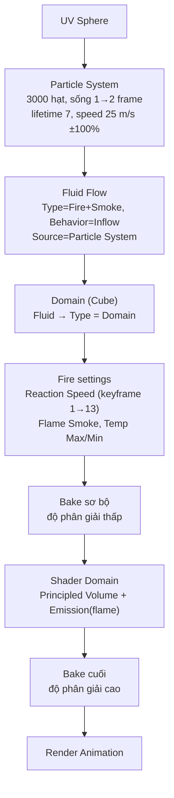
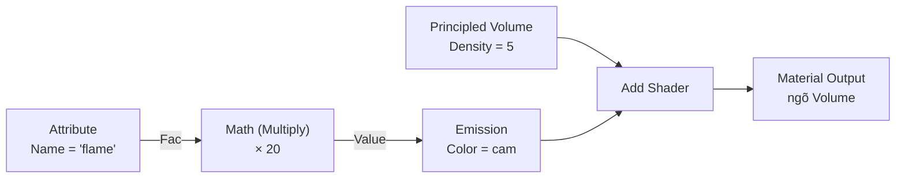

# 01 — Blender Tutorial: Quick Explosion Simulation With Mantaflow in Cycles

## Thông tin bài học

| Thuộc tính       | Nội dung                                                                                     |
| ---------------- | --------------------------------------------------------------------------------------------- |
| **Video**        | *Blender Tutorial: Quick Explosion Simulation With Mantaflow in Cycles*                        |
| **Tác giả**      | tự giới thiệu là "Olaf" trong video (nghe theo bản dịch máy — nhiều khả năng là **Olav**, có thể trùng kênh Olav3D Tutorials chuyên các video "Quick ___ Tutorial", nhưng **không chắc chắn**, chỉ là suy đoán) |
| **Công cụ**      | Blender (hệ mô phỏng chất lỏng/khói/lửa mới **Mantaflow**), render engine **Cycles**            |
| **Thời lượng**   | ~14 phút 34 giây                                                                                |
| **Chủ đề mới hơn bản gốc** | Dựng vụ nổ nhanh: dùng hệ hạt (particle burst) làm **nguồn phát** cho Fluid Flow lửa+khói, thay vì animate một mesh nổ; dựng shader lửa/khói thủ công trong Cycles; bake 2 lần (sơ bộ rồi độ phân giải cao) |

> **Về nguồn ghi chú:** dựa trên bản dịch máy (tiếng Việt) của transcript/phụ đề gốc video, do người dùng cung cấp. Một số cụm bị dịch sai/lạ do là thuật ngữ Blender chuyên ngành, đã diễn giải lại đúng theo ngữ cảnh bên dưới:
> - **"Manta Flow"** → **Mantaflow** (viết liền, tên hệ mô phỏng chất lỏng/khói/lửa của Blender).
> - **"linh hoạt"** (khi nói về tab đặt kiểu Domain cho khối lập phương) → tab **Fluid** trong Physics Properties (dịch nghĩa đen của "Fluid" thay vì giữ nguyên thuật ngữ).
> - **"Bắn cài đặt"** → mục **Fire** (lửa) trong cài đặt Domain, không phải "bắn/súng".
> - **"giá trị thương hiệu"** → nhiều khả năng là thông số **Brownian** (chuyển động Brown, một trường trong Physics của hệ hạt) — không chắc chắn hoàn toàn, tác giả chỉ minh hoạ rồi đặt lại về 0 nên không ảnh hưởng kết quả cuối.
> - **"D5" / "mật độ khói D5"** → đặt **Density = 5** trong node Principled Volume.
> - **"yếu tố"** → **Fac** (Factor), output của node Attribute.
> - **"toot"** (tên file animation) → tác giả tự đặt tên project khi xuất, giữ nguyên phiên âm nghe được, không chắc chữ gốc.
> - Một số con số nghe được (ví dụ giá trị **Flame Smoke = 8**, độ dài mô phỏng sau khi "tăng thêm 50") có thể không chính xác tuyệt đối vì dựa trên giọng đọc qua dịch máy — luôn coi là điểm khởi đầu, tinh chỉnh lại bằng mắt trong Rendered viewport.

---

## 1. Mục tiêu bài học

Sau bài này, người học cần:

* Hiểu ý tưởng cốt lõi: dùng một **cụm hạt phát nổ ngắn hạn** (particle burst, tuổi thọ vài khung hình, tốc độ ban đầu lớn + ngẫu nhiên cao) làm **nguồn phát (Flow Source)** cho một đối tượng Fluid Flow kiểu Fire + Smoke — không cần animate tay một mesh nổ nào.
* Dựng được Domain (miền mô phỏng) và chỉnh mục **Fire** (Reaction Speed, Flame Smoke, Temperature Max/Min) để tạo nhịp lửa bùng rồi tắt dần, để lại khói, theo thời gian.
* Dựng được node shader thủ công cho lửa + khói trong Cycles: **Principled Volume** (khói) cộng **Emission** (lửa, cường độ lấy từ thuộc tính `flame` qua node Attribute) bằng **Add Shader**, nối vào ngõ **Volume** của Material Output.
* Biết quy trình **bake hai lần**: bake sơ bộ độ phân giải thấp để kiểm tra hình dạng/bố cục, rồi bake lại độ phân giải cao sau khi ánh sáng, camera, vật liệu đã chốt.
* Biết các mốc **lưu file thường xuyên** trong suốt quy trình — mô phỏng Mantaflow nặng, dễ crash giữa chừng.

---

## 2. Tạo nguồn hạt phát nổ (00:00–01:26)

Cảnh khởi điểm:

* **X** để xoá khối lập phương mặc định.
* Add → Mesh → **UV Sphere**. Quả cầu này sẽ là vật thể phát hạt (emitter), bản thân nó không hiện trong bản render cuối.
* Chọn quả cầu → tab **Particles** → nhấn dấu **+** để thêm một hệ hạt mới.

Thiết lập hệ hạt cho vụ nổ:

* **Number** (số lượng hạt) = **3000**.
* Emission: **Start** = **1**, **End** = **2** — chỉ phát hạt trong đúng **một khung hình** (toàn bộ 3000 hạt bung ra gần như cùng lúc, tạo hiệu ứng "nổ" thay vì phát liên tục).
* **Lifetime** = **7** (mỗi hạt chỉ tồn tại 7 khung hình rồi biến mất).
* **Velocity → Emission** (tốc độ phát) = **25 m/s** — khá mạnh.
* **Velocity → Randomness** (giá trị ngẫu nhiên) = **100%** — mỗi hạt bay theo hướng/tốc độ lệch nhau đáng kể, tạo hình dạng nổ lởm chởm tự nhiên thay vì một quả cầu hạt đều tăm tắp.

Kết quả: xem trong viewport đã thấy rõ một vụ nổ hạt (particle explosion). Tác giả lưu ý còn nhiều giá trị khác có thể thử nghiệm trong tab Physics của hệ hạt (ví dụ thông số nghe ra "giá trị thương hiệu" — xem ghi chú dịch thuật ở đầu bài), nhưng minh hoạ xong rồi **đặt lại về 0**, không dùng trong bài này.

### Hiển thị hạt cho render

* Vào phần cài đặt **Render** và **Viewport Display** của hệ hạt.
* Lùi về một khung hình trước đó để dễ chỉnh, đặt **Size** (kích thước hiển thị mỗi hạt) = **0.03**.
* Tắt **Show Emitter in Render** (ẩn quả cầu UV Sphere khi render) nhưng **giữ bật trong Viewport** (vẫn cần nhìn thấy nó khi làm việc).

---

## 3. Nguyên lý cốt lõi: hạt làm nguồn phát, không animate mesh nổ

Ý tưởng: thay vì tạo và animate một mesh vụ nổ (khó, tốn công dựng hình), video dùng một **cụm hạt bùng nổ ngắn hạn** — mỗi hạt chỉ sống 7 khung hình, bay ra với tốc độ lớn và ngẫu nhiên cao — làm **nguồn phát** cho một đối tượng Fluid Flow kiểu Fire + Smoke. Mantaflow đọc trực tiếp vị trí từng hạt còn sống làm điểm "gieo" lửa/khói tại đó. Vì các hạt tự bay toả ra theo mọi hướng với tốc độ khác nhau (nhờ Randomness=100%), hình dạng vụ nổ tự nhiên trở nên hỗn loạn, không đối xứng — đúng chất một vụ nổ thật — mà không cần animate tay bất cứ thứ gì.

---

## 4. Fluid Flow cho hệ hạt (01:27–03:30)

* Chọn quả cầu (vẫn đang chọn) → tab **Physics** → **Fluid**.
* **Type** = **Flow**.
* **Flow Type** = **Fire + Smoke**.
* **Flow Behavior** = **Inflow**.
* **Sampling Substeps** = **2** — tăng chất lượng lấy mẫu nguồn phát (quan trọng vì các hạt di chuyển nhanh, cần lấy mẫu nhiều hơn 1 lần/khung hình để không bị "nhảy cóc").
* **Flow Source** = **Particle System** → chọn đúng hệ hạt vừa thêm ở bước 2.
* **Size** (kích thước nguồn phát theo hạt) = **4**.

  * Nhấn **I** để keyframe giá trị này tại khung hình hiện tại.
  * Chuyển sang **khung hình 5**, đặt lại giá trị về **0.5**, nhấn **I** để keyframe lần nữa.
  * → Nguồn phát to ở đầu rồi thu nhỏ nhanh trong 5 khung hình đầu, tạo sự đa dạng cho lõi vụ nổ (giống lõi co lại sau cú bùng ban đầu) thay vì một nguồn phát cỡ cố định suốt clip.
* **Initial Velocity** (hệ số vận tốc ban đầu) = **0.5** — thêm vận tốc riêng cho dòng chảy, không chỉ dựa hoàn toàn vào tốc độ bay của hạt.

**Lưu dự án**: File → Save As, đặt tên, chọn nơi lưu trên máy, Enter.

---

## 5. Domain (miền mô phỏng) + mục Fire (03:37–05:19)

* Add → Mesh → **Cube**.
* **S** để phóng to khối lập phương này sao cho bao trọn toàn bộ không gian vụ nổ dự kiến sẽ lan tới — đây chính là **đường biên mô phỏng**.
* Tab **Physics** → **Fluid** → **Type** = **Domain**.

### Mục Fire trong cài đặt Domain

* **Reaction Speed** (tốc độ phản ứng cháy): tăng lên từ mặc định — giá trị càng cao, tỷ lệ lửa trong vụ nổ càng lớn/cháy càng nhanh. Nhấn **I** để keyframe giá trị (cao) này tại khung hình hiện tại.
* Chuyển sang **khung hình 13**, giảm giá trị này xuống **0.1**, nhấn **I** để keyframe lần nữa.
  → Lửa bùng mạnh lúc đầu rồi tắt dần đến khung 13, chỉ còn lại khói — tạo sự đa dạng cho vụ nổ theo thời gian thay vì cháy đều suốt clip.
* **Flame Smoke**: tăng lên (transcript nghe ra giá trị **tối đa = 8** — con số này có thể không chính xác tuyệt đối do qua dịch máy, coi là điểm khởi đầu và tinh chỉnh bằng mắt) để thêm lượng khói sinh ra từ phần nhiên liệu đang cháy.
* **Temperature Max** = **10**, **Temperature Min** = **5** — mở rộng/nâng dải nhiệt độ dùng để tô màu lửa, nghĩa là vùng lửa (màu vàng/trắng nóng) xuất hiện nhiều hơn trong vụ nổ.

### Độ dài mô phỏng

* Trong Cache của Domain, tăng độ dài mô phỏng (End frame). Có thể giữ ở mức mặc định **50** nếu muốn, nhưng tác giả thích có khói còn vương lại ở cuối clip nên **kéo dài hơn 50** (transcript không nói rõ số khung hình cụ thể — chọn theo mắt, ví dụ 100 hoặc hơn tuỳ độ dài khói mong muốn).

---

## 6. Lưu & bake sơ bộ (05:19–06:08)

* Quay lại đầu timeline, **lưu lần nữa**: File → Save As → nhấn **+** (tăng số phiên bản file) → Save.
* Physics của Domain → Cache → **Bake Data** (Bake All).
* Nhấn **Escape** để tạm dừng khi đạt khoảng 30% — đây là chủ đích để tiếp tục dựng ánh sáng trong lúc phần còn lại chờ bake sau, không phải lỗi.
* Kết quả: đã thấy rõ hình dạng vụ nổ trong preview.

---

## 7. Ánh sáng + chuyển sang Cycles (05:57–07:07)

* Lưu trước khi thiết lập ánh sáng (bản bake cuối độ phân giải cao sẽ chỉ chạy sau khi mọi thứ — ánh sáng, camera, vật liệu — đã chốt, xem mục 12).
* Chọn nguồn sáng mặc định → đổi loại thành **Sun**.
* **Strength** (cường độ) ≈ **3**.
* Nhấn **R** để xoay, rồi **R** lần nữa để xoay tiếp — canh góc chiếu sáng cho vụ nổ (transcript không nói rõ trục cụ thể ở bước này; sẽ tinh chỉnh chính xác hơn ở bước 10 sau khi bake độ phân giải cao).
* Render Properties → **Render Engine** = **Cycles**. Có thể đặt **Device** = **GPU** nếu máy có.
* Vì đang ghi màn hình, tác giả dùng **CPU** (dùng GPU lúc quay có thể làm chậm/giật bản ghi hình).
* **Samples** ≈ **50** — đủ để xem trước trong lúc dựng shader, chưa phải giá trị render cuối.

---

## 8. Node shader thủ công cho lửa + khói (07:07–09:04)

* Vào **Shader Editor**, chọn khối lập phương **Domain**, xem vật liệu của nó.
* **X** để xoá node hiện có (mặc định thường có Principled BSDF — không dùng vì vật liệu domain khói/lửa nối vào ngõ **Volume**, không phải Surface).
* Shift+A → Search → **Principled Volume**.

  * Đặt **Density** = **5** — tăng độ dày/đậm đặc của khói.
* Shift+A → Add → **Add Shader** — dùng để cộng shader khói (Principled Volume) với shader lửa (Emission) sẽ thêm tiếp theo.
* Shift+A → Shader → **Emission** — sẽ phát ra ánh sáng lửa.
* Shift+A → Converter → **Math**, đổi **operation** = **Multiply**.
* Shift+A → Input → **Attribute**:

  * Gõ đúng `flame` (chữ thường) vào ô **Name** — đây là tên thuộc tính dữ liệu độ mạnh lửa mà Mantaflow ghi lên domain sau khi bake; bắt buộc để lấy đúng dữ liệu lửa thật, không phải giá trị tự bịa.
  * Nối output **Fac** của Attribute vào input trên của node Math (Multiply).
  * Đặt input dưới của Math = **20** — hệ số khuếch đại cường độ lửa.
  * Nối output **Value** của Math vào input **Strength** của Emission.
  * Đặt **Color** của Emission thành **màu cam** — màu của ngọn lửa.
* Nối output **Volume** của Principled Volume và output **Emission** của Emission vào hai input của **Add Shader**.
* Nối output Add Shader vào input **Volume** của **Material Output** (không phải Surface — điểm này video không nói rõ bằng lời nhưng là quy tắc bắt buộc của Blender cho vật liệu Domain khói/lửa).
* Chuyển Viewport Shading sang **Rendered**: thấy cả **lửa** lẫn **khói**. Có thể đặt màu World hoàn toàn đen để nền tối, làm nổi bật vụ nổ.
* Quay lại **Solid** shading.

**Lưu dự án lần nữa** (File → Save As → + → Save) — phòng khi crash.

---

## 9. Camera (09:41–11:17)

* **Numpad 0** để xem qua camera, chọn camera.
* Camera Properties → **Clip End** = **10 000** (m) — tăng tầm nhìn xa của camera để không bị cắt hình vụ nổ lớn/lan xa.
* **N** để mở sidebar, bật **Camera to View** (khoá camera vào chế độ xem hiện tại).
* Lùi ra (zoom out) để đảm bảo toàn bộ vụ nổ nằm gọn trong khung hình camera — có thể tắt overlay để nhìn rõ khối Domain khi canh khung.

---

## 10. Tinh chỉnh vật liệu Domain lần 2 (11:17–11:34)

* Quay lại vật liệu của Domain: có thể chỉnh lại **Emission Strength** (độ sáng lửa), **Color** của khói (đậm hơn hoặc đổi tông), **Density** (độ dày khói).
* Tác giả thử gần như không khói, rồi quyết định **giữ nguyên Density = 5** như đã đặt ở bước 8.
* Quay lại **Solid** shading.

---

## 11. Cài đặt render cuối cùng (11:34–12:38)

* Render Properties: **Device** = **GPU** (cho bản render thật, khác với lúc quay dùng CPU).
* **Samples** = **100**.
* **Tile Size** = **512** (dùng GPU); nếu chỉ dùng CPU thì để **64**.
* **Resolution %** = **200** (tăng chi tiết; giữ **100** nếu chỉ cần 1080p).
* Output: **End Frame** = **200** (khớp độ dài mô phỏng), **Frame Rate** = **30** fps.
* Chọn thư mục output trên máy, đặt tên cho animation (tác giả gõ nghe ra là **"toot"** — không chắc chữ gốc, chỉ là tên project tự đặt), **Compression** = **80%**, **File Format** = **PNG** (ghép lại thành video ở bước hậu kỳ).
* **Lưu** (File → Save As → + → Save).

---

## 12. Bake cuối cùng, độ phân giải cao (12:38–13:27)

* Physics của Domain → Cache → **giải phóng bản bake sơ bộ** trước đó (Free Bake).
* Tăng **Resolution Divisions** (độ phân giải lưới mô phỏng): máy cấu hình bình thường nên để khoảng **200**; tác giả dùng GPU mạnh nên đặt **400**.
* **Bake Data** lại — mất **nhiều giờ**.
* **Lưu ngay** sau khi bake xong (phòng crash, tránh mất kết quả bake nặng).

---

## 13. Kiểm tra & render thử (13:27–14:34)

* Chuyển sang **Rendered View**.
* Chọn đèn **Sun**, bật overlay, **R** rồi **Z** để xoay trên trục Z, sau đó **R** rồi **X** để xoay trên trục X — tinh chỉnh hướng sáng lần cuối theo đúng hình dạng lửa/khói đã bake ở độ phân giải cao.
* Xem qua vài khung hình để kiểm tra toàn bộ animation trước khi render thật (đây là lúc thực hiện các điều chỉnh cuối cùng).
* Quay lại **Solid** shading, hài lòng với màu sắc hiện tại.
* **Render → Render Image** để test 1 khung hình đơn lẻ — mất khoảng **6 phút**.
* **Lưu lần cuối** (File → Save As) phòng khi có gì bị crash.
* **Render → Render Animation** để render toàn bộ.

---

## 14. Phím tắt & thiết lập liên quan

| Phím/Thiết lập                     | Công dụng                                                                 |
| ------------------------------------ | ---------------------------------------------------------------------------- |
| **X**                                | Xoá đối tượng/node đang chọn                                                 |
| **Shift+A**                          | Thêm mesh mới / node mới (tuỳ editor đang mở)                                |
| **S**                                | Scale (phóng to/thu nhỏ) đối tượng đang chọn                                 |
| **I**                                | Chèn keyframe cho giá trị đang trỏ chuột tới                                 |
| **R**                                | Rotate (xoay) đối tượng đang chọn; kèm trục (Z, X…) để giới hạn theo trục    |
| **N**                                | Mở/đóng sidebar (Item/View panel) trong viewport                             |
| **Numpad 0**                         | Xem qua camera                                                                |
| **Fluid → Type: Flow**               | Đối tượng phát nguồn (ở đây: quả cầu hạt) cho mô phỏng                       |
| **Flow Source: Particle System**     | Dùng vị trí các hạt còn sống làm nguồn phát lửa/khói, thay vì bề mặt mesh    |
| **Fluid → Type: Domain**             | Khối chứa, xác định biên mô phỏng và nơi bake dữ liệu lửa/khói               |
| **Reaction Speed**                   | Tốc độ cháy nhiên liệu; keyframe để lửa tắt dần theo thời gian               |
| **Flame Smoke**                      | Lượng khói sinh ra từ phần nhiên liệu đang cháy                              |
| **Temperature Max/Min**              | Dải nhiệt độ tô màu lửa — càng rộng/cao càng nhiều vùng lửa nóng             |
| **Principled Volume**                | Node shader thể tích cho khói (Density = độ dày)                             |
| **Attribute (Name: "flame")**        | Đọc dữ liệu độ mạnh lửa Mantaflow ghi lên mesh Domain sau khi bake           |
| **Add Shader**                       | Cộng hai shader/volume (ở đây: khói + lửa) làm một                          |
| Material Output — **Volume**         | Ngõ nhận vật liệu thể tích (khói/lửa), khác với Surface                     |
| **Resolution Divisions**             | Độ phân giải lưới mô phỏng Domain — càng cao càng chi tiết, càng chậm bake   |
| **Clip End** (Camera)                | Khoảng cách xa nhất camera còn hiển thị — cần tăng cho cảnh lớn              |

---

## 15. Lưu ý & lỗi thường gặp

### 15.1. Nhầm nguồn phát là mesh thay vì hệ hạt

Fluid Flow của quả cầu phải đặt **Flow Source = Particle System** và chọn đúng hệ hạt 3000 hạt — nếu để mặc định là **Mesh**, chỉ bề mặt quả cầu (đứng yên phần lớn thời gian, chỉ phát 1 khung hình) sẽ phát lửa/khói, không có hiệu ứng hạt toả ra khắp không gian như video.

### 15.2. Nối Emission/Principled Volume vào Surface thay vì Volume

Vật liệu Domain khói/lửa trong Cycles **luôn nối vào ngõ Volume của Material Output**, không phải Surface. Nếu nối nhầm vào Surface, domain sẽ hiện như một khối rắn có bề mặt phát sáng kỳ lạ thay vì thể tích khói/lửa trong suốt.

### 15.3. Quên đặt tên chính xác "flame" ở node Attribute

Node Attribute phải có tên chính xác `flame` (chữ thường) mới đọc đúng dữ liệu Mantaflow đã bake. Gõ sai tên (hoa/thường, dấu cách thừa) sẽ khiến Fac luôn ra 0 — Emission không bao giờ sáng dù đã bake đúng.

### 15.4. Reaction Speed không keyframe đúng khung hình

Nếu keyframe giá trị cao của Reaction Speed và giá trị 0.1 lệch khung hình so với dự định (không phải khung 1 và khung 13), nhịp lửa bùng-rồi-tắt sẽ xảy ra sớm/muộn hơn ý đồ ban đầu — luôn kiểm tra lại vị trí hai keyframe trên Timeline/Graph Editor.

### 15.5. Bake cũ còn "dính" khi đổi tham số

Sau khi đổi bất kỳ tham số nào của Domain (Resolution Divisions, Fire settings…), phải **Free Bake** trước khi Bake Data lại — nếu không, Blender có thể giữ lại một phần cache cũ không khớp với tham số mới, cho kết quả sai lệch khó chẩn đoán.

### 15.6. Quên lưu trước các bước bake nặng

Video nhấn mạnh lưu file **nhiều lần** (sau khi thiết lập hạt, sau khi thiết lập Domain, trước bake sơ bộ, trước bake cuối, trước render) — mô phỏng Mantaflow độ phân giải cao (400) chạy nhiều giờ, mất file giữa chừng do crash đồng nghĩa mất toàn bộ thời gian bake đó.

### 15.7. Dùng GPU lúc quay màn hình làm chậm bản ghi

Đây là lưu ý riêng của tác giả khi làm tutorial, không phải lỗi kỹ thuật: nếu vừa ghi màn hình vừa render bằng GPU, hiệu năng ghi hình có thể giảm — cân nhắc dùng CPU khi vừa preview vừa quay, chỉ chuyển hẳn sang GPU cho lần render/bake cuối cùng.

---

## 16. Checklist thực hành

### Nguồn hạt & Fluid Flow

* [ ] Dựng hệ hạt burst: 3000 hạt, phát 1 khung hình (Start=1, End=2), Lifetime=7, Emission Speed=25, Randomness=100%.
* [ ] Đặt Fluid Flow cho quả cầu: Type=Flow, Flow Type=Fire+Smoke, Behavior=Inflow, Sampling Substeps=2, Flow Source=Particle System.
* [ ] Keyframe Size của Flow Source (4 → 0.5 ở khung 5), đặt Initial Velocity=0.5.

### Domain & Fire

* [ ] Dựng khối Domain đủ lớn bao trọn vụ nổ, Fluid Type=Domain.
* [ ] Keyframe Reaction Speed (cao ở khung đầu → 0.1 ở khung 13).
* [ ] Chỉnh Flame Smoke, Temperature Max/Min để thêm khói và mở rộng vùng lửa.
* [ ] Tăng độ dài mô phỏng (Cache End) nếu muốn khói lưu lại ở cuối clip.

### Shader & bake

* [ ] Dựng đúng graph: Principled Volume (Density=5) + Emission (Strength = Attribute "flame" Fac × 20, Color cam) → Add Shader → Material Output (Volume).
* [ ] Bake sơ bộ để kiểm tra hình dạng, sau đó bake lại độ phân giải cao (Resolution Divisions 200–400) sau khi ánh sáng/camera/vật liệu đã chốt.

### Camera, ánh sáng, render

* [ ] Đặt Clip End camera đủ lớn (10 000), khoá Camera to View để canh khung.
* [ ] Dùng Sun light, Strength≈3, xoay đúng hướng sau khi có kết quả bake độ phân giải cao.
* [ ] Cấu hình render cuối: Cycles, GPU, Samples=100, Resolution=200%, End Frame=200, FPS=30, output PNG nén 80%.
* [ ] Lưu file thường xuyên ở mọi mốc quan trọng, đặc biệt trước và sau các lần bake nặng.

---

## 17. Tóm tắt

Kỹ thuật cốt lõi của video: thay vì animate một mesh vụ nổ, dùng một **cụm hạt phát nổ ngắn hạn** (3000 hạt, sống 7 khung hình, tốc độ 25 m/s ± 100% ngẫu nhiên, phát trong đúng 1 khung hình) làm **Flow Source** cho một đối tượng Fluid Flow kiểu **Fire + Smoke** — Mantaflow tự đọc vị trí từng hạt còn sống để "gieo" lửa/khói, cho hình dạng nổ hỗn loạn tự nhiên mà không cần tay animate. Domain bao quanh vụ nổ được keyframe **Reaction Speed** (cao → 0.1 ở khung 13) để lửa bùng rồi tắt dần thành khói theo thời gian, cùng **Flame Smoke** và **Temperature Max/Min** để kiểm soát lượng khói và vùng lửa nóng. Vật liệu Domain trong Cycles được dựng thủ công: **Principled Volume** (khói, Density=5) cộng **Emission** (lửa, Strength lấy từ Fac của node Attribute đọc thuộc tính `flame` nhân 20, Color cam) qua **Add Shader**, nối vào ngõ **Volume** (không phải Surface) của Material Output. Quy trình bake diễn ra **hai lần**: bake sơ bộ độ phân giải thấp để kiểm tra bố cục trong lúc dựng ánh sáng/camera/vật liệu, rồi bake lại ở độ phân giải cao (200–400) sau khi mọi thứ đã chốt, trước khi render animation cuối cùng bằng Cycles/GPU.
