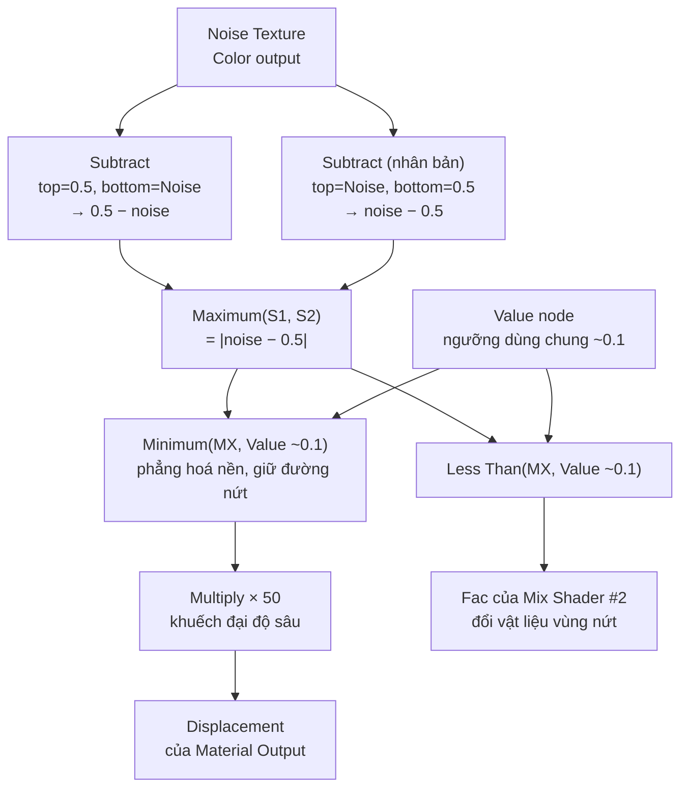

# 01 — Blender Tutorial: Surface Cracks

## Thông tin bài học

| Thuộc tính       | Nội dung                                                                                     |
| ---------------- | --------------------------------------------------------------------------------------------- |
| **Video**        | *Blender Tutorial: Surface Cracks*                                                             |
| **Kênh**         | tutor4u                                                                                         |
| **Công cụ**      | Blender 2.7x, render engine **Cycles**                                                          |
| **Thời lượng**   | ~8 phút 24 giây                                                                                 |
| **Chủ đề chính** | Tạo vết nứt bề mặt hoàn toàn procedural (không texture ảnh) bằng cách "gấp" Noise Texture thành đường nứt, dùng cho cả Displacement lẫn đổi vật liệu vùng nứt |

> **Về nguồn ghi chú:** dựa trên bản dịch máy (tiếng Việt) của transcript/phụ đề gốc video, do người dùng cung cấp. Một số cụm bị dịch sai do là thuật ngữ Blender chuyên ngành (ví dụ "shader hỗn hợp" = **Mix Shader**, "trọng lượng lớp" = **Layer Weight**, "bộ chuyển đổi" = nhóm node **Converter**, "kiểu math ít hơn" = phép toán **Less Than**, "đầu vào yếu tố shaders" = **Fac** của Mix Shader) — đã diễn giải lại đúng theo ngữ cảnh bên dưới. Riêng giá trị số của node **Value** dùng làm ngưỡng chung (mục 4.5) transcript nghe ra "2.01", nhưng đối chiếu với các giá trị khác trong video (Minimum đặt 0.1, ví dụ thu hẹp vết nứt dùng 0.02) thì nhiều khả năng con số thật gần **0.1** hơn — đã ghi chú rõ sự không chắc chắn này, nên tự tinh chỉnh bằng mắt thay vì chép đúng số.

---

## 1. Mục tiêu bài học

Sau bài này, người học cần:

* Hiểu kỹ thuật **"ridged noise"**: biến một Noise Texture mượt thành mạng lưới đường nứt mảnh bằng các node Math cơ bản (Subtract, Maximum, Minimum, Multiply) — không cần bất kỳ texture ảnh nào.
* Dựng được node setup dùng **đúng một hoạ tiết vết nứt cho hai việc**: Displacement (độ lõm vật lý) và mặt nạ đổi vật liệu (vùng nứt khuếch tán/tối hơn vùng bề mặt bóng xung quanh).
* Biết cách dùng Emission làm công cụ **xem trước tạm thời** khi ráp một chuỗi node dài, thay vì phải đoán mò.
* Biết những tham số nào điều khiển **độ sâu**, **độ rộng**, và **vị trí** của vết nứt, và vì sao chúng phụ thuộc lẫn nhau.

---

## 2. Giới thiệu & thiết lập cảnh (00:00–01:26)

Video mở đầu: đây là cách thêm vết nứt vào bề mặt một đối tượng bằng phương pháp **thủ tục (procedural)**, không cần texture ảnh bên ngoài. Video dùng **Blender 2.7**.

Cảnh khởi điểm:

* Một quả cầu (sphere) đặt trên một mặt phẳng (plane).
* Chiếu sáng bằng đèn **Spot**: Size = 1, Power = 5000 W, Spot Size (kích thước hình nón chiếu) = 35°.
* Render engine đặt là **Cycles Render**.

Thiết lập giao diện:

* Chuyển sang screen layout **Compositing** (có sẵn tab Shader Editor).
* Đảm bảo **Use Nodes** đang bật (có dấu check) cho vật liệu.
* Chọn quả cầu để xem node setup của nó trong Shader Editor.
* Chuyển Viewport Shading sang **Rendered** để thấy trực tiếp thay đổi.
* Đóng Properties panel để có thêm không gian làm việc với node.

### Vật liệu nền có sẵn

Vật liệu ban đầu của quả cầu đã có:

* **Diffuse BSDF** và **Glossy BSDF**, trộn bằng một **Mix Shader**.
* **Layer Weight** node (Shift+A → Input → Layer Weight) cắm vào **Fac** của Mix Shader, với **Blend = 0.1**: những vùng bề mặt nghiêng ra xa camera (góc nhìn xiên/rìa) dùng nhiều **Glossy** hơn, vùng bề mặt hướng thẳng về camera dùng nhiều **Diffuse** hơn — hiệu ứng Fresnel kinh điển cho vật liệu nhìn tự nhiên hơn.

---

## 3. Nguyên lý cốt lõi: biến Noise thành đường nứt

Ý tưởng: `Maximum(0.5 − noise, noise − 0.5)` về mặt toán học chính là `|noise − 0.5|` — một dạng "gấp đôi" (rectify) giá trị noise quanh điểm giữa 0.5. Kết quả là một hoạ tiết có các **đường mảnh gần 0** đúng tại những nơi noise gốc đi qua giá trị 0.5 — đây chính là mạng lưới vết nứt. Đúng một hoạ tiết `|noise − 0.5|` này được tái sử dụng cho cả Displacement (qua Minimum + Multiply) lẫn mặt nạ đổi vật liệu (qua Less Than).

---

## 4. Dựng node setup từng bước (01:26–07:06)

### 4.1. Noise Texture + Emission để xem trước

* Thêm **Noise Texture**: Shift+A → Texture → Noise Texture.
* Vì noise sẽ được nối vào **Displacement** ở cuối cùng, nhưng để xem trực quan hoạ tiết trong lúc ráp các node Math, tạm thời nối nó vào **Surface** của Material Output thông qua một shader **Emission**:

  * Thêm Emission: Shift+A → Shader → Emission.
  * Nối output **Color** của Noise Texture vào input **Color** của Emission.
  * Nối output Emission vào input **Surface** của Material Output.
* Lúc này quả cầu hiển thị đúng hoạ tiết Noise Texture thô.

### 4.2. Hai node Subtract "gấp" noise quanh 0.5

* Thêm một node **Math**: Shift+A → Converter → Math. Nối output Color của Noise Texture vào input trên của nó.
* Đổi phép toán (operation) thành **Subtract**.
* Di chuyển kết nối Noise Color từ input **trên** xuống input **dưới cùng**, và đảm bảo input **trên cùng** giữ giá trị mặc định **0.5**. Node này giờ tính `0.5 − noise` — thao tác này cũng khiến hoạ tiết trên quả cầu "quy tâm" quanh giá trị 0.
* **Nhân bản** node Subtract này bằng **Shift+D**. Ở bản sao, nối Noise Color vào input **trên cùng**, và đảm bảo input **dưới cùng** giữ giá trị **0.5**. Node này tính `noise − 0.5`.
* Hai node Subtract giờ cho ra giá trị **ngược dấu nhau** — nếu đổi chỗ input/output giữa hai node này, màu trên quả cầu sẽ đảo ngược (tác giả minh hoạ trực tiếp điều này).

### 4.3. Maximum — tạo đường nứt bằng |noise − 0.5|

* Thêm một node **Math** khác, đổi phép toán thành **Maximum**.
* Nối output của Subtract thứ nhất (`0.5 − noise`) vào input trên, output của Subtract thứ hai (`noise − 0.5`) vào input dưới.
* Output của Maximum = giá trị **lớn hơn** trong hai input = `|noise − 0.5|`. Quả cầu giờ hiện vài **đường màu đen** (giá trị gần 0) nổi trên nền xám — đây chính là các đường nứt tiềm năng, nhưng phần còn lại của bề mặt vẫn chưa đồng nhất.

### 4.4. Minimum — "phẳng hoá" phần nền, chỉ giữ đường nứt

* Thêm một node Math khác, đổi phép toán thành **Minimum**.
* Nối output của Maximum vào input trên; đặt input dưới (giá trị ngưỡng) = **0.1**.
* `Minimum(|noise−0.5|, 0.1)`: mọi giá trị lớn hơn 0.1 bị "cắt" về đúng 0.1 — toàn bộ nền trở thành một mức **xám đậm đồng nhất**, chỉ còn các đường nứt (giá trị gần 0) nổi tối hơn hẳn.

### 4.5. Multiply — khuếch đại thành Displacement

* Thêm một node Math khác, đổi phép toán thành **Multiply**, đặt giá trị nhân = **50** (giúp làm sáng hẳn phần nền xám đậm lên, trong khi đường nứt vẫn giữ giá trị gần 0 → tương phản mạnh).
* Nối output của Minimum vào input trên của Multiply.
* Đến đây, coi như đã xong việc dùng Emission để xem trước: **chọn Emission node → nhấn X để xoá**.
* Nối lại: **Mix Shader** gốc (Diffuse+Glossy qua Layer Weight) → **Surface** của Material Output; **Multiply** → **Displacement** của Material Output.
* Quả cầu giờ có vết nứt thật dưới dạng **độ lõm vật lý** (Displacement), không còn là hình ảnh phẳng.

### 4.6. Node Value dùng chung + Mix Shader thứ hai cho vật liệu vùng nứt

Vết nứt lúc này chỉ lõm xuống nhưng vẫn cùng vật liệu bóng (Glossy) như phần còn lại — cần thêm bước đổi vật liệu vùng nứt sang khuếch tán/tối hơn:

* **Nhân bản Mix Shader** gốc (chọn nó, Shift+D), đặt bản sao này sẽ trở thành Mix Shader "cấp hai" nối ra Surface (thay cho Mix Shader gốc).
* **Nhân bản Diffuse BSDF** gốc (Shift+D), nối vào **input dưới** của Mix Shader thứ hai này, và **đổi màu** của nó **tối hơn** một chút — đây là màu vật liệu bên trong vết nứt.
* Thêm một node Math, đổi phép toán thành **Less Than**. Nối output của node **Maximum** (bước 4.3, tức `|noise−0.5|`) vào input trên.
* Thêm một node **Value** (Shift+A → Input → Value), đặt giá trị (mặc định gợi ý **~0.1** — xem lưu ý ở đầu bài về độ chắc chắn của con số này). Nối output của Value node vào **cả hai chỗ**:

  1. Input dưới của node **Minimum** (bước 4.4) — thay cho hằng số 0.1 gõ tay trước đó.
  2. Input dưới của node **Less Than** vừa thêm.

  Làm vậy để **ngưỡng của Displacement và ngưỡng của mặt nạ vật liệu luôn khớp nhau** — chỉ cần chỉnh một node Value là cả hai cùng đổi theo.
* Nối output của **Less Than** vào **Fac** của Mix Shader thứ hai. Theo đúng ngữ nghĩa Mix Shader: khi input trên (`|noise−0.5|`) **nhỏ hơn** ngưỡng (bên trong vết nứt) → Fac = 1 → chọn shader ở input dưới (Diffuse tối, vật liệu vết nứt); khi không nhỏ hơn (bên ngoài vết nứt) → Fac = 0 → giữ nguyên Mix Shader gốc (Diffuse+Glossy).
* Nối output Mix Shader thứ hai này vào **Surface** của Material Output (thay cho kết nối trực tiếp từ Mix Shader gốc ở bước 4.5).

---

## 5. Tinh chỉnh hình dạng vết nứt (05:00–08:12)

### 5.1. Scale, Detail, Distortion của Noise Texture

* **Scale**: giá trị càng nhỏ, hoạ tiết càng lớn (ít vết nứt hơn, khoảng cách xa hơn). Video giảm xuống **2**.
* **Detail**: tăng lên **10** để làm các cạnh vết nứt **răng cưa, gồ ghề** hơn thay vì mượt mà đơn điệu.
* Giá trị input còn lại của Noise Texture (Distortion) được giảm xuống **0.5** để thêm biến dạng nhẹ cho hoạ tiết.

### 5.2. Độ sâu vết nứt — node Multiply

* Node **Multiply** (bước 4.5) điều khiển **độ sâu** vết nứt qua Displacement: giá trị càng cao, vết nứt càng sâu.

  * Giảm xuống **25** → vết nứt nông hơn.
  * Tăng lên **200** → vết nứt sâu hơn hẳn.

### 5.3. Độ rộng vết nứt — node Value dùng chung

* Node **Value** dùng chung ở bước 4.6 điều khiển **độ rộng** vết nứt: giá trị càng lớn, vết nứt càng rộng; giảm xuống ví dụ **0.02** làm vết nứt **hẹp lại** đáng kể.
* **Lưu ý phụ thuộc lẫn nhau**: nếu đổi Scale của Noise Texture, gần như chắc chắn phải chỉnh lại cả node Value (độ rộng) lẫn node Multiply (độ sâu) để giữ vết nứt trông cân đối — ba tham số này không độc lập với nhau.

### 5.4. Vị trí vết nứt

* Mở rộng panel của node Noise Texture để thấy phần **Mapping** tích hợp sẵn trong node (Blender 2.7x: Noise Texture có Location/Rotation/Scale ngay trong node, không cần node Mapping riêng).
* Chỉnh giá trị **Rotation**, cụ thể trục **Z**, để xoay/dịch chuyển vị trí hoạ tiết vết nứt trên bề mặt.

---

## 6. Phím tắt & node liên quan

| Node/Công cụ                | Công dụng                                                                 |
| ----------------------------- | ---------------------------------------------------------------------------- |
| **Noise Texture**             | Nguồn hoạ tiết gốc, dùng Mapping tích hợp sẵn để chỉnh vị trí/xoay           |
| **Math — Subtract** (×2)      | `0.5−noise` và `noise−0.5`, chuẩn bị cho bước Maximum                       |
| **Math — Maximum**            | `|noise−0.5|` — tạo đường nứt mảnh từ noise mượt                            |
| **Math — Minimum**            | Cắt/"phẳng hoá" phần nền theo một ngưỡng, giữ lại đường nứt                  |
| **Math — Multiply**           | Khuếch đại giá trị đã phẳng hoá; nối Displacement → điều khiển độ sâu        |
| **Math — Less Than**          | So `|noise−0.5|` với ngưỡng để làm Fac đổi vật liệu vùng nứt                 |
| **Value** (Input)             | Node giá trị dùng chung cho cả ngưỡng Minimum và ngưỡng Less Than            |
| **Layer Weight**              | Tạo hiệu ứng Fresnel: Fac cho Mix Shader gốc (Diffuse ↔ Glossy)              |
| **Mix Shader** (×2)           | #1: Diffuse+Glossy nền; #2: nền ↔ Diffuse tối cho vùng nứt                   |
| **Emission**                  | Dùng tạm để xem trước hoạ tiết/giá trị Math node trong lúc ráp node          |
| Material Output — **Displacement** | Nhận giá trị Multiply, tạo độ lõm vật lý thật cho vết nứt              |
| Shift+A                        | Thêm node mới trong Shader Editor                                            |
| Shift+D                        | Nhân bản node đang chọn                                                      |
| X (khi chọn node)              | Xoá node                                                                     |

---

## 7. Lưu ý & lỗi thường gặp

### 7.1. Nhầm input trên/dưới ở hai node Subtract

Hai node Subtract chỉ khác nhau ở **vị trí** input Noise Color (trên hay dưới) — nếu cắm nhầm, dấu của kết quả bị đảo ngược và bước Maximum ở sau sẽ không cho ra đúng đường nứt mảnh như mong muốn. Luôn kiểm tra: Subtract #1 = `0.5(trên) − noise(dưới)`, Subtract #2 = `noise(trên) − 0.5(dưới)`.

### 7.2. Ngưỡng Minimum và ngưỡng Less Than lệch nhau

Nếu gõ tay hai giá trị ngưỡng khác nhau cho Minimum và Less Than (thay vì dùng chung một node Value), vùng **lõm xuống** (Displacement) và vùng **đổi vật liệu tối** sẽ không khớp vị trí — nhìn sẽ thấy "viền" lệch giữa chỗ lõm và chỗ tối màu. Luôn dùng một node Value duy nhất cho cả hai.

### 7.3. Quên xoá node Emission preview

Emission chỉ là công cụ tạm để xem trước — nếu quên xoá và vô tình để nó nối vào Surface, vật thể sẽ phát sáng phẳng thay vì hiển thị đúng vật liệu Diffuse/Glossy thật.

### 7.4. Đổi Scale mà không chỉnh lại Value/Multiply

Vết nứt trông "quá dày/quá mờ" hoặc "quá nông/quá sâu" sau khi đổi Scale của Noise Texture thường không phải do sai node, mà do quên tinh chỉnh lại node Value (độ rộng) và Multiply (độ sâu) cho khớp với mật độ hoạ tiết mới.

### 7.5. Giá trị số trong ghi chú chỉ là điểm khởi đầu

Vì ghi chú này dựa trên bản dịch máy của giọng đọc, một số con số (đặc biệt giá trị ban đầu của node Value, transcript nghe ra "2.01") có thể không chính xác tuyệt đối. Luôn coi các số trong bài là điểm khởi đầu hợp lý, tinh chỉnh lại bằng mắt trong Rendered viewport.

---

## 8. Checklist thực hành

### Nguyên lý

* [ ] Hiểu vì sao `Maximum(0.5−noise, noise−0.5) = |noise−0.5|` tạo ra đường nứt mảnh từ noise mượt.
* [ ] Hiểu vì sao dùng chung một node Value cho hai ngưỡng (Minimum và Less Than) giúp Displacement và vật liệu vùng nứt luôn khớp nhau.

### Node setup

* [ ] Dựng đúng hai node Subtract (vị trí input trên/dưới khác nhau) và node Maximum.
* [ ] Dựng được Minimum → Multiply → cắm vào Displacement của Material Output.
* [ ] Dựng được Mix Shader thứ hai (nền ↔ Diffuse tối) với Fac = Less Than(Maximum output, cùng ngưỡng Value).
* [ ] Dùng Emission tạm thời để xem trước, rồi xoá và ráp lại Surface/Displacement thật.

### Tinh chỉnh

* [ ] Biết chỉnh Scale/Detail/Distortion của Noise Texture và hiểu tác động của từng tham số.
* [ ] Biết Multiply điều khiển độ sâu, node Value điều khiển độ rộng vết nứt.
* [ ] Biết khi đổi Scale thì phải chỉnh lại cả Value lẫn Multiply.
* [ ] Biết dùng Rotation (đặc biệt trục Z) trong Mapping tích hợp của Noise Texture để đổi vị trí vết nứt.

---

## 9. Tóm tắt

Kỹ thuật cốt lõi của video: dùng hai node **Subtract** đảo input cho nhau (`0.5−noise` và `noise−0.5`) rồi lấy **Maximum** — tương đương `|noise−0.5|` — để biến một Noise Texture mượt thành mạng lưới **đường nứt mảnh**. Hoạ tiết này được **tái sử dụng hai lần**: qua **Minimum** (phẳng hoá nền theo một ngưỡng) rồi **Multiply** (khuếch đại) để làm **Displacement** thật cho độ lõm vật lý; và qua **Less Than** (so với cùng ngưỡng đó) để làm **Fac** cho một **Mix Shader** thứ hai, đổi vùng nứt sang vật liệu Diffuse tối hơn thay vì giữ nguyên Glossy như phần bề mặt còn lại. Một node **Value** duy nhất cấp ngưỡng cho cả hai nhánh (Minimum và Less Than) để đảm bảo vùng lõm và vùng đổi màu luôn khớp vị trí. Ba tham số — Scale của Noise Texture, giá trị Value (độ rộng), và giá trị Multiply (độ sâu) — phụ thuộc lẫn nhau, nên đổi cái này thường cần chỉnh lại hai cái kia; vị trí hoạ tiết có thể xoay/dịch qua phần Mapping tích hợp sẵn trong node Noise Texture.
