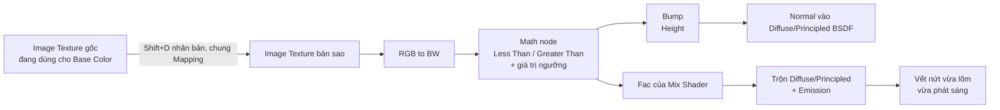
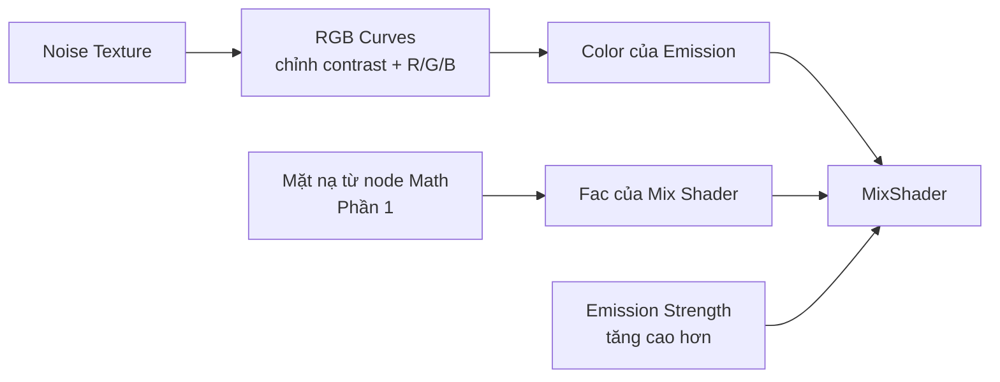

# 01 — How to Create Glowing Surface Cracks

## Thông tin bài học

| Thuộc tính       | Nội dung                                                                                     |
| ---------------- | --------------------------------------------------------------------------------------------- |
| **Video**        | *How to Create Glowing Surface Cracks \|\| Blender Tutorial*                                   |
| **Kênh/Tác giả** | TooEazyCG (Joshua Ader)                                                                        |
| **Thời lượng**   | ~4 phút 27 giây                                                                                 |
| **Chủ đề chính** | Dùng chính texture màu (diffuse) của vật liệu làm mặt nạ, qua node **Math (Less Than/Greater Than)**, để tạo độ lồi lõm (Bump) và ánh sáng (Emission) đúng vị trí khe nứt |

> **Về nguồn ghi chú:** dựa trên bản dịch máy (tiếng Việt) của transcript/phụ đề gốc video, do người dùng cung cấp. Bản dịch máy có nhiều cụm bị dịch sai/lạ do là video kỹ thuật (ví dụ "node đeo mặt nạ" thực chất là **node Math**, "cục u" là **bump/bump map**, "pha trộn một lượt nợ" là **Mix Shader**, "độ bền" là **Strength**, "điểm mạnh" ở bước Math thực chất là **giá trị ngưỡng/threshold**) — các thuật ngữ này đã được diễn giải lại đúng theo ngữ cảnh Blender chuẩn bên dưới. Vì có transcript thật, node setup mô tả trong bài bám sát đúng thao tác tác giả làm trong video (khác với suy đoán chung chung).

---

## 1. Mục tiêu bài học

Sau bài này, người học cần:

* Hiểu nguyên lý cốt lõi: **texture màu (diffuse/color map) đã có sẵn của vật liệu có thể tái sử dụng làm mặt nạ vết nứt**, không cần vẽ mask riêng — miễn là texture có đủ tương phản sáng/tối ở các khe/vân.
* Dựng đúng node setup của video, dùng **một node Math (Less Than / Greater Than)** làm "công tắc ngưỡng" điều khiển cả:

  1. Độ lồi lõm vật lý (Bump) đúng vị trí khe nứt.
  2. Ánh sáng (Emission) phát ra đúng từ các khe nứt đó, qua Mix Shader.
* Biết cách thêm màu sắc cho ánh sáng (Noise Texture + RGB Curves) thay vì một màu Emission phẳng.
* Biết vì sao cắm Emission thẳng vào Mix Shader mà chưa nối Fac sẽ ra "rác" — và cách sửa.

---

## 2. Giới thiệu (00:00–00:20)

Video mở đầu bằng lời giới thiệu ngắn: đây là cách **nhanh chóng tạo vết nứt phát sáng trên bất kỳ bề mặt nào trong Blender, dùng bất kỳ texture hình ảnh nào** — hữu ích để tạo vết nứt phát sáng trên đất/đá cho một cảnh giả tưởng, một bản thiết kế (blueprint), hay bất cứ ý tưởng nào phù hợp. Tác giả nhấn mạnh quy trình "khá nhanh và đơn giản". Kênh thực hiện là **TooEazyCG**, tác giả **Joshua Ader**.

---

## 3. Nguyên lý cốt lõi

Texture màu (diffuse) của vật liệu thường đã có sẵn các đường vân/khe **tối hơn** phần còn lại — đây chính là "khe hở và ngóc ngách" mà video muốn ánh sáng phát ra từ bên trong. Thay vì tạo mask riêng, video **nhân bản chính node Image Texture** đang dùng cho màu, chuyển nó sang đen trắng, rồi dùng một node **Math** để "ép ngưỡng" giá trị đen trắng đó thành mặt nạ 0/1 — và tái sử dụng đúng mặt nạ ấy cho cả Bump lẫn Fac của Mix Shader.

Một mặt nạ (output của node Math) được **dùng lại hai lần** cho hai mục đích khác nhau — displacement và glow luôn khớp đúng vị trí vì cùng xuất phát từ một nguồn duy nhất.

---

## 4. Phần 1 — Dựng vết nứt lồi lõm + phát sáng (00:29–03:03)

### 4.1. Nhân bản Image Texture đang dùng cho màu

* Bắt đầu từ Shader Editor, với **Image Texture** (bản đồ màu/diffuse) đã cắm sẵn vào material.
* Chọn node Image Texture đó, nhấn **Shift+D** để nhân bản, đặt bản sao ở chỗ trống bất kỳ.
* Nếu texture gốc đang dùng chung một node **Mapping** để chỉnh UV, hãy chắc chắn cắm cùng một output của Mapping vào input **Vector** của cả node Image Texture gốc **và** node bản sao — để cả hai luôn khớp đúng UV với nhau.

### 4.2. Chuyển sang đen trắng (RGB to BW)

* Vì muốn ánh sáng phát ra dựa trên giá trị **đen trắng** của texture, hãy nghĩ tới việc dùng một bump map/displacement map thật cho bước này nếu bạn có sẵn — video khuyên dùng bản đồ đó thay cho bản đồ màu gốc để chân thực hơn.
* Nếu không có bump/displacement map riêng, dùng ngay bản sao Image Texture ở bước 4.1: nhấn **Shift+A** (hoặc nút Add), tìm node **RGB to BW**.
* Cắm output **Color** của Image Texture (bản sao) vào input **Color** của node **RGB to BW** — node này chuyển giá trị đỏ/xanh lá/xanh dương thành một giá trị xám (grayscale) duy nhất.
* Có thể kiểm tra nhanh bằng cách tạm cắm output của RGB to BW vào một shader **Diffuse** để xem texture giờ chỉ còn đen trắng, không còn màu.

### 4.3. Tạo mặt nạ bằng node Math (ngưỡng Less Than / Greater Than)

* Thêm một node **Math**. Cắm output **Value** của RGB to BW vào input trên của Math node.
* Đổi phép toán (operation) của Math node từ mặc định **Add** sang **Less Than**. Giá trị ở ô dưới (bottom value) đóng vai trò **ngưỡng (threshold)**: những điểm có giá trị xám nhỏ hơn ngưỡng này (tức các vùng tối — chính là khe nứt) sẽ ra 1 (trắng), phần còn lại ra 0 (đen).
* Có thể xem trước hiệu ứng bằng cách tạm cắm output của Math node vào một shader Diffuse.
* Đổi phép toán sang **Greater Than** sẽ **đảo ngược** mặt nạ — hữu ích nếu muốn khe nứt và bề mặt đổi vai trò cho nhau.
* Giá trị ngưỡng (bottom value) chính là núm chỉnh: kéo lên/xuống để tăng/giảm lượng vết nứt hiện ra là mặt nạ.

### 4.4. Tạo độ lồi lõm vật lý bằng Bump

* Thêm node **Bump**. Cắm output **Value** của Math node vào input **Height** của Bump.
* Cắm output **Normal** của Bump vào input **Normal** của shader bề mặt (Diffuse BSDF trong video; nếu dùng **Principled BSDF** hoặc shader khác, quy trình cắm Normal hoàn toàn tương tự).

### 4.5. Trộn shader bề mặt với Emission bằng Mix Shader

* Thêm node **Mix Shader**: cắm shader bề mặt (Diffuse/Principled đã có Bump ở bước 4.4) vào input đầu tiên.
* Thêm node **Emission**, cắm vào input còn lại (dưới) của Mix Shader.
* **Nếu dừng ở đây và chưa nối Fac**, kết quả sẽ là "rác" — Emission phủ tùm lum hoặc không đúng chỗ — vì Blender chưa được chỉ rõ **phát sáng ở đâu** trên texture.
* Cắm output **Value** của node Math (bước 4.3) vào **Fac** của Mix Shader. Ngay khi nối xong, chỉ các khe nứt/khoảng hở trên texture mới phát sáng — đúng như mong muốn.
* Nối output Mix Shader vào **Material Output → Surface**.

### 4.6. Tinh chỉnh

* Vẫn có thể đổi phép toán Math sang **Greater Than** để đảo ngược hiệu ứng đã tạo (glow xuất hiện ở phần ngược lại).
* Giá trị ngưỡng (bottom value) của Math node đồng thời đóng vai trò **ngưỡng lẫn "tỷ lệ" (scale)** cho vùng phát sáng — chỉnh tới khi vừa ý là được.

Đến đây đã hoàn tất phần chính: vết nứt phát sáng trên vật thể.

---

## 5. Phần 2 (tuỳ chọn) — Thêm màu cho ánh sáng (03:05–03:49)

Video chỉ cần thêm hai node nữa để có màu sắc "chất" hơn cho ánh sáng, thay vì một màu Emission phẳng:

* Thêm node **Noise Texture**, cắm output **Color** của nó vào input **Color** của node **Emission** (thay cho màu đơn sắc trước đó). Màu ánh sáng lập tức đổi theo hoạ tiết noise.
* Tác giả lưu ý: dùng Noise Texture chủ yếu vì **hoạ tiết màu của nó nhìn đẹp làm màu phát sáng đặc (solid)**, chứ không thật sự chân thực trừ khi vật thể nhỏ trong cảnh — nên cũng không cần quá cầu kỳ.
* Để kiểm soát màu tốt hơn, thêm node **RGB Curves** giữa Noise Texture và Emission: chỉnh đường cong để tăng/giảm **độ tương phản (contrast)** cùng từng kênh **Red / Green / Blue** riêng, cho tới khi ra đúng tông màu mong muốn.
* Cuối cùng, tăng **Strength** của Emission lên cao hơn mức mặc định — tác giả nói vui là "quên nhắc" bước này nhưng cần thiết để ánh sáng đủ nổi bật.
* **Mặt nạ ở Fac của Mix Shader (từ Phần 1) không đổi** — Phần 2 chỉ thay đổi *màu gì phát sáng*, không thay đổi *phát sáng ở đâu*.

---

## 6. Quy trình thực hành gợi ý

### Bước 1 — Chuẩn bị

* Có sẵn material với **Image Texture** (bản đồ màu) đã cắm vào Base Color của shader bề mặt (Diffuse hoặc Principled BSDF).

### Bước 2 — Nhân bản texture

* Chọn Image Texture, **Shift+D** nhân bản; nếu có node Mapping, cắm chung Vector cho cả hai bản.

### Bước 3 — Đen trắng

* Thêm **RGB to BW**, cắm Color của bản sao Image Texture vào. (Ưu tiên dùng bump/displacement map thật thay cho bước này nếu có sẵn.)

### Bước 4 — Mặt nạ bằng Math

* Thêm **Math**, đổi operation thành **Less Than**, cắm Value của RGB to BW vào input trên, chỉnh giá trị ngưỡng ở input dưới.
* Kiểm tra bằng cách tạm cắm ra Diffuse; thử đổi sang **Greater Than** nếu muốn đảo ngược.

### Bước 5 — Bump

* Thêm **Bump**, cắm Value của Math vào Height, Normal của Bump ra Normal của shader bề mặt.

### Bước 6 — Mix Shader + Emission

* Thêm **Mix Shader** (shader bề mặt + Emission), cắm Value của Math vào **Fac**.
* Nối Mix Shader ra Material Output.

### Bước 7 — (Tuỳ chọn) Màu cho ánh sáng

* Thêm **Noise Texture → RGB Curves → Color của Emission**; tăng **Strength** của Emission.

### Bước 8 — Kiểm tra

* Xem trong Rendered Shading, chỉnh lại giá trị ngưỡng của Math node và Emission Strength cho tới khi vừa ý.

---

## 7. Phím tắt & node liên quan

| Node/Công cụ            | Công dụng                                                              |
| ------------------------ | ------------------------------------------------------------------------ |
| **Image Texture**        | Nguồn texture màu, nhân bản (Shift+D) để dùng riêng cho mặt nạ            |
| **Mapping**               | Nếu có, phải cắm chung Vector cho cả Image Texture gốc và bản sao         |
| **RGB to BW**             | Chuyển màu thành một giá trị grayscale duy nhất                          |
| **Math** (Less Than / Greater Than) | Ép ngưỡng giá trị grayscale thành mặt nạ 0/1; giá trị dưới = ngưỡng/tỷ lệ vùng phát sáng |
| **Bump**                  | Tạo độ lồi/lõm vật lý từ giá trị Height (ở đây là output của Math)        |
| **Emission**              | Shader phát sáng, có Color và Strength                                   |
| **Mix Shader**            | Trộn shader bề mặt và Emission theo Fac (= output của Math)              |
| **Noise Texture**         | Nguồn hoạ tiết màu cho ánh sáng (Phần 2)                                 |
| **RGB Curves**            | Chỉnh contrast + từng kênh R/G/B của màu Emission (Phần 2)               |
| Shift+D                   | Nhân bản node đang chọn                                                  |
| Shift+A                   | Thêm node mới trong Shader Editor                                        |

---

## 8. Lưu ý & lỗi thường gặp

### 8.1. Quên cắm chung Mapping cho bản sao Image Texture

Nếu bản sao Image Texture không nhận cùng input Vector với bản gốc, mặt nạ vết nứt sẽ **lệch UV** so với texture màu hiển thị trên bề mặt — vết nứt và màu không còn khớp vị trí.

### 8.2. Cắm Emission vào Mix Shader mà quên nối Fac

Đúng như video mô tả: nếu Mix Shader đã có Diffuse + Emission nhưng **chưa cắm Fac**, kết quả là "rác" — Emission phủ sai chỗ (mặc định Fac = 0.5, trộn đều toàn bộ bề mặt) chứ không giới hạn đúng trong khe nứt. Luôn nhớ cắm output Math vào Fac ngay sau khi thêm Emission.

### 8.3. Nhầm Less Than với Greater Than

Hai phép toán này cho **mặt nạ đảo ngược nhau** — nếu thấy ánh sáng phát ra ở phần bề mặt thay vì khe nứt (hoặc ngược lại), thử đổi qua lại giữa hai phép toán trước khi nghi ngờ các bước khác.

### 8.4. Quên tăng Emission Strength

Mặc định Emission Strength = 1.0 thường không đủ "rực" để tạo cảm giác phát sáng rõ rệt, nhất là sau khi thêm màu bằng Noise Texture + RGB Curves ở Phần 2 (màu output thường tối hơn Emission phẳng ban đầu). Nhớ tăng Strength lên sau khi đổi màu.

### 8.5. Texture nền không đủ tương phản

Nếu texture màu không có vùng tối/sáng rõ rệt ở các khe/vân, RGB to BW + Math sẽ cho ra mặt nạ mờ nhạt hoặc không tách được hình dạng vết nứt rõ ràng — nên chọn texture có khe/vân tối tương phản mạnh, hoặc dùng đúng bump/displacement map thật như tác giả khuyên ở bước 4.2.

---

## 9. Checklist thực hành

### Nguyên lý

* [ ] Hiểu vì sao nhân bản chính Image Texture đang dùng cho màu, thay vì vẽ mask riêng.
* [ ] Hiểu vai trò "công tắc ngưỡng" của node Math (Less Than/Greater Than) — cùng một output dùng cho cả Bump lẫn Fac.

### Node setup

* [ ] Nhân bản Image Texture bằng Shift+D, giữ chung Vector/Mapping với bản gốc.
* [ ] Chuyển sang đen trắng bằng RGB to BW (hoặc dùng bump/displacement map thật nếu có).
* [ ] Tạo mặt nạ bằng Math (Less Than/Greater Than) và chỉnh được giá trị ngưỡng.
* [ ] Cắm mặt nạ vào Height của Bump, Normal của Bump ra Normal shader bề mặt.
* [ ] Trộn Diffuse/Principled BSDF và Emission bằng Mix Shader, với Fac = output của Math.
* [ ] (Tuỳ chọn) Thêm Noise Texture + RGB Curves vào Color của Emission, tăng Emission Strength.

### Kiểm tra

* [ ] Biết vì sao thiếu Fac sẽ ra "rác" khi trộn Emission vào Mix Shader.
* [ ] Preview đúng ở Rendered Shading khi canh chỉnh giá trị ngưỡng/Strength.

---

## 10. Tóm tắt

Kỹ thuật cốt lõi của video: **nhân bản chính Image Texture đang dùng cho màu (diffuse)**, chuyển sang đen trắng bằng RGB to BW, rồi dùng **một node Math (Less Than/Greater Than)** để ép giá trị xám đó thành mặt nạ 0/1 theo một ngưỡng tuỳ chỉnh. Đúng một mặt nạ này được **dùng lại hai lần**: cắm vào Height của Bump để tạo độ lồi lõm vật lý, và cắm vào Fac của Mix Shader (giữa shader bề mặt và Emission) để ánh sáng chỉ phát ra đúng trong khe nứt — thiếu bước nối Fac này sẽ ra kết quả "rác" vì Blender không biết phát sáng ở đâu. Phần mở rộng tuỳ chọn tách riêng "màu phát sáng" khỏi "vị trí phát sáng" bằng cách cắm Noise Texture qua RGB Curves vào Color của Emission (mặt nạ ở Fac giữ nguyên), rồi tăng Emission Strength cho ánh sáng đủ nổi bật.
