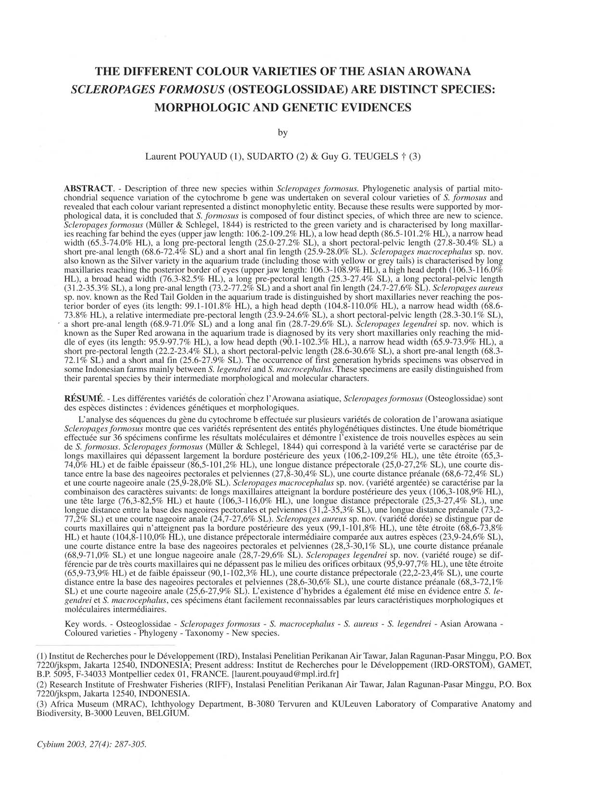

# Bài 00 - Tổng quan khóa học

## 1. Loại bài

**Lesson / Course overview**

## 2. Bài báo nguồn

- Tác giả: Laurent Pouyaud, Sudarto, Guy G. Teugels.
- Tạp chí: *Cybium* 2003, 27(4), tr. 287-305.
- Chủ đề: đánh giá xem các dạng màu của cá rồng châu Á vốn được gom dưới *Scleropages formosus* có đại diện cho các đơn vị loài khác nhau hay không.

## 3. Luận điểm trung tâm của bài báo

Nghiên cứu kết hợp ba lớp bằng chứng:

1. **Di truyền phân tử:** trình tự một đoạn gen ty thể cytochrome b.
2. **Hình thái định lượng:** 23 phép đo, các đặc điểm đếm và PCA.
3. **Sinh thái - địa lý:** kiểu môi trường nước, khu vực phân bố và sự đồng tồn tại/tách biệt giữa các dạng màu.

Từ tổ hợp bằng chứng này, tác giả xem bốn nhóm màu chính là các thực thể sinh học có thể phân biệt và mô tả lại/tách tên ở cấp loài.

## 4. Bốn nhóm trọng tâm

| Nhóm trong thương mại/đời sống | Tên được xử lý trong bài báo | Dấu hiệu nổi bật trong lập luận |
| --- | --- | --- |
| Green | *S. formosus* | hàm trên dài, đầu hẹp, khoảng trước ngực dài |
| Silver (Grey/Yellow Tail) | *S. macrocephalus* sp. nov. | đầu rộng, hàm trên dài, khoảng ngực-chậu dài |
| Red Tail Golden | *S. aureus* sp. nov. | hàm trên ngắn hơn, đầu sâu, vây hậu môn tương đối dài |
| Super Red | *S. legendrei* sp. nov. | hàm trên rất ngắn, đầu hẹp, nhiều khoảng chiều dài tương đối ngắn |

## 5. Kỹ năng đọc paper cần rèn

- Tách **quan sát** khỏi **diễn giải**.
- Đọc giá trị bootstrap trên cây phát sinh chủng loại.
- Hiểu chỉ số hình thái theo `%SL` (tỷ lệ chiều dài chuẩn) và `%HL` (tỷ lệ chiều dài đầu).
- Không dùng màu sắc đơn độc để định loài; luôn đối chiếu hình thái, di truyền và địa lý.

## 6. Câu hỏi khởi động

1. Vì sao một “dạng màu” trong cá cảnh chưa chắc chỉ là biến dị màu trong cùng một loài?
2. Nếu hai quần thể khác màu nhưng có kiểu gen gần nhau, cần thêm loại bằng chứng nào để đánh giá ranh giới loài?
3. Điều gì có thể khiến lai nhân tạo làm khó việc nhận dạng dựa trên ngoại hình?
