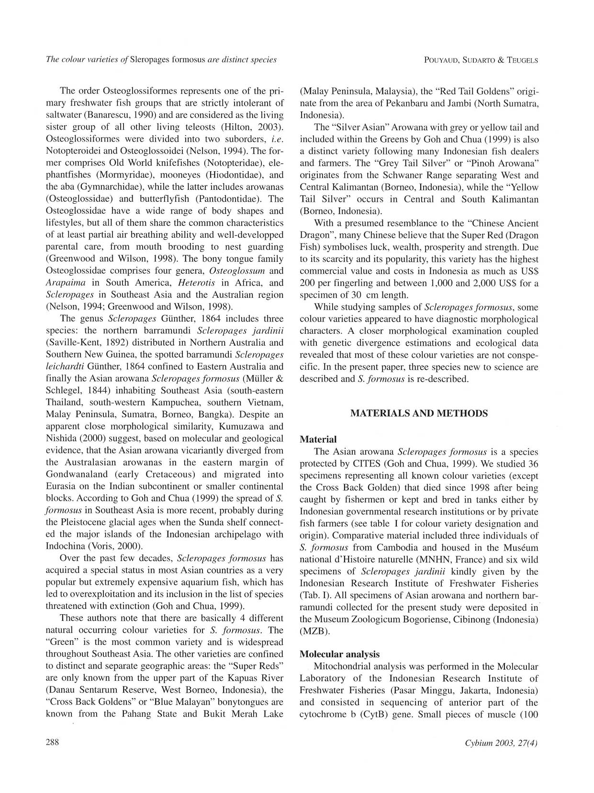

# Bài 01 - Bối cảnh và câu hỏi nghiên cứu

## 1. Loại bài

**Lesson**

## 2. Mục tiêu học tập

Sau bài này, người học có thể trình bày bối cảnh hệ thống học của cá rồng châu Á và giải thích vì sao tác giả đặt vấn đề phân loại lại các dạng màu.

## 3. Bối cảnh hệ thống học

Bài báo đặt *Scleropages* trong nhóm cá xương lưỡi (Osteoglossidae). Trước nghiên cứu, *Scleropages formosus* được dùng rộng cho cá rồng châu Á ở Đông Nam Á, trong khi thị trường và người nuôi đã nhận biết nhiều dạng màu có phân bố địa lý khác nhau.

Tác giả nhấn mạnh bốn nhóm tự nhiên chính:

- **Green:** rộng nhất ở Đông Nam Á.
- **Super Red:** gắn với vùng thượng Kapuas/Sentarum ở Tây Borneo.
- **Red Tail Golden:** gắn với khu vực Pekanbaru và Jambi, Sumatra.
- **Silver:** gồm Grey Tail và Yellow Tail, phân bố ở một số lưu vực Borneo.

## 4. Vấn đề nghiên cứu

Câu hỏi cốt lõi là: **các dạng màu này chỉ là biến dị trong cùng một loài hay là các thực thể tiến hóa/phân loại riêng?**

Để trả lời, nghiên cứu tránh phụ thuộc hoàn toàn vào màu sắc và kiểm tra đồng thời:

- khoảng cách và nhóm di truyền;
- tỷ lệ hình thái cơ thể;
- đặc điểm chẩn đoán;
- vùng phân bố và môi trường sống.

## 5. Bối cảnh bảo tồn và thương mại

Cá rồng châu Á có giá trị thương mại cao và từng chịu áp lực khai thác. Điều này làm cho câu hỏi phân loại có ý nghĩa thực tế: nếu một “loài” thực ra gồm nhiều đơn vị phân bố hẹp, mức độ dễ tổn thương của từng đơn vị có thể khác nhau đáng kể.

## 6. Đọc nguồn trực quan

Xem trang 2 của PDF để đối chiếu phần mở đầu và phân bố các dạng màu ban đầu:

## 7. Tự kiểm tra

1. Nêu ba lý do khiến phân bố địa lý có thể hỗ trợ một giả thuyết phân tách loài.
2. Vì sao giá trị thương mại cao có thể làm sai lệch quan sát về phân bố tự nhiên?
3. Trong thiết kế đa bằng chứng, bằng chứng nào là độc lập tương đối với màu sắc?
