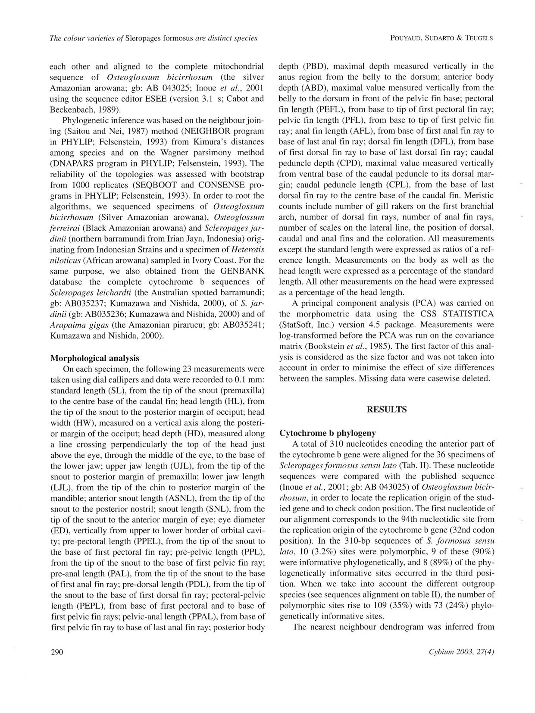

# Bài 02 - Thiết kế nghiên cứu và dữ liệu

## 1. Loại bài

**Lesson**

## 2. Mục tiêu học tập

- Mô tả mẫu nghiên cứu và dữ liệu phân tử.
- Nhận biết bộ biến hình thái mà tác giả đo.
- Hiểu vì sao cần chuẩn hóa phép đo theo chiều dài chuẩn hoặc chiều dài đầu.

## 3. Mẫu nghiên cứu

Bài báo cho biết nhóm tác giả khảo sát **36 mẫu cá rồng châu Á** đại diện cho các dạng màu đã biết trong phạm vi nghiên cứu, ngoại trừ Cross Back Golden. Mẫu gồm nguồn hoang dã và nuôi, cùng vật liệu so sánh từ một số loài cá rồng khác.

## 4. Phân tích phân tử

Tác giả giải trình tự phần trước của gen ty thể **cytochrome b (CytB)**. Trong phần kết quả, một đoạn căn chỉnh dài **310 nucleotide** được dùng cho 36 mẫu *S. formosus sensu lato*.

Các bước chính:

1. tách DNA tổng số;
2. khuếch đại bằng PCR;
3. giải trình tự;
4. căn chỉnh chuỗi;
5. dựng quan hệ bằng phương pháp neighbour joining và parsimony;
6. đánh giá độ ổn định bằng bootstrap 1000 lần.

## 5. Hình thái định lượng

Mỗi mẫu được đo **23 kích thước** với độ chính xác 0,1 mm. Các biến bao phủ:

- chiều dài chuẩn và kích thước đầu;
- chiều dài hàm trên/hàm dưới;
- khoảng trước vây ngực, trước vây bụng, trước vây hậu môn, trước vây lưng;
- khoảng ngực-chậu và chậu-hậu môn;
- độ sâu thân;
- chiều dài các vây;
- cuống đuôi;
- đường kính mắt và chiều dài mõm.

Ngoài ra còn có các đặc điểm đếm: số tia mang, số tia vây, số vảy đường bên và vị trí tương quan giữa các vây.

## 6. Chuẩn hóa số đo

- Số đo trên thân thường được biểu diễn dưới dạng **% chiều dài chuẩn (%SL)**.
- Số đo vùng đầu thường được biểu diễn dưới dạng **% chiều dài đầu (%HL)**.

Cách chuẩn hóa này giúp giảm ảnh hưởng của kích thước tuyệt đối giữa cá lớn và cá nhỏ.

## 7. PCA

Tác giả dùng PCA trên 14 biến sau biến đổi log. Thành phần đầu được xem như yếu tố kích thước và không dùng để diễn giải ranh giới nhóm; các thành phần tiếp theo được dùng để quan sát sự phân tách hình thái.

## 8. Bài tập

Từ bảng thuật ngữ ở cuối khóa học, chọn 8 biến hình thái và chia thành ba nhóm: **đầu**, **thân**, **vây/đuôi**. Giải thích vì sao mỗi biến có thể hữu ích cho chẩn đoán loài.
