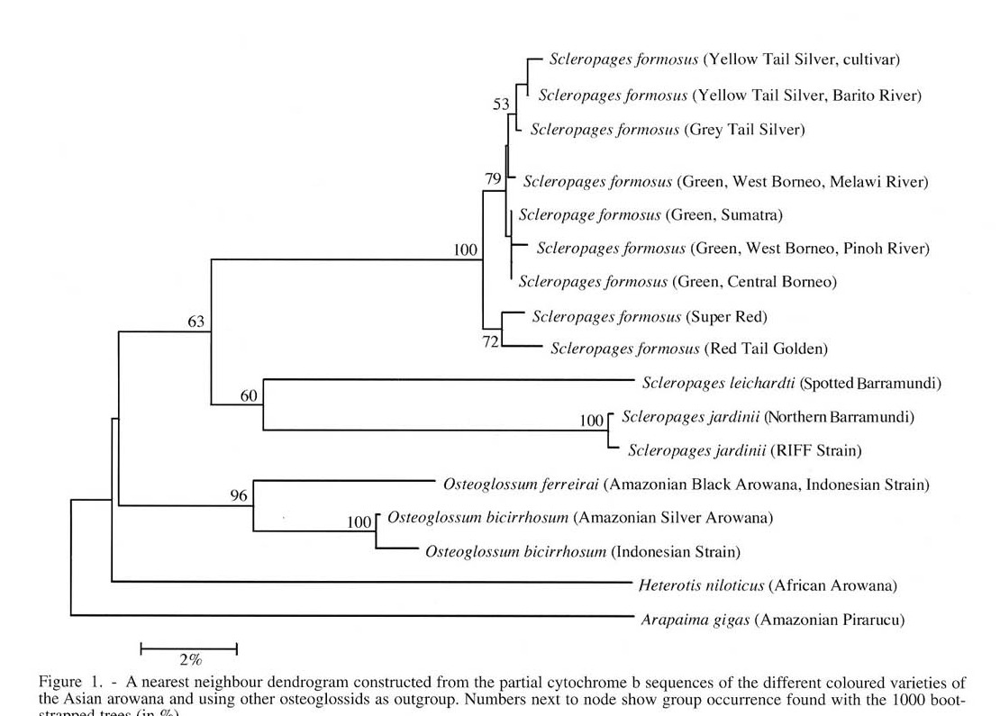

# Bài 03 - Cytochrome b và cây phát sinh chủng loại

## 1. Loại bài

**Lesson**

## 2. Mục tiêu học tập

- Đọc cấu trúc cây neighbour joining trong bài báo.
- Phân biệt quan hệ gần về di truyền với sự đồng nhất hoàn toàn.
- Liên hệ cây gene với giả thuyết phân loại.

## 3. Kết quả chuỗi CytB

Trong 310 nucleotide của nhóm cá rồng châu Á sensu lato, bài báo ghi nhận 10 vị trí đa hình; phần lớn các vị trí có thông tin phát sinh nằm ở vị trí codon thứ ba. Khi bổ sung các nhóm ngoài, số vị trí đa hình và có thông tin tăng lên.

## 4. Cây neighbour joining

Cách đọc hình:

- toàn bộ các dạng màu của cá rồng châu Á trong mẫu tạo thành một nhánh chung với bootstrap cao;
- **Super Red** và **Red Tail Golden** được đặt gần nhau hơn so với Green/Silver;
- **Silver** gần **Green** về di truyền nhưng có một số phân tách haplotype;
- các loài cá rồng Australia, Amazon và châu Phi đóng vai trò nhóm so sánh/ngoài.

## 5. Khoảng cách di truyền được báo cáo

Theo phần kết quả của bài báo:

- Super Red và Red Tail Golden khác nhau khoảng **1,3%** nucleotide;
- Super Red khác Green khoảng **1,3-2,2%**, khác Silver khoảng **1,6-2,0%**;
- Red Tail Golden khác Green khoảng **1,6-2,0%**, khác Silver khoảng **2,0-2,6%**;
- Silver gần Green hơn, với khoảng khác biệt thấp hơn trong nhiều so sánh.

Các con số này phải được hiểu trong bối cảnh toàn bộ bằng chứng; bài báo không dựa riêng vào một ngưỡng phần trăm cố định để gọi tên loài.

## 6. Haplotype và địa lý

Tác giả ghi nhận:

- Super Red trong mẫu có cùng một trình tự cytochrome b;
- Red Tail Golden cũng có cùng một trình tự trong mẫu;
- Green có nhiều haplotype theo vùng;
- Silver có các haplotype khác nhau giữa Grey Tail và Yellow Tail, nhưng bằng chứng bootstrap không đủ mạnh để tách hai dạng Silver thành hai thực thể loài riêng.

## 7. Ý nghĩa phương pháp

Một cây gene ty thể phản ánh lịch sử của locus ty thể, không phải toàn bộ genome. Điểm mạnh của bài báo là đặt kết quả này cạnh hình thái và sinh thái thay vì xem CytB là bằng chứng duy nhất.

## 8. Câu hỏi tự kiểm tra

1. Bootstrap 100 khác gì với khoảng cách nucleotide 1,3%?
2. Vì sao hai nhóm gần nhau trên cây vẫn có thể được tác giả xem là loài khác?
3. Tại sao Silver và Green là cặp đặc biệt quan trọng khi đánh giá sự phù hợp giữa gene và hình thái?
