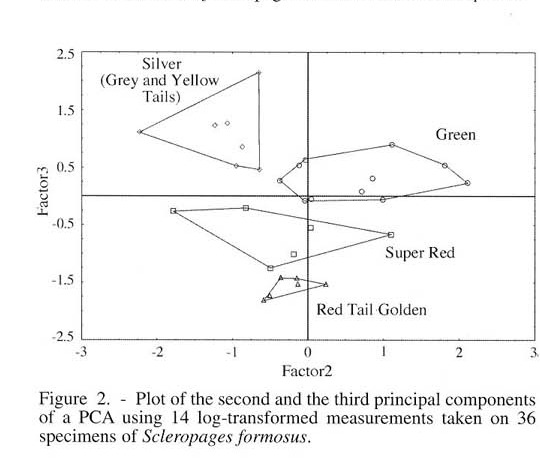
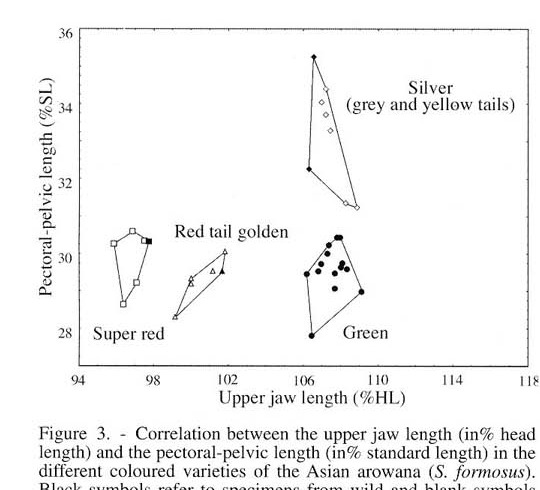
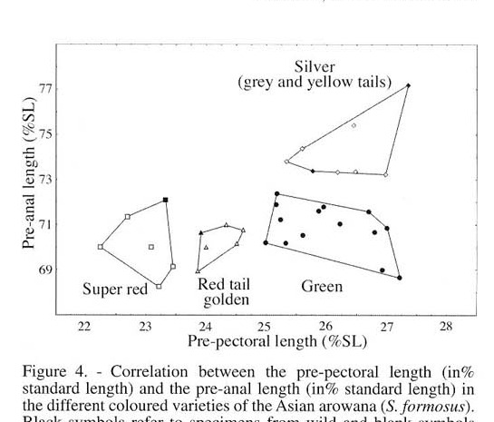
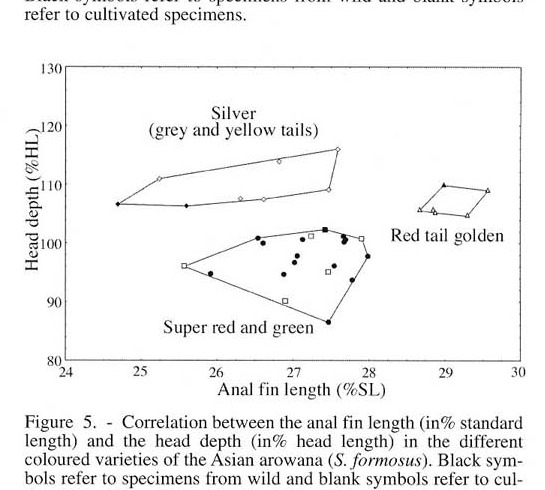

# Bài 04 - Morphometrics, PCA và chẩn đoán hình thái

## 1. Loại bài

**Lesson**

## 2. Mục tiêu học tập

- Đọc PCA và ba đồ thị tương quan hình thái.
- Nhận biết nhóm biến giúp tách bốn dạng màu.
- Hiểu khái niệm “tổ hợp đặc điểm chẩn đoán”.

## 3. PCA

PCA cho thấy bốn vùng hình thái tương ứng với Silver, Green, Super Red và Red Tail Golden. Tác giả cho biết các biến đóng góp quan trọng vào các trục gồm chiều dài vây lưng, chiều dài mõm trước, độ sâu đầu, chiều rộng đầu, khoảng ngực-chậu, chiều dài vây hậu môn, khoảng trước ngực và chiều dài hàm trên.

## 4. Hàm trên và khoảng ngực-chậu

Mẫu hình chính:

- Silver và Green có hàm trên dài hơn.
- Super Red có hàm trên rất ngắn.
- Red Tail Golden nằm trung gian nhưng tách được nhờ tổ hợp với khoảng ngực-chậu.

## 5. Khoảng trước ngực và trước hậu môn

Đồ thị này làm rõ Silver nhờ các tỷ lệ dài hơn ở phần trước thân và trước vây hậu môn, trong khi Super Red và Red Tail Golden tập trung ở vùng giá trị ngắn hơn.

## 6. Chiều dài vây hậu môn và độ sâu đầu

Red Tail Golden có thể tách khỏi Silver bởi tổ hợp vây hậu môn tương đối dài và đầu sâu. Green và Super Red gần nhau hơn ở đồ thị này nhưng vẫn tách khỏi các nhóm còn lại bằng các biến khác.

## 7. Tổ hợp đặc điểm chẩn đoán

Bài báo nhấn mạnh rằng không phải mọi loài đều có **một** đặc điểm duy nhất tuyệt đối. Thay vào đó, chẩn đoán dựa trên **nhiều tỷ lệ kết hợp**, ví dụ:

- chiều dài hàm trên;
- chiều rộng/độ sâu đầu;
- khoảng trước ngực;
- khoảng ngực-chậu;
- khoảng trước hậu môn;
- chiều dài vây hậu môn.

## 8. Bài tập phân tích

Không nhìn tên nhóm trên hình, hãy mô tả bốn cụm chỉ bằng vị trí hình học trên các đồ thị: trái/phải, trên/dưới, tập trung/phân tán. Sau đó mới đối chiếu tên loài. Mục tiêu là rèn khả năng đọc dữ liệu trước khi đọc nhãn.
