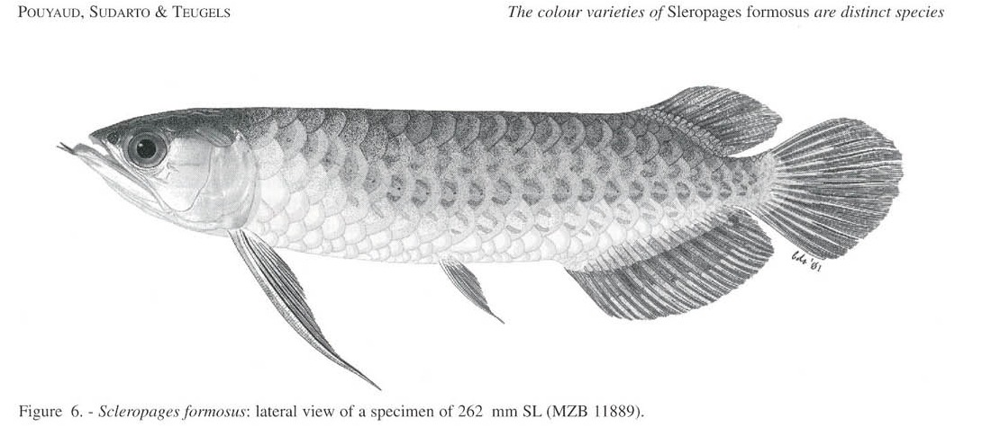
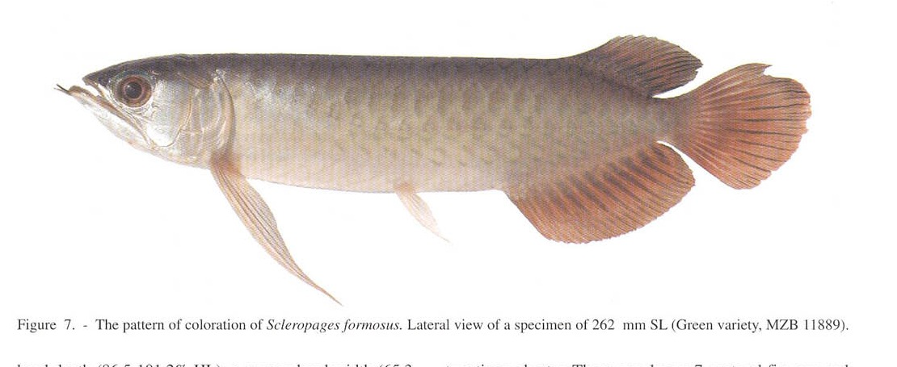

# Bài 05 - *Scleropages formosus* - dạng Green

## 1. Loại bài

**Lesson**

## 2. Mục tiêu học tập

- Nhận diện cách bài báo giới hạn lại tên *S. formosus*.
- Mô tả hình thái, màu sắc, sinh thái và phân bố của nhóm Green theo nguồn.

## 3. Quan điểm phân loại trong bài báo

Tác giả đề nghị giới hạn tên *Scleropages formosus* cho dạng **Green**, dựa trên tổng hợp bằng chứng hình thái, di truyền và địa lý.

## 4. Hình thái chẩn đoán nổi bật

Theo chẩn đoán trong bài:

- hàm trên dài, vượt xa bờ sau mắt;
- đầu tương đối hẹp;
- khoảng trước vây ngực dài;
- khoảng ngực-chậu ngắn hơn Silver;
- khoảng trước vây hậu môn ngắn;
- vây hậu môn tương đối ngắn.

Các khoảng giá trị chi tiết được trình bày trong bài báo và bảng đo ở PDF trang 9-10.

## 5. Minh họa

## 6. Mô tả cơ thể

Nguồn mô tả cơ thể thon dài, đầu dài và hẹp, miệng chếch, hàm trên dài, cằm rõ với hai râu. Vây ngực dài; vây hậu môn và vây lưng nằm về phía sau cơ thể, tạo dáng điển hình của cá rồng.

## 7. Màu sắc

Dạng Green có vùng lưng xanh ô-liu sẫm, hai bên ánh bạc hoặc vàng-xanh. Trên vảy có thể xuất hiện các mảng xiên; màng vây thay đổi giữa các vùng địa lý.

## 8. Sinh thái và phân bố

Bài báo mô tả nhóm này sống ở suối nước trắng chảy chậm hoặc vùng nước đục hơn với **pH > 6**, khác với môi trường nước đen pH thấp của Super Red/Red Tail Golden. Phân bố được nêu rộng ở Đông Nam Á, gồm Thái Lan phía nam, Campuchia, Việt Nam phía nam, bán đảo Mã Lai, Borneo và Sumatra.

## 9. Tự kiểm tra

1. Đặc điểm nào giúp tách Green khỏi Silver dù cả hai có hàm trên dài?
2. Màu sắc có đủ để xác định *S. formosus* hay không? Vì sao?
3. Môi trường nước được mô tả khác nhóm Super Red như thế nào?
