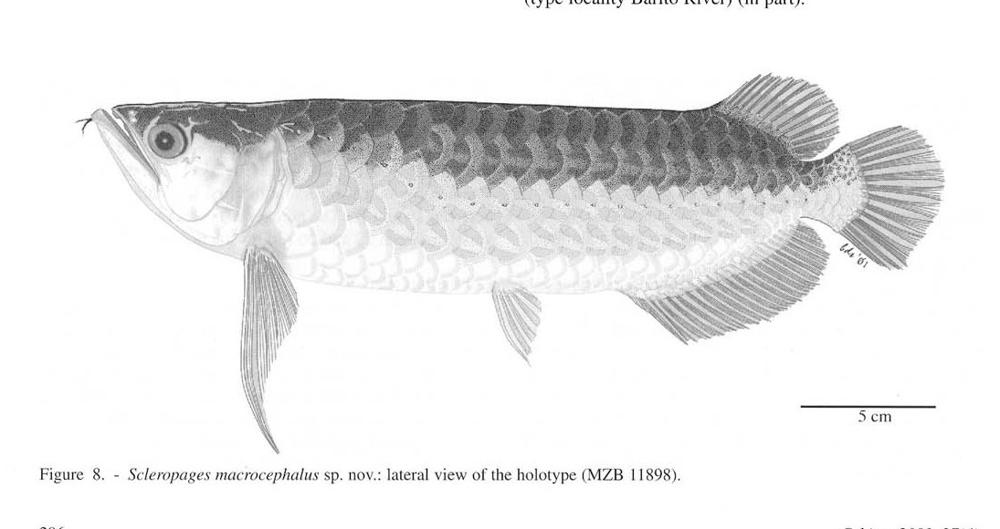
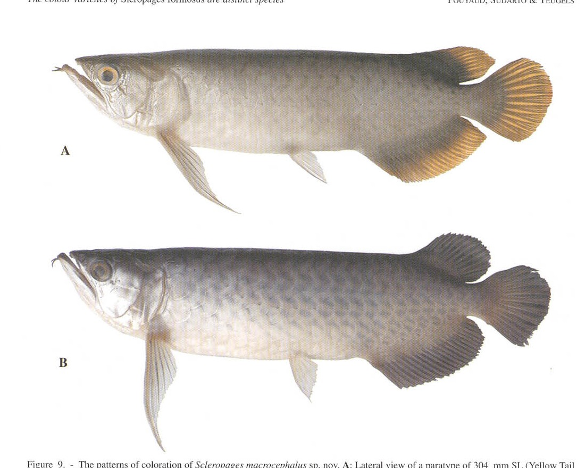

# Bài 06 - *Scleropages macrocephalus* - nhóm Silver

## 1. Loại bài

**Lesson**

## 2. Mục tiêu học tập

- Nhận biết nhóm Silver (Grey Tail và Yellow Tail) trong cách xử lý của bài báo.
- Giải thích vì sao hai biến thể Silver được gom vào cùng một đơn vị hình thái.

## 3. Tên và phạm vi

Bài báo mô tả **_*Scleropages macrocephalus*_ sp. nov.** cho nhóm Silver, gồm Grey Tail Silver và Yellow Tail Silver.

## 4. Hình thái chẩn đoán

Tổ hợp đặc điểm chính:

- hàm trên dài, tới bờ sau mắt;
- **đầu rộng** hơn các nhóm còn lại;
- độ sâu đầu cao;
- khoảng trước vây ngực dài;
- khoảng ngực-chậu dài;
- khoảng trước vây hậu môn dài;
- vây hậu môn tương đối ngắn.

## 5. Minh họa

## 6. Grey Tail và Yellow Tail

Màu vây đuôi/vây có thể khác nhau rõ, nhưng tác giả không tìm thấy một đặc điểm hình thái đơn lẻ đủ để tách hai dạng thành hai đơn vị loài riêng. Dữ liệu ty thể cũng cho thấy khác biệt haplotype nhưng độ hỗ trợ chưa đủ để kết luận hai loài.

## 7. Sinh thái và phân bố

Nguồn ghi nhận *S. macrocephalus* ở hệ thống Barito (Central Borneo) và các sông Melawi/Pinoh (West Borneo). Môi trường có thể là suối nước trắng/đục, pH > 6; tại Tây Borneo còn gặp ở dòng chảy mạnh hơn.

## 8. Ý nghĩa tên loài

Tên **macrocephalus** được giải thích là liên quan đến chiếc đầu khỏe/rộng. Đây cũng là đặc điểm morphometric nổi bật của nhóm Silver trong PCA và đồ thị chẩn đoán.

## 9. Câu hỏi tự kiểm tra

1. Biến hình thái nào nổi bật nhất khi so Silver với các nhóm khác?
2. Vì sao khác màu đuôi chưa đủ để tách Grey Tail và Yellow Tail thành hai loài?
3. Trên PCA, Silver nằm ở vùng nào so với Green?
