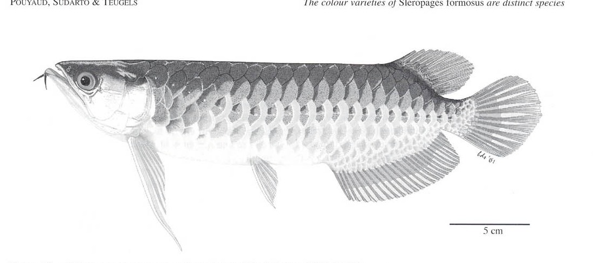
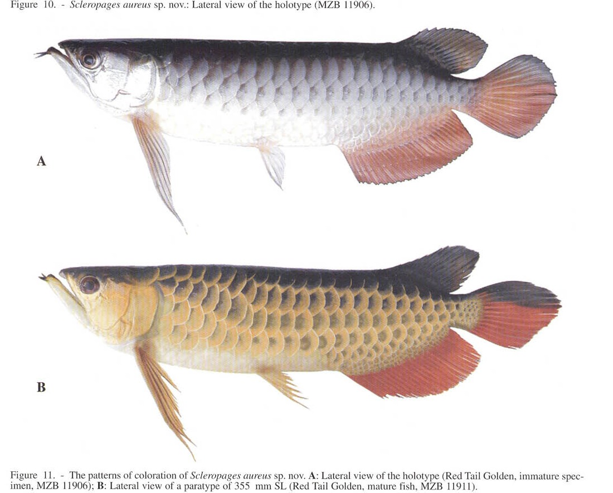

# Bài 07 - *Scleropages aureus* - Red Tail Golden

## 1. Loại bài

**Lesson**

## 2. Mục tiêu học tập

- Mô tả nhóm Red Tail Golden theo bài báo.
- Nêu tổ hợp morphometric giúp phân biệt với Super Red, Green và Silver.

## 3. Tên và phạm vi

Bài báo mô tả **_*Scleropages aureus*_ sp. nov.**, tương ứng với Red Tail Golden/Indonesian Golden trong thương mại cá cảnh.

## 4. Hình thái chẩn đoán

Các đặc điểm được nhấn mạnh:

- hàm trên ngắn hơn Green/Silver và không chạm bờ sau mắt;
- đầu sâu;
- chiều rộng đầu tương đối hẹp;
- khoảng trước vây ngực ở mức trung gian;
- khoảng ngực-chậu ngắn;
- khoảng trước vây hậu môn ngắn;
- vây hậu môn **dài hơn** Green/Super Red/Silver trong tổ hợp chẩn đoán.

## 5. Minh họa

## 6. Màu sắc

Nguồn mô tả vùng lưng sẫm; vây lưng và phần trên vây đuôi sẫm, các vây còn lại thiên đỏ/đỏ nâu. Ở cá non, thân và vảy có phản quang vàng rời rạc; sắc vàng trở nên rõ hơn khi trưởng thành.

## 7. Phân bố và môi trường

Tác giả ghi nhận *S. aureus* trong các thủy vực nước đen nhuộm tannin, pH thấp (**< 5,5**) tại Sumatra, gồm vùng liên quan sông Siak/Pekanbaru và Batanghari/Berbak.

## 8. Quan hệ với Super Red

Trên cây CytB, Red Tail Golden gần Super Red hơn Green/Silver. Tuy nhiên bài báo vẫn phân biệt chúng bằng hình thái: Red Tail Golden có hàm trên dài hơn Super Red một chút, đầu sâu hơn và vây hậu môn tương đối dài hơn.

## 9. Bài tập

Lập bảng hai cột so sánh *S. aureus* và *S. legendrei* theo: hàm trên, độ sâu đầu, vây hậu môn, màu trưởng thành, phân bố.
