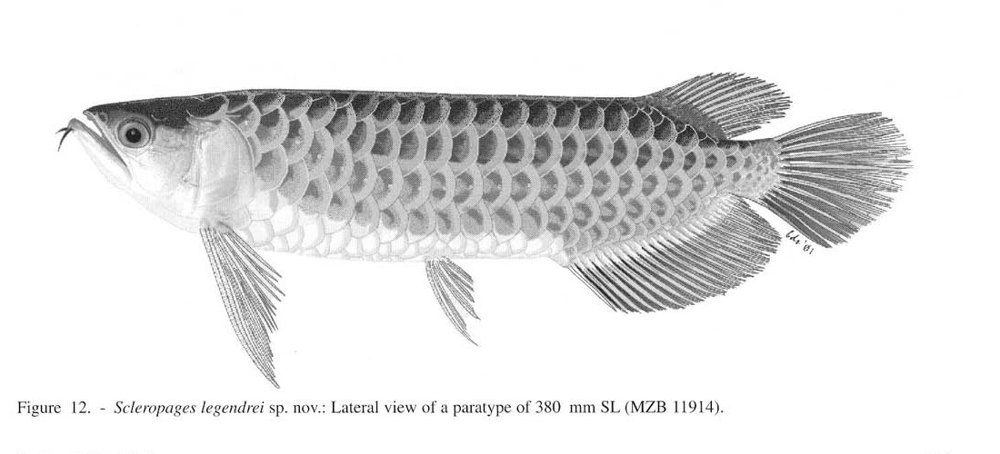
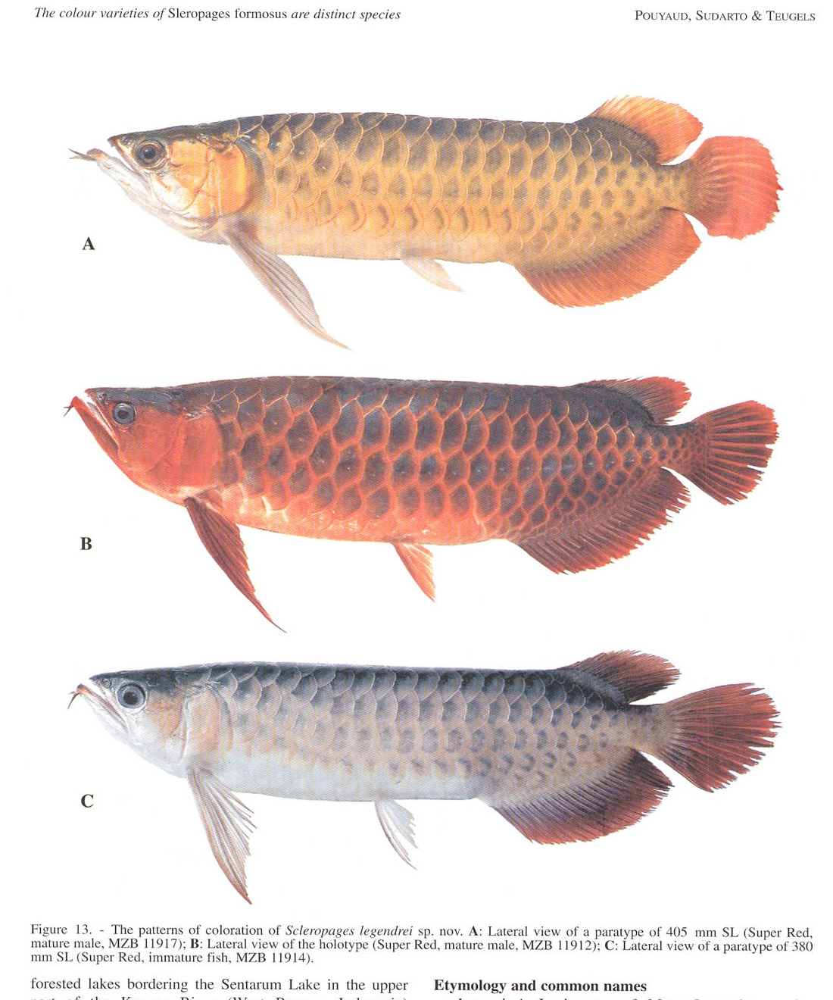

# Bài 08 - *Scleropages legendrei* - Super Red

## 1. Loại bài

**Lesson**

## 2. Mục tiêu học tập

- Nhận biết tổ hợp chẩn đoán của Super Red.
- Liên hệ màu sắc với tuổi và môi trường sống.
- Hiểu vì sao phạm vi phân bố hẹp làm tăng quan ngại bảo tồn trong bài báo.

## 3. Tên và phạm vi

Bài báo mô tả **_*Scleropages legendrei*_ sp. nov.** cho nhóm Super Red, còn được gọi là Super Red, Chili Red hoặc Blood Indonesian Arowana.

## 4. Hình thái chẩn đoán

Nhóm này được mô tả với:

- **hàm trên rất ngắn**, chỉ tới khoảng giữa mắt;
- đầu hẹp và tương đối thấp;
- khoảng trước vây ngực ngắn;
- khoảng ngực-chậu ngắn;
- khoảng trước vây hậu môn ngắn;
- vây hậu môn ngắn.

## 5. Minh họa

## 6. Màu sắc và tuổi

Nguồn mô tả lưng nâu sẫm, môi đỏ. Hai bên thân, nắp mang và vây có thể chuyển từ đỏ ánh vàng sang đỏ sâu. Cá non có màu đỏ kém đậm hơn; sắc đỏ tăng khi cá trưởng thành.

## 7. Phân bố và sinh thái

Bài báo giới hạn Super Red vào các hồ/rừng ngập nước đen nhuộm tannin, pH thấp (**< 5,5**) ở vùng Sentarum - thượng Kapuas, Tây Borneo.

## 8. Ý nghĩa bảo tồn

Do vùng phân bố trong bài báo rất hẹp và phụ thuộc vào các hồ rừng nước đen nhỏ, tác giả cho rằng đơn vị này có mức độ dễ tổn thương cao hơn cách nhìn “một loài rộng khắp” trước đó.

## 9. Câu hỏi tự kiểm tra

1. Dấu hiệu hàm trên của Super Red khác Red Tail Golden như thế nào?
2. Vì sao màu cá non có thể gây nhầm lẫn?
3. Nếu môi trường sống đặc trưng bị biến đổi pH và độ đục, tác động bảo tồn có thể lớn vì lý do nào?
