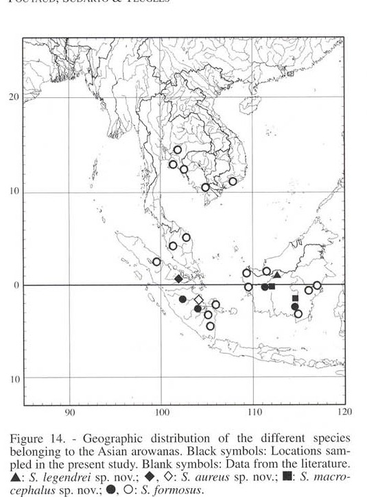
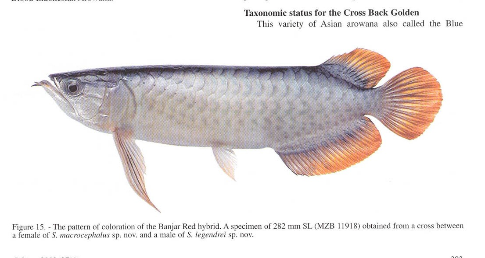

# Bài 09 - Lai, phân bố và bảo tồn

## 1. Loại bài

**Lesson**

## 2. Mục tiêu học tập

- Hiểu ví dụ Banjar Red hybrid.
- Đọc bản đồ phân bố và liên hệ với phân loại.
- Tóm tắt hệ quả bảo tồn được tác giả nêu.

## 3. Bản đồ phân bố

Bản đồ cho thấy các nhóm không phân bố ngẫu nhiên mà tập trung ở các lưu vực/khu vực riêng. Tác giả dùng mẫu hình này như một phần của lập luận rằng khác biệt màu và hình thái có nền tảng địa lý - sinh thái.

## 4. Lai nhân tạo: Banjar Red

Bài báo mô tả Banjar Red là con lai thế hệ đầu từ **cá cái Yellow Tail Silver (*S. macrocephalus*)** và **cá đực Super Red (*S. legendrei*)** trong mẫu được khảo sát. Cá lai thể hiện nhiều chỉ số hình thái trung gian giữa hai nhóm bố mẹ.

Điểm quan trọng: màu sắc của con lai có thể thay đổi theo tuổi và xử lý hormone, làm nhận dạng bằng ngoại hình đơn thuần khó hơn.

## 5. Cross Back Golden

Tác giả không có mẫu trực tiếp của Cross Back Golden/Blue Malayan để phân tích đầy đủ. Dựa trên mô tả hình thể và màu đuôi, họ nghi ngờ quan hệ gần với *S. aureus* nhưng **tạm thời giữ trong *S. formosus*** cho đến khi có nghiên cứu phân loại tiếp theo. Đây là ví dụ rõ về việc không kết luận vượt quá dữ liệu mẫu.

## 6. Bảo tồn

Trong phần thảo luận, tác giả cho rằng việc tách các đơn vị có phân bố hẹp làm thay đổi cách nhìn về rủi ro:

- *S. legendrei* có phạm vi rất hạn chế ở các hồ rừng nước đen vùng Sentarum và được tác giả đề nghị xem là đặc biệt nguy cấp;
- *S. aureus* cũng được xem là cần quan ngại cao;
- *S. formosus* và *S. macrocephalus* có phạm vi rộng hơn nên được thảo luận ở mức ít khẩn cấp hơn trong khuôn khổ bài báo.

Nguồn cũng nhấn mạnh tác động của khai thác gỗ và biến đổi chất lượng nước, không chỉ đánh bắt.

## 7. Phân biệt “kết luận nguồn” và “tình trạng hiện nay”

Các nhận định trên là **kết luận của bài báo năm 2003**. Muốn biết tình trạng pháp lý/IUCN hoặc phân loại hiện hành, cần nghiên cứu cập nhật riêng; khóa học này không tự thay thế nguồn 2003 bằng dữ liệu hiện đại.

## 8. Câu hỏi tự kiểm tra

1. Con lai trung gian hình thái có làm vô hiệu khái niệm loài trong bài báo không? Giải thích theo lập luận của tác giả.
2. Vì sao Cross Back Golden là ví dụ tốt về giới hạn dữ liệu?
3. Phân loại chi tiết hơn có thể làm thay đổi ưu tiên bảo tồn như thế nào?
