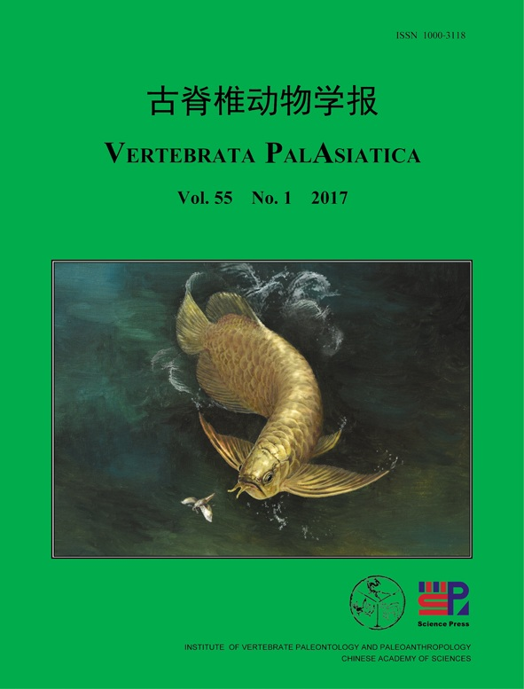

# Khóa học: Giải phẫu, hệ xương và cổ sinh học cá rồng `Scleropages`



Khóa học này chuyển hóa bài báo **Zhang & Wilson (2017), “First complete fossil Scleropages (Osteoglossomorpha)”** thành hệ thống bài học Markdown độc lập bằng tiếng Việt. Trọng tâm là loài hóa thạch mới `Scleropages sinensis`, hình thái bộ xương, hệ vây, bộ xương đuôi, vảy, so sánh với cá rồng hiện sinh và ý nghĩa cổ sinh địa lý.

## 1. Mục tiêu khóa học

Sau khi hoàn thành, người học có thể:

- trình bày vì sao `Scleropages sinensis` được xếp vào chi `Scleropages`;
- nhận diện các vùng giải phẫu chính của sọ, hàm, nắp mang, đai vai, cột sống, các vây và bộ xương đuôi;
- ghi nhớ các số liệu hình thái quan trọng như số đốt sống, tia vây và vảy đường bên;
- so sánh `S. sinensis` với `S. formosus` và `S. leichardti`;
- phân biệt dữ liệu quan sát trực tiếp với các suy luận về sinh thái, sinh sản và địa sinh học;
- đọc và khai thác các hình giải phẫu trong bài báo thay vì chỉ dựa vào mô tả chữ.

## 2. Cấu trúc khóa học

| Module | Nội dung | Bài |
| --- | --- | ---: |
| 01 | Bối cảnh, địa chất và phân loại | 2 |
| 02 | Hình thái toàn thân, sọ, hàm và nắp mang | 2 |
| 03 | Hệ vây, cột sống và bộ xương đuôi | 2 |
| 04 | Vảy và chẩn đoán so sánh | 2 |
| 05 | Sinh thái, sinh sản và cổ sinh địa lý | 2 |
| 06 | Ôn tập, bài tập và đáp án | 2 |

Bắt đầu tại [COURSE_MAP.md](COURSE_MAP.md).

## 3. Quy ước sử dụng nguồn

Mỗi lesson đều có mục **Phạm vi nguồn** ghi rõ phần hoặc trang tương ứng trong bài báo. Nội dung được **giảng lại và tái cấu trúc**, không phải bản chép nguyên văn. Những điểm mà tác giả chỉ đề xuất hoặc suy đoán được ghi rõ bằng các từ như *có thể*, *gợi ý*, *giả thuyết*.

## 4. Thư mục

```text
Scleropages_Sinensis_MD_Course/
├── README.md
├── COURSE_MAP.md
├── SOURCE_MAP.md
├── GLOSSARY.md
├── modules/
├── assets/figures/
└── source/
```

## 5. Tài liệu gốc

Zhang, J.-Y. & Wilson, M. V. H. (2017). *First complete fossil Scleropages (Osteoglossomorpha).* Vertebrata PalAsiatica, 55(1), 1-23.
