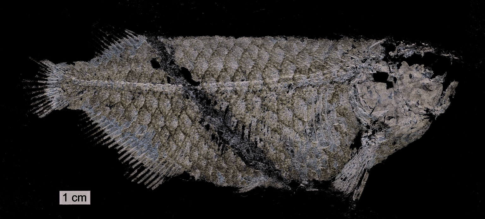

# Lesson 01 - Vì sao hóa thạch `Scleropages` hoàn chỉnh quan trọng?

## 1. Mục tiêu học tập

Sau bài này, người học có thể giải thích bối cảnh nghiên cứu của `Scleropages`, phân biệt hóa thạch rời rạc với bộ xương hoàn chỉnh và nêu được đóng góp cốt lõi của `Scleropages sinensis`.

## 2. Phạm vi nguồn

Nguồn chính: Abstract và phần **Introduction** của Zhang & Wilson (2017), đặc biệt các đoạn về phân bố của `Scleropages`, hồ sơ hóa thạch trước đó và việc phát hiện các bộ xương hoàn chỉnh ở Trung Quốc.

## 3. Bối cảnh của chi Scleropages

`Scleropages` là một chi cá nước ngọt thuộc họ Osteoglossidae. Các loài hiện sinh được tác giả bài báo thảo luận gồm `S. formosus`, `S. inscriptus`, `S. jardinii` và `S. leichardti`, phân bố tại Đông Nam Á, Australia và New Guinea. `S. formosus` chính là cá rồng châu Á nổi tiếng trong thú chơi cá cảnh.

Trước nghiên cứu này, vật liệu hóa thạch gán cho `Scleropages` đã được báo cáo từ nhiều khu vực và nhiều tuổi địa chất khác nhau, nhưng chủ yếu là **vảy, otolith và những mảnh xương rời**. Vấn đề của dạng bằng chứng này là nhiều cấu trúc có thể giống nhau giữa các osteoglossid, khiến việc định danh ở cấp chi hoặc loài khó chắc chắn hơn.

## 4. Điểm đột phá của nghiên cứu

Nghiên cứu mô tả những bộ xương `Scleropages` hóa thạch từ tầng Eocene sớm ở Hồ Nam và Hồ Bắc, Trung Quốc. Một số mẫu gần như hoàn chỉnh và bảo tồn tốt, cho phép tác giả kiểm tra đồng thời:

- hình dạng và vị trí các vây;
- cấu trúc sọ và hệ xương quanh mắt;
- đai vai và các cấu trúc nâng đỡ vây;
- cột sống và bộ xương đuôi;
- đặc trưng của vảy.

Chính tổ hợp nhiều hệ cơ quan trên cùng một cơ thể giúp việc định danh mạnh hơn rất nhiều so với chỉ dựa vào một chiếc vảy hoặc một mảnh xương.

*Hình 1 cho thấy holotype nhìn bên trái. Các nhãn a.f, c.f, d.f, p.f và pec.f đánh dấu lần lượt vây hậu môn, vây đuôi, vây lưng, vây bụng và vây ngực.*

## 5. Loài mới Scleropages sinensis

Tác giả thiết lập loài mới `Scleropages sinensis sp. nov.`. Việc xếp loài này vào `Scleropages` dựa trên mức tương đồng lớn về xương sọ, bộ xương đuôi, hình thái/vị trí các vây và kiểu vảy lưới đặc trưng. Đồng thời, hàng loạt khác biệt ổn định so với các loài hiện sinh cho phép tách nó thành một loài mới.

Kết quả so sánh cho thấy `S. sinensis` gần với loài châu Á `S. formosus` hơn so với `S. leichardti` ở phía nam.

## 6. Ý nghĩa tiến hóa

Một đóng góp quan trọng của phát hiện này là đặt mốc tối thiểu cho sự phân ly giữa dòng `Scleropages` và `Osteoglossum`: sự phân ly đó phải xảy ra **không muộn hơn Eocene sớm**, vì ở thời điểm ấy `Scleropages` đã có hình thái nhận diện rõ ràng.

Đây không phải là tuyên bố về chính xác năm phân ly. Hóa thạch chỉ cung cấp một **mốc tối thiểu**: dòng dõi phải tồn tại trước hoặc vào thời điểm mẫu hóa thạch được hình thành.

## 7. Kiểm tra nhanh

1. Vì sao một bộ xương gần hoàn chỉnh có giá trị phân loại cao hơn một vảy rời?
2. Bốn nhóm đặc trưng chính nào giúp tác giả xếp `S. sinensis` vào `Scleropages`?
3. Phát hiện này giới hạn thời gian phân ly giữa `Scleropages` và `Osteoglossum` như thế nào?
