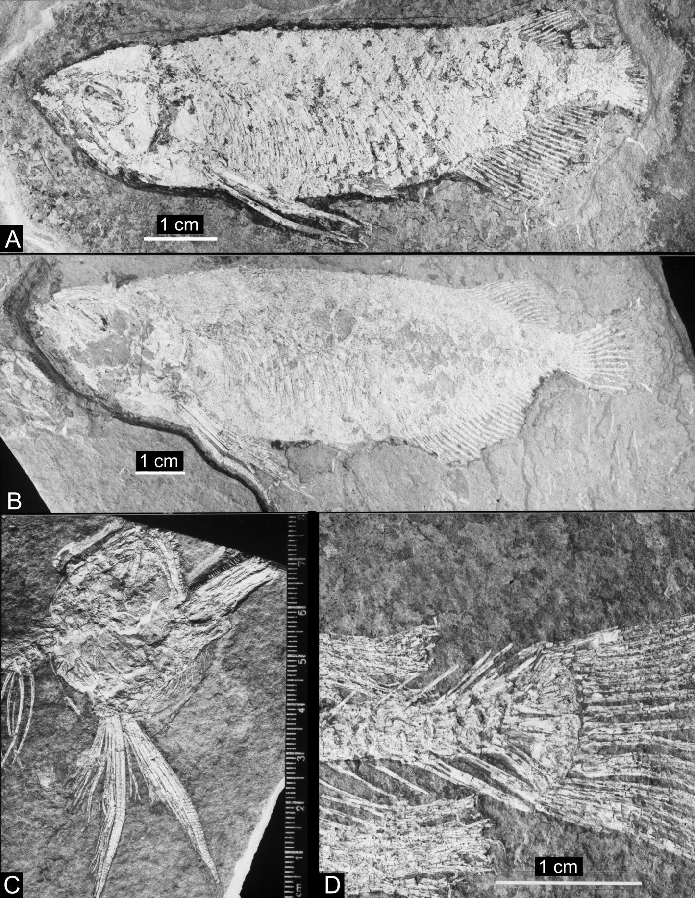

# Lesson 02 - Địa tầng, mẫu vật và chẩn đoán loài

## 1. Mục tiêu học tập

Người học có thể xác định nơi phát hiện hóa thạch, hiểu khái niệm holotype/referred specimens và tóm tắt những đặc điểm chẩn đoán làm `S. sinensis` khác với các loài `Scleropages` hiện sinh.

## 2. Phạm vi nguồn

Nguồn chính: phần cuối **Introduction**, **Material and methods** và **Systematic paleontology**.

## 3. Hai khu vực hóa thạch

Các mẫu đến từ hai khu vực ở Trung Quốc:

- **Xiangxiang, Hunan**: mẫu nằm trong Xiawanpu Formation, chủ yếu là trầm tích hồ với claystone và shale; tuổi được đặt trong Eocene, thường được xem là Eocene sớm đến đầu Eocene giữa.
- **Songzi, Hubei**: mẫu, bao gồm holotype, đến từ Yangxi Formation; đây là trầm tích hồ nông gồm mudstone và siltstone phân lớp mịn, có tuổi Eocene sớm.

Bối cảnh trầm tích hồ rất quan trọng vì nó phù hợp với một hệ sinh thái nước ngọt và giúp diễn giải môi trường sống của quần xã cá hóa thạch.

## 4. Mẫu vật nghiên cứu

Tất cả mẫu được lưu giữ tại Institute of Vertebrate Paleontology and Paleoanthropology (IVPP), Chinese Academy of Sciences. Tác giả cũng dùng bộ xương khô của `S. formosus` và `S. leichardti` để so sánh trực tiếp.

Phân loại được trình bày theo chuỗi:

`Teleostei` → `Osteoglossomorpha` → `Osteoglossidae` → `Scleropages` → `Scleropages sinensis sp. nov.`

Holotype là **IVPP V 13672.2**, một bộ xương hoàn chỉnh. Các mẫu tham chiếu khác gồm V 12749.1-8, V 12750 và V 13672.1, 3.

*Hình 3 kết hợp nhiều loại mẫu: cá hoàn chỉnh, một phần sọ và bộ xương đuôi. Đây là ví dụ tốt về cách nhiều mẫu bổ sung cho nhau khi một chi tiết không bảo tồn rõ trên holotype.*

## 5. Chẩn đoán loài

Một loài mới không được xác lập chỉ vì “trông khác”. Tác giả liệt kê một tổ hợp đặc điểm chẩn đoán. Những điểm dễ nhớ nhất gồm:

- xương mũi không biểu hiện trang trí rõ như các loài hiện sinh;
- một số ống/canal cảm giác ở vùng sọ có trạng thái lộ hoặc vị trí khác;
- các infraorbital phía sau nhỏ hơn tương đối và không che hoàn toàn nhánh lưng của preopercle;
- góc sau-bụng của preopercle kéo thành mũi nhọn;
- opercle có bờ sau-bụng lõm và đầu bụng nhọn;
- supracleithrum cong ngược;
- mỏm lưng của cleithrum dài, khỏe và dạng que;
- vây ngực rất dài, vượt qua vị trí bắt đầu của vây bụng;
- có khoảng **46-48 đốt sống**, ít hơn đáng kể so với các `Scleropages` hiện sinh được so sánh;
- parapophyses ngắn;
- gai thần kinh trên U1 có trạng thái tách đôi một phần;
- các tia ngoài cùng của vây đuôi gần dài bằng các tia bên trong.

## 6. Cách đọc một chẩn đoán phân loại

Khi học một chẩn đoán, nên chia đặc điểm theo hệ cơ quan thay vì học một danh sách dài:

| Hệ | Ví dụ đặc điểm |
| --- | --- |
| Sọ | nasal, pterotic, infraorbital, sensory canal |
| Nắp mang | preopercle, opercle |
| Đai vai | supracleithrum, cleithrum |
| Vây | chiều dài vây ngực, hình thái tia vây đuôi |
| Trục thân | số đốt sống, parapophysis, neural spine |

Cách tổ chức này giúp liên hệ chẩn đoán với các lesson giải phẫu phía sau.

## 7. Kiểm tra nhanh

1. Holotype của `S. sinensis` có mã gì?
2. Hai formation nào cung cấp mẫu cho nghiên cứu?
3. Hãy chọn ba đặc điểm chẩn đoán thuộc ba hệ cơ quan khác nhau.
