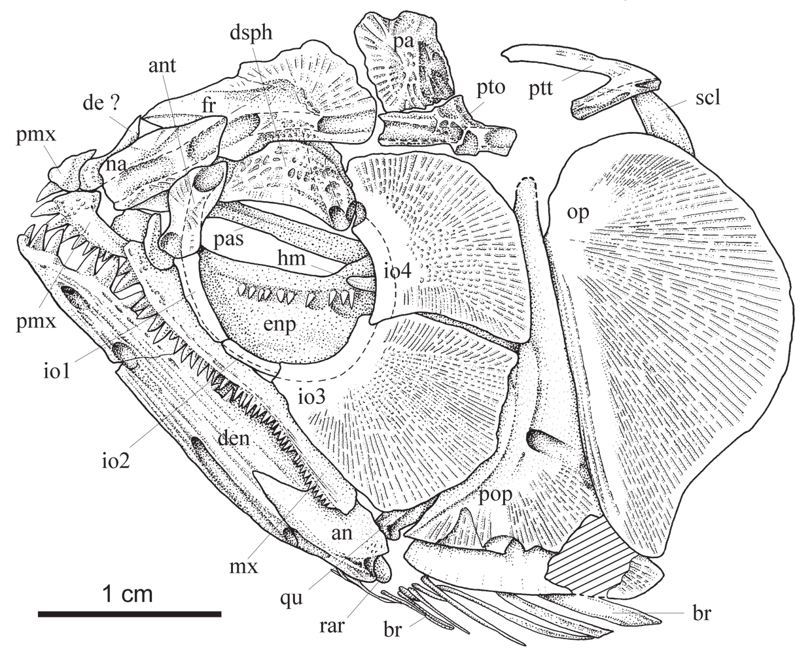

# Lesson 04 - Hệ hàm, cung khẩu, nắp mang và đai vai

## 1. Mục tiêu học tập

Người học có thể nhận diện các xương chính của bộ hàm và nắp mang, hiểu tổ chức của răng và mô tả các đặc điểm đai vai được dùng trong so sánh loài.

## 2. Phạm vi nguồn

Nguồn chính: các mục **Jaws**, **Palato-quadrate arch**, **Hyoid arch and branchiostegals**, **Opercular series** và phần đầu **Appendicular skeleton**.

## 3. Premaxilla, maxilla và mandible

Premaxilla nhỏ, gần tam giác và có trang trí bề mặt. Ở holotype, phía trái bảo tồn **7 răng**, ba răng trước lớn hơn các răng sau.

Maxilla dài và mảnh. Khi miệng đóng, nó tạo góc khoảng **45°** với trục dài cơ thể. Holotype có khoảng **40 răng hình nón** ở hàng ngoài; số này gần `S. formosus` và nhiều hơn mức khoảng 35 ở `S. leichardti` trong mẫu so sánh của tác giả.

Mandible cũng rất dài và tạo góc khoảng 45° với trục cơ thể. Nó gồm dentary, angulo-articular và retroarticular. Dentary chiếm khoảng **3/4 chiều dài mandibular**.

## 4. Cung khẩu và vùng hyoid

Palato-ectopterygoid có hàng răng nhỏ khá đồng đều ở bờ ngoài và vùng răng nhỏ hơn về phía trong. Entopterygoid bảo tồn một phần hàng răng lớn ở bờ trong.

Ở vùng hyoid, một số thành phần chỉ bảo tồn từng phần. Holotype cho thấy **9 branchiostegal dạng mảnh** và ít nhất **2 dạng bản rộng**. Dựa trên so sánh với `S. formosus`, tác giả cho rằng tổng số ban đầu có thể gần 16, nhưng đây là **ước lượng**, không phải số đếm trực tiếp đầy đủ từ hóa thạch.

## 5. Preopercle và opercle

Preopercle giống cấu trúc cơ bản của `Scleropages` nhưng khác ở một số chi tiết:

- nhánh lưng không bị các infraorbital phía sau che kín;
- góc sau-bụng nhô thành mũi nhọn;
- canal cảm giác có một lỗ lớn và rãnh đặc trưng.

Opercle lớn, gần bán nguyệt, nhưng có đầu bụng kéo nhọn và bờ sau-bụng lõm. Đây là hai đặc điểm quan trọng trong chẩn đoán loài mới.

## 6. Đai vai

Posttemporal có dạng chạc. Supracleithrum mở rộng dần về bụng và **cong ngược**, trong khi ở các loài `Scleropages` hiện sinh được so sánh, đường cong đồng đều hơn.

Cleithrum có nhánh lưng dài và kết thúc bằng một mỏm dạng que dài. Tác giả nhấn mạnh rằng cấu trúc này dài và khỏe hơn so với trạng thái ngắn, nhọn ở loài hiện sinh.

Bốn radial gần (proximal pectoral radials) nâng đỡ các tia vây ngực có thể nhận diện ở holotype; radial đầu tiên dày và khỏe nhất.

## 7. Bài tập đọc sơ đồ

Trên Hình 4, hãy lần theo chuỗi từ `pmx` → `mx` → `den` → `qu` → `op`. Mục tiêu là nhìn thấy quan hệ không gian giữa bộ hàm, khớp hàm và nắp mang thay vì học từng nhãn rời rạc.

## 8. Kiểm tra nhanh

1. Holotype có bao nhiêu răng maxilla được mô tả?
2. Vì sao số branchiostegal tổng cộng không nên ghi như một giá trị đo trực tiếp chắc chắn?
3. Hai đặc điểm nào của opercle giúp phân biệt `S. sinensis`?
