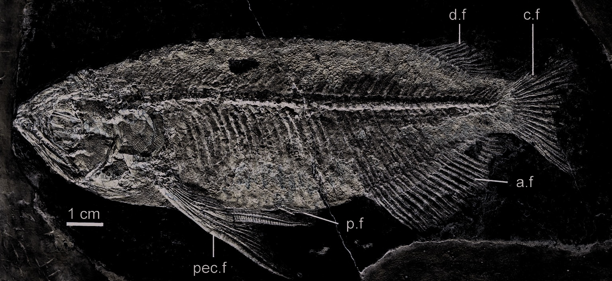

# Lesson 05 - Hệ vây và các cấu trúc nâng đỡ

## 1. Mục tiêu học tập

Người học có thể mô tả vị trí, tỷ lệ và số tia của các vây chính, đồng thời phân biệt dữ liệu của holotype với khoảng biến thiên quan sát ở các mẫu khác.

## 2. Phạm vi nguồn

Nguồn chính: **Appendicular skeleton**, **Pectoral fin**, **Pelvic girdle and fin**, **Dorsal and anal fins**.

## 3. Vây ngực

Vây ngực là một trong những đặc điểm nổi bật nhất của loài hóa thạch. Nó rất dài và **vượt ra phía sau vị trí bắt đầu của vây bụng**. Ở holotype, tia dài nhất khoảng **47 mm**, trong khi điểm bắt đầu vây bụng nằm khoảng 35 mm phía sau gốc vây ngực.

Vây ngực có **7 tia**. Tất cả tia trừ tia đầu đều phân nhánh và phân đốt; tia đầu rất dày, không phân nhánh nhưng vẫn có đốt.

## 4. Vây bụng

Đai vây bụng và vây bụng đều nhỏ. Vây bụng bắt đầu hơi gần vây hậu môn hơn so với vây ngực. Tác giả nhận diện khoảng **6 tia vây bụng**; tia đầu không phân nhánh, các tia còn lại phân nhánh.

Đặc điểm 6 tia giống `S. leichardti` trong mẫu so sánh và khác `S. formosus`, nơi tác giả đếm 5 tia.

## 5. Vây lưng

Vây lưng nhỏ, nằm về phía sau và bắt đầu sau điểm khởi đầu của vây hậu môn. Ở holotype:

- 2 tia procurrent ngắn;
- 1 tia chính dài không phân nhánh;
- 11 tia phân nhánh, với tia cuối có vẻ đôi;
- tổng cộng được diễn giải là **12 tia chính**.

Các mẫu khác có thể có khoảng **12-15 tia chính** và 14-17 pterygiophore.

## 6. Vây hậu môn

Vây hậu môn lớn hơn rõ rệt so với vây lưng. Holotype có 3 tia procurrent rất nhỏ và **22 tia chính**, được nâng đỡ bởi 23 pterygiophore. Ở các mẫu khác, số pterygiophore hậu môn khoảng 21-24.

Đặc trưng này gần `S. formosus` hơn `S. leichardti`, loài sau có số tia chính vây hậu môn cao hơn trong mẫu so sánh.

## 7. Bảng ghi nhớ

| Cấu trúc | Số liệu chính ở holotype |
| --- | ---: |
| Tia vây ngực | 7 |
| Chiều dài tia ngực dài nhất | ~47 mm |
| Tia vây bụng | ~6 |
| Tia chính vây lưng | 12 |
| Tia chính vây hậu môn | 22 |

## 8. Ý nghĩa hình thái

Khi so sánh cá hóa thạch, không nên chỉ ghi “có vây ngực dài”. Cần kết hợp **vị trí gốc vây**, **độ vươn của tia**, **số tia**, **kiểu phân nhánh** và **cấu trúc nâng đỡ**. Chính tổ hợp này mới mang giá trị phân loại cao.

## 9. Kiểm tra nhanh

1. Đặc điểm nào làm vây ngực `S. sinensis` nổi bật so với `Scleropages` hiện sinh?
2. Vây lưng và vây hậu môn, vây nào lớn hơn?
3. Vì sao cần phân biệt số liệu holotype với khoảng biến thiên của các mẫu khác?
