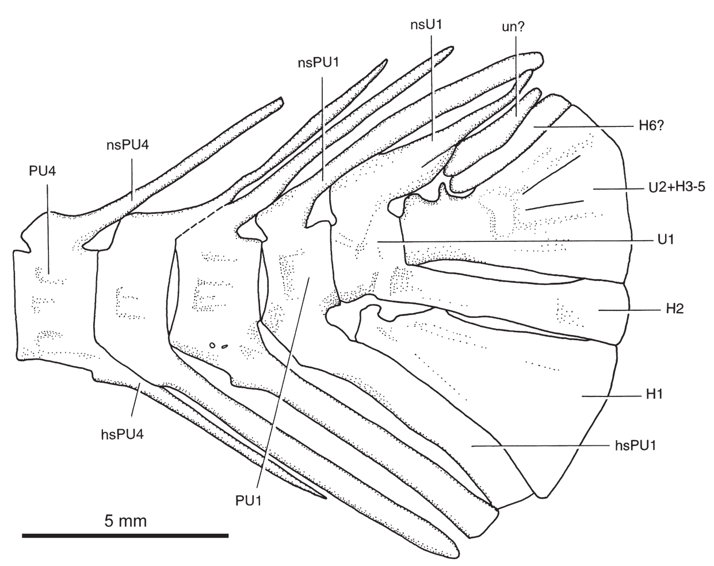
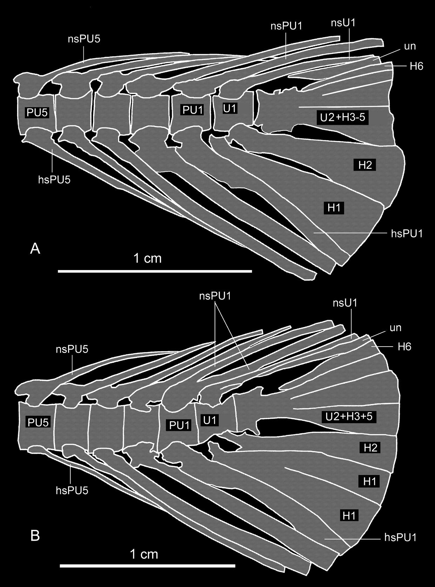

# Lesson 06 - Cột sống và bộ xương đuôi

## 1. Mục tiêu học tập

Người học có thể mô tả cột sống của `S. sinensis`, đọc các thành phần U1/U2-hypural trong bộ xương đuôi và so sánh tổ chức đuôi với hai loài `Scleropages` hiện sinh.

## 2. Phạm vi nguồn

Nguồn chính: **Vertebral column and caudal fin** và phần thảo luận liên quan đến hypural.

## 3. Cột sống

Các mẫu có khoảng **46-48 đốt sống**. Holotype được diễn giải có khoảng 22 đốt bụng và 24 đốt đuôi, bao gồm hai ural centra. Con số tổng này thấp hơn đáng kể so với các osteoglossid hiện sinh được tác giả so sánh.

Bốn neural spine đầu tiên còn ở trạng thái đôi; các neural spine phía sau, trước vây lưng, hợp thành cấu trúc đơn. Tác giả cũng ghi nhận khoảng **22 cặp xương sườn** và khoảng 22 supraneural ở một mẫu.

## 4. Tổ chức bộ xương đuôi

Các nhãn quan trọng của Hình 5:

- `PU1`, `PU4`: preural vertebrae;
- `U1`, `U2`: ural centra;
- `H1-H6`: sáu hypural;
- `ns`: neural spine;
- `hs`: haemal spine;
- `un`: uroneural.

Ba neural/haemal spine được kéo dài để nâng đỡ các tia vây đuôi. U1 mang một neural spine hoàn chỉnh và có dấu hiệu của một neural spine thứ hai chưa tách hoàn toàn. U2 hợp với phần gốc của hypural 3-5.

Tác giả nhận diện **6 hypural**. H1 rất sâu, H2 hẹp hơn nhiều; H3-H5 hợp gần ở phần gốc và áp sát nhau về phía xa. Một xương dạng que phía trên nhóm H3-H5 được diễn giải là H6; phía trên nữa là uroneural hợp nhất.

## 5. So sánh với loài hiện sinh

`S. leichardti` có một trạng thái khác thường: U1 liên hệ với ba hypural ở các mẫu tác giả kiểm tra. `S. formosus` gần với cấu hình thường gặp hơn, với hai hypural dưới chính. `S. sinensis` có H1 rất sâu, gợi liên hệ hình thái với việc các hypural dưới ở `S. leichardti` có thể hợp nhất, nhưng bài báo nhấn mạnh rằng cần thêm mẫu và dữ liệu phát triển để giải thích chắc chắn.

## 6. Vây đuôi

Vây đuôi tròn. Có **16 tia chính**. Tia đầu và tia cuối không phân nhánh nhưng gần dài bằng các tia bên trong. Điều này khác các loài `Scleropages` và `Osteoglossum` hiện sinh được thảo luận, nơi các tia ngoài ngắn hơn nhiều so với tia giữa.

## 7. Cách học bộ xương đuôi

Thay vì nhớ hình như một tập ký hiệu, hãy học theo chuỗi cơ học từ trước ra sau:

`đốt preural` → `ural centra` → `hypural/uroneural` → `tia vây đuôi`.

Chuỗi này phản ánh cách lực từ cột sống được truyền đến mặt phẳng vây đuôi, dù bài báo tập trung vào hình thái học chứ không đo cơ sinh học chuyển động.

## 8. Kiểm tra nhanh

1. `S. sinensis` có khoảng bao nhiêu đốt sống?
2. U2 liên hệ với hypural 3-5 như thế nào?
3. Đặc điểm chiều dài tia ngoài của vây đuôi khác loài hiện sinh ra sao?
