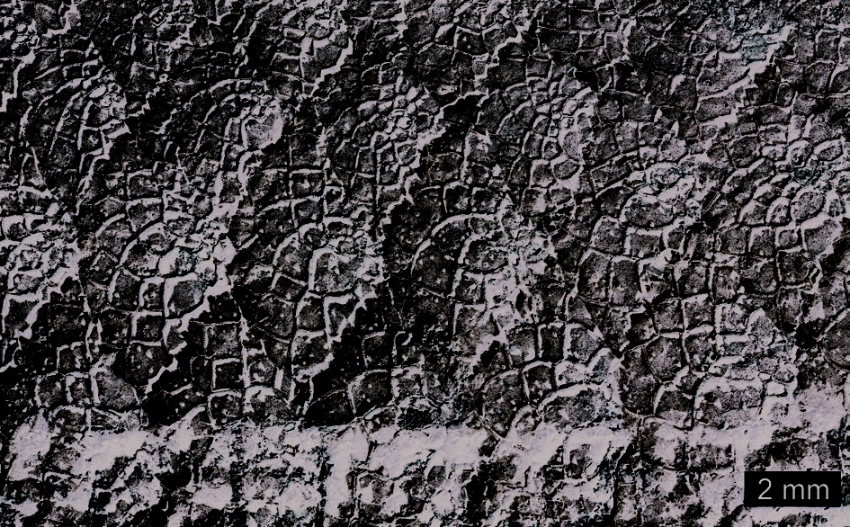
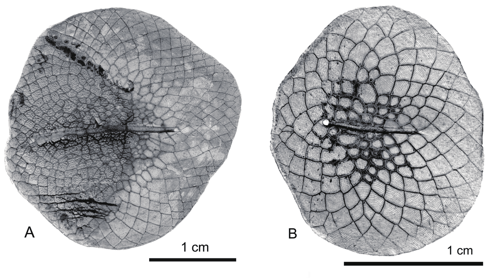

# Lesson 07 - Vảy, squamule và đường bên

## 1. Mục tiêu học tập

Người học có thể mô tả kiểu vảy của `S. sinensis`, giải thích khái niệm squamule và hiểu vì sao vảy là một phần quan trọng trong chẩn đoán Osteoglossidae.

## 2. Phạm vi nguồn

Nguồn chính: mục **Squamation** và phần Discussion sử dụng đặc điểm vảy để so sánh.

## 3. Hình thái vảy

Vảy của `S. sinensis` lớn, dạng **cycloid**, hình oval và có hoa văn lưới đặc trưng của osteoglossid.

Bề mặt ngoài có circuli ở vùng gốc và trang trí dạng hạt ở vùng ngọn. Cấu trúc lưới được tạo bởi các đơn vị nhỏ gọi là **squamule**.

## 4. Squamule

Squamule có thể có dạng thoi, đa giác hoặc không đều. Bề mặt phía trong của một squamule có thể trơn hoặc mang nhiều gờ/nốt tròn nhỏ. Tác giả ghi nhận mỗi squamule có thể có từ **1 đến 25 tubercle** nổi, với một lỗ nhỏ ở trung tâm mỗi tubercle.

Đây là đặc điểm vi hình thái hữu ích khi so sánh vảy osteoglossiform, nhưng việc phân loại không dựa riêng vào nó; bài báo kết hợp vảy với sọ, vây và bộ xương đuôi.

## 5. So sánh vảy hiện sinh

Hình 8 cho phép quan sát trực tiếp mô hình lưới trên vảy `Osteoglossum bicirrhosum` và `Scleropages formosus`. So sánh kiểu cấu trúc này giúp người học hiểu tại sao hóa thạch vảy rời từng được gán cho osteoglossid, đồng thời cũng thấy giới hạn: các nhóm gần nhau có thể sở hữu vảy rất giống nhau.

## 6. Đường bên

Đường bên chạy ngay dưới cột sống. Tác giả đếm khoảng **24 vảy dọc đường bên** ở `S. sinensis`, gần `S. formosus` và ít hơn khoảng 10 vảy so với `S. leichardti` trong mẫu so sánh.

## 7. Bài tập quan sát

So sánh Hình 7 và Hình 8, hãy ghi lại ba tầng quan sát:

1. hình dạng toàn vảy;
2. hoa văn lưới cấp trung gian;
3. chi tiết squamule/tubercle.

Cách quan sát theo cấp độ giúp tránh nhầm giữa đặc điểm của cả vảy và đặc điểm vi cấu trúc.

## 8. Kiểm tra nhanh

1. Vảy `S. sinensis` thuộc kiểu cơ bản nào?
2. Squamule là gì?
3. Số vảy đường bên giúp so sánh `S. sinensis` với `S. leichardti` như thế nào?
