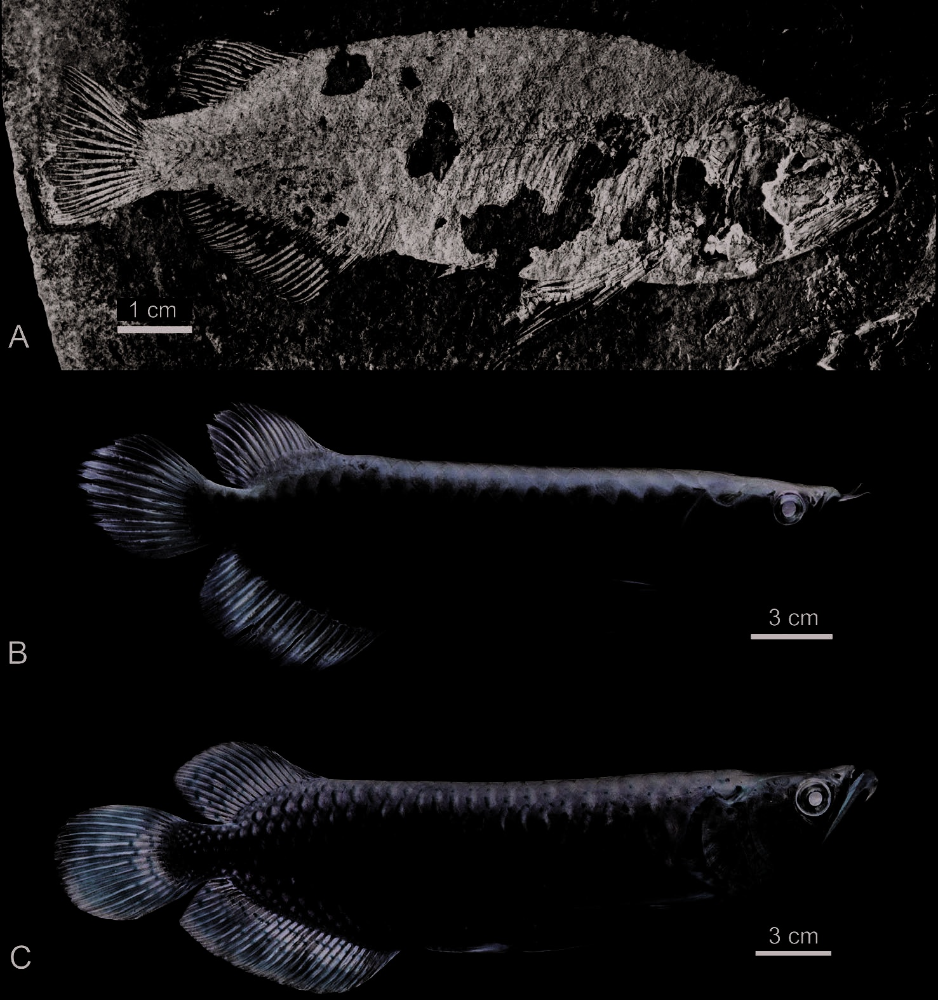

# Lesson 08 - So sánh `S. sinensis`, `S. formosus` và `S. leichardti`

## 1. Mục tiêu học tập

Người học có thể dùng ma trận đặc điểm để giải thích vì sao `S. sinensis` vừa đủ giống `Scleropages` để thuộc cùng chi, vừa đủ khác để là loài mới, và vì sao nó được xem là gần `S. formosus` hơn.

## 2. Phạm vi nguồn

Nguồn chính: phần đầu **Discussion** và các bảng so sánh bằng mô tả trong bài báo.

## 3. Những đặc điểm tách `S. sinensis` khỏi loài hiện sinh

| Đặc điểm | `S. sinensis` | Trạng thái ở loài hiện sinh được so sánh |
| --- | --- | --- |
| Posterior infraorbital | không che kín nhánh lưng preopercle | che kín hơn |
| Tỷ lệ rộng:cao posterior infraorbital | ~0,75 | ~1,0-1,2 |
| Góc sau-bụng preopercle | kéo nhọn | không như vậy |
| Opercle | bờ sau-bụng lõm, đầu bụng nhọn | ít/không biểu hiện trạng thái này |
| Supracleithrum | cong ngược | cong đều hơn |
| Mỏm lưng cleithrum | dài, khỏe, dạng que | ngắn và nhọn hơn |
| Vây ngực | rất dài, vượt gốc vây bụng | không vươn tới gốc vây bụng |
| Số đốt sống | ~46-48 | khoảng ~60 ở so sánh của tác giả |
| Tia ngoài vây đuôi | gần dài bằng tia giữa | ngắn hơn nhiều |

## 4. Đặc điểm gần S. formosus hơn S. leichardti

Một số đặc điểm đặt `S. sinensis` gần `S. formosus` hơn:

- parietal có tỷ lệ dài:rộng khoảng 2:3, trong khi `S. leichardti` gần 1:1;
- antorbital có hình thái gần `S. formosus` hơn;
- maxilla có khoảng 40 răng, so với khoảng 35 ở `S. leichardti`;
- số tia chính vây hậu môn thấp hơn `S. leichardti`;
- có khoảng 24 vảy đường bên, so với khoảng 34 ở `S. leichardti`.

## 5. Những nét vẫn chia sẻ với S. leichardti

Không phải mọi đặc điểm đều “nghiêng” về `S. formosus`. `S. sinensis` có khoảng 6 tia vây bụng, giống trạng thái được tác giả ghi ở `S. leichardti` hơn `S. formosus` có 5. H1 của bộ xương đuôi cũng rất sâu, tạo một điểm tương đồng hình thái với cấu hình hypural của `S. leichardti`.

Điều này minh họa một nguyên tắc quan trọng của phân loại hình thái: quan hệ không được suy ra từ một đặc điểm đơn lẻ mà từ **tổ hợp đặc điểm**.

## 6. Quy trình lập ma trận so sánh

Khi tự nghiên cứu một model cá khác, có thể dùng mẫu sau:

| Vùng | Biến số định lượng | Trạng thái định tính | Hình tham chiếu |
| --- | --- | --- | --- |
| Sọ | tỷ lệ xương, số răng | có/không ornament | Hình sọ |
| Vây | số tia, vị trí gốc | tia phân nhánh/không | ảnh toàn thân |
| Trục thân | số đốt sống | gai đôi/hợp | ảnh xương |
| Đuôi | số hypural/tia | hình dạng H1, U1 | sơ đồ đuôi |
| Vảy | số vảy đường bên | reticulate pattern | ảnh vảy |

## 7. Kiểm tra nhanh

1. Nêu hai đặc điểm cho thấy `S. sinensis` gần `S. formosus` hơn.
2. Nêu một đặc điểm mà `S. sinensis` lại giống `S. leichardti` hơn.
3. Vì sao không nên kết luận quan hệ chỉ từ một tia vây hoặc một chiếc vảy?
