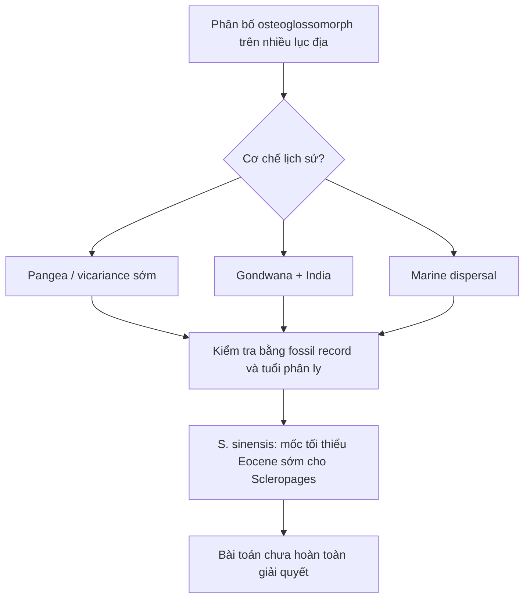

# Lesson 10 - Cổ sinh địa lý và ý nghĩa tiến hóa

## 1. Mục tiêu học tập

Người học có thể tóm tắt các mô hình giải thích phân bố xuyên lục địa của Osteoglossomorpha và hiểu vì sao `S. sinensis` cung cấp một mốc thời gian quan trọng nhưng chưa giải quyết hoàn toàn bài toán địa sinh học.

## 2. Phạm vi nguồn

Nguồn chính: phần sau của **Discussion**, từ đoạn nói về phân bố toàn cầu của osteoglossomorph đến kết luận về ý nghĩa của `S. sinensis`.

## 3. Bài toán phân bố xuyên đại dương

Ngoại trừ một số trường hợp, osteoglossomorph hiện sinh chủ yếu là cá nước ngọt nhiệt đới/cận nhiệt đới, nhưng hóa thạch của nhóm đã xuất hiện trên nhiều lục địa. Phân bố này tạo ra một câu hỏi lớn: bằng cách nào các dòng cá nước ngọt có thể xuất hiện ở những vùng cách nhau bởi đại dương?

Bài báo điểm lại nhiều giả thuyết lịch sử:

- nguồn gốc ở châu Phi;
- nguồn gốc ở Đông Á;
- một vùng đất giả thuyết kiểu “Pacifica”;
- nguồn gốc rất sớm trên Pangea, sau đó phân tách do kiến tạo và tuyệt chủng;
- nguồn gốc Gondwana với sự vận chuyển của dòng cá rồng châu Á qua tiểu lục địa Ấn Độ;
- phát tán biển ở một giai đoạn nào đó.

## 4. Mô hình Pangea và Gondwana

Một số tác giả được Zhang & Wilson trích dẫn cho rằng các nhánh chính của Osteoglossomorpha đã phân bố rộng trên Pangea trước khi siêu lục địa tách hoàn toàn. Theo mô hình này, phân bố “rời rạc” ngày nay phần lớn là tàn dư sau tuyệt chủng.

Một hướng khác dựa trên ước tính phân tử từng đặt sự tách giữa cá rồng châu Á và Australia vào khoảng 138 Ma, gần thời gian tách các mảnh Gondwana. Từ đó xuất hiện giả thuyết cá rồng châu Á được “chở” theo tiểu lục địa Ấn Độ lên Eurasia.

## 5. Các kết quả thời gian gần hơn

Bài báo cũng trình bày kết quả của Lavoué (2015), cho khoảng tuổi 79,9-101,4 Ma cho `Scleropages`, trẻ hơn đáng kể so với ước tính 138 ± 18 Ma trước đó. Nếu đúng, sự phân ly giữa nhánh Sundaland-Indochina và Australia-New Guinea xảy ra sau khi Ấn Độ tách khỏi Australia-Antarctica, làm yếu mô hình Gondwana đơn giản cho `Scleropages`.

Lavoué (2016) tiếp tục dùng cây phát sinh có hiệu chỉnh thời gian kết hợp dữ liệu hiện sinh, hóa thạch, phân tử và hình thái, và cho rằng phát tán biển có thể là một lời giải cần xem xét cho một số osteoglossomorph, đặc biệt `Scleropages`. Tuy nhiên, khả năng chịu mặn của `Scleropages` cũng được các nguồn khác nhau đánh giá không thống nhất.

## 6. Vai trò của Scleropages sinensis

`S. sinensis` không tự mình chứng minh Pangea, Gondwana hay marine dispersal. Giá trị chắc chắn hơn của nó là **ràng buộc thời gian**: `Scleropages` đã hiện diện rõ ở châu Á vào Eocene sớm, vì vậy sự phân ly giữa `Scleropages` và `Osteoglossum` phải ít nhất cổ đến mức đó.

Bài báo kết luận bài toán địa sinh học của osteoglossid vẫn là một “enigma”. Cần thêm hóa thạch, đặc biệt các bằng chứng có thể kiểm tra khả năng phân bố biển hoặc những sự kiện phân cắt địa lý chưa biết.

## 7. Sơ đồ tư duy

## 8. Kiểm tra nhanh

1. Vì sao phân bố xuyên lục địa của cá nước ngọt là bài toán khó?
2. Kết quả tuổi của Lavoué (2015) tác động thế nào đến giả thuyết Gondwana?
3. Phát hiện `S. sinensis` giải quyết được điều gì chắc chắn nhất?
