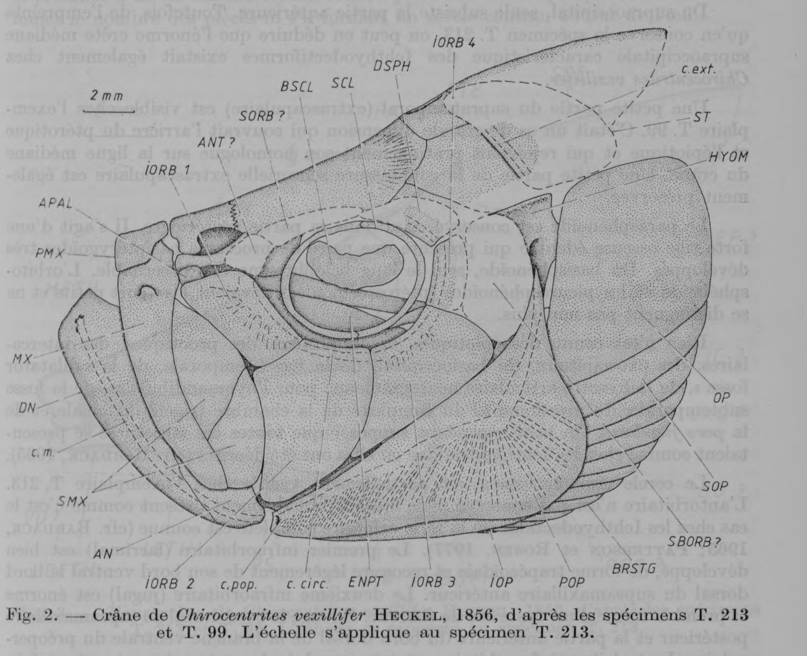
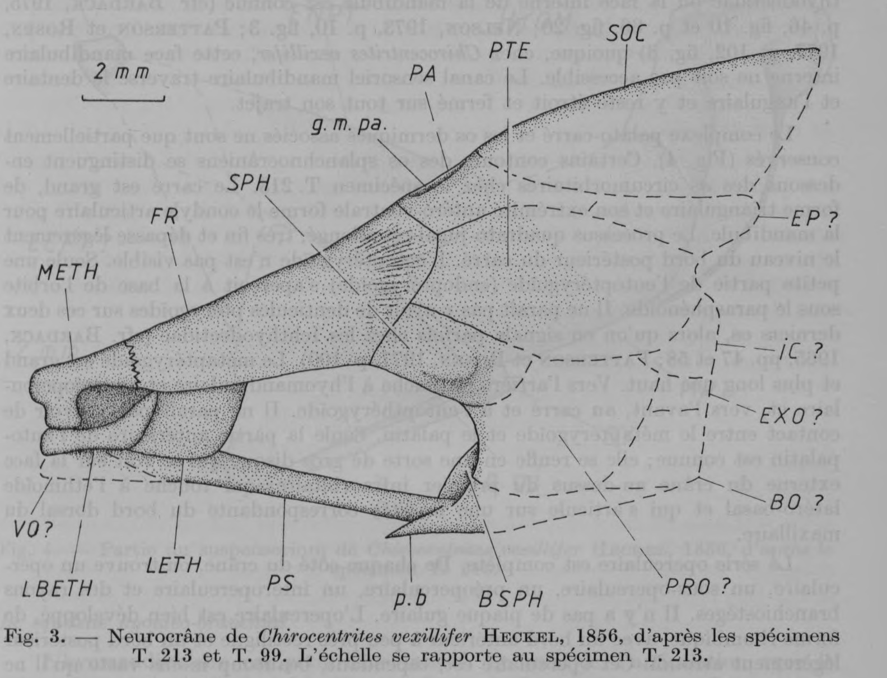

# Bài 01 - Sọ và phức hợp ethmoid

**Loại:** Lesson  
**Module:** 02 - Giải phẫu vùng đầu  
**Nguồn chính:** PDF, trang 2-5; Figures 2-3

## Mục tiêu học tập

Sau bài này, người học có thể:

- mô tả hình dạng tổng quát của sọ;
- nhận diện phức hợp ethmoid và các liên kết chính;
- giải thích các đặc điểm của vòm sọ và neurocranium;
- phân biệt dữ liệu quan sát được với phần không bảo tồn.

## Hình dạng tổng quát của sọ

Đầu được mô tả là chắc và ossified mạnh. Chiều cao sọ vào khoảng 75-85% chiều dài sọ. Hàm dưới nhô ra rõ, miệng hướng lên, mõm ngắn, đường trán dốc và gần thẳng, ổ mắt lớn và nằm lùi.

## Phức hợp ethmoid

Ở specimen T. 213, vùng ethmoid bảo tồn tốt. Mesethmoid là xương giữa, ngắn và rộng, tiếp khớp với frontal ở phía sau. Phía trước có vùng tròn rộng và các mỏm bên lớn.

Tác giả diễn giải mesethmoid như cấu trúc hình thành từ sự hợp nhất của phần dermethmoid bề mặt và supraethmoid có nguồn gốc enchondral. Lateral ethmoid phát triển mạnh. Phía trước mỗi lateral ethmoid có lateral-basal ethmoid, còn gọi ethmo-palatine, dài và mảnh.

Lateral-basal ethmoid có quan hệ quan trọng với:

- mesethmoid;
- frontal;
- maxilla;
- autopalatine.

Đặc điểm này về sau trở thành một mắt xích quan trọng trong lập luận hệ thống học của tác giả.

## Vòm sọ và neurocranium

Vòm sọ gồm frontal, parietal và pterotic. Frontal dài, rộng và mở rộng dần về phía sau. Ở specimen T. 99, hai parietal được mô tả là hợp nhất thành một xương giữa.

Từ dấu tích của supraoccipital, tác giả suy ra loài này có mào giữa lớn, một đặc điểm gắn với Ichthyodectiformes.

Parasphenoid là một thanh xương khỏe, không mang răng và có cặp basipterygoid process phát triển.

## Các phần chưa biết rõ

Bài báo nêu nhiều cấu trúc không bảo tồn hoặc không quan sát chắc chắn, gồm một số phần của occipital region, prootic, intercalar, basioccipital, temporal fossa và các khoang thần kinh-sọ khác. Các phần này không nên được tái dựng như dữ liệu trực tiếp của specimen.

## Điểm ghi nhớ

- Sọ cao tương đối, ossified mạnh và có miệng hướng lên.
- Lateral-basal ethmoid là cấu trúc then chốt trong mô tả và hệ thống học.
- Parietal hợp nhất là một đặc điểm được tác giả dùng khi so sánh với *Thrissops*.
