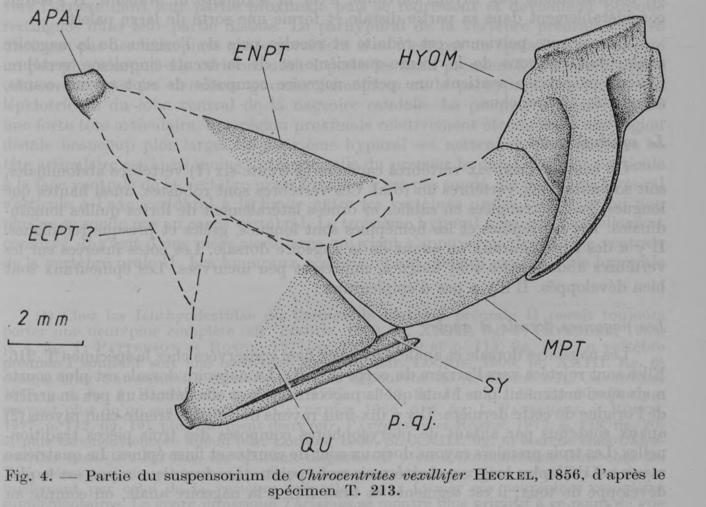

# Bài 03 - Bộ nắp mang và hệ hyoid-branchial

**Loại:** Lesson  
**Module:** 02 - Giải phẫu vùng đầu  
**Nguồn chính:** PDF, trang 6-8; Figure 4

## Mục tiêu học tập

Sau bài này, người học có thể:

- liệt kê thành phần của opercular series;
- mô tả hình dạng đặc biệt của preopercular;
- giải thích vị trí của hyomandibular và symplectic;
- chỉ ra phần dữ liệu hyoid-branchial còn thiếu.

## Opercular series

Chuỗi nắp mang được mô tả là đầy đủ với:

- opercular;
- subopercular;
- preopercular;
- interopercular;
- branchiostegal rays.

Không có gular plate.

Opercular có dạng gần hình thoi và nhỏ hơn đáng kể so với opercular của nhiều Ichthyodectidae khác.

## Preopercular - đặc điểm nổi bật

Preopercular rất lớn nhưng không phát triển đồng đều. Nhánh dorsal ngắn và hẹp; nhánh ventral lại rất dài và rộng. Kênh cảm giác preopercular chạy suốt xương và phát ra nhiều nhánh phụ, specimen T. 213 được mô tả có khoảng 23 diverticula.

Sự phì đại nhánh ventral và thu nhỏ nhánh dorsal sau đó được dùng như một đặc điểm quan trọng để định vị *Chirocentrites*.

## Hyoid-branchial region

Hyomandibular nhỏ nhưng chắc. Condyle với neurocranium dày và kéo dài. Nhánh đi xuống cong như móc và có rãnh tiếp nhận nhánh dorsal nhỏ của preopercular.

Symplectic là một thanh xương hẹp nằm giữa quadrate và quadratojugal process. Các phần khác của hyoid arch và branchial arches không đủ dữ liệu để mô tả.

## Liên hệ với Figure 4

Figure 4 minh họa trực tiếp mối quan hệ giữa autopalatine, entopterygoid, hyomandibular, metapterygoid, symplectic và quadrate. Khi đọc hình, nên ưu tiên quan hệ tiếp xúc giữa các xương thay vì chỉ ghi nhớ hình dạng riêng lẻ.

## Điểm ghi nhớ

- Preopercular là một trong những xương chẩn đoán quan trọng nhất của chi.
- Hyomandibular không chỉ tham gia treo hàm mà còn liên hệ chặt với preopercular.
- Phần branchial arch gần như không đủ dữ liệu trong hóa thạch này.
