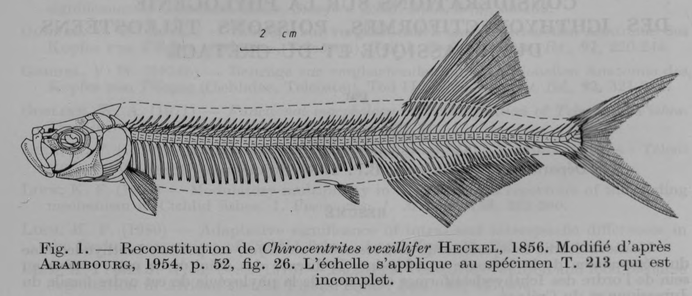

# Bài 02 - Vây lưng, vây hậu môn và hình thái vây

**Loại:** Lesson  
**Module:** 03 - Thân, vây và bộ xương đuôi  
**Nguồn chính:** PDF, trang 8; Figure 1

## Mục tiêu học tập

Sau bài này, người học có thể:

- so sánh vị trí và hình dạng vây lưng với vây hậu môn;
- nêu số ray được tác giả ghi nhận;
- nhận biết sự chuyển tiếp từ spine sang segmented ray.

## Vị trí của hai vây

Cả dorsal fin và anal fin đều nằm lùi về phía sau. Dorsal fin ngắn hơn nhưng cao hơn đáng kể. Gốc dorsal fin bắt đầu hơi phía sau gốc anal fin.

## Vây lưng

Tác giả ghi nhận 18 dorsal rays. Ba ray đầu là các spine ngắn và mảnh. Ray thứ tư dài hơn, đã phân đốt nhưng vẫn nhọn. Ray thứ năm phát triển mạnh nhất, phân đốt và phân nhánh.

## Vây hậu môn

Anal fin có khoảng 35 rays ở specimen được nghiên cứu. Ít nhất hai ray đầu là spine ngắn, sau đó chuyển sang các ray phân đốt và phân nhánh.

Số ray hậu môn được các nghiên cứu cũ báo cáo dao động nhẹ giữa các specimen và địa điểm, vì vậy cần hiểu đây là dữ liệu hóa thạch có biến thiên và giới hạn bảo tồn.

## Ý nghĩa so sánh

Số lượng ray, vị trí bắt đầu của vây và tỷ lệ chiều cao/chiều dài của vây được dùng trong so sánh giữa các loài và các chi Ichthyodectidae.

## Điểm ghi nhớ

- Dorsal fin: ngắn hơn nhưng cao hơn anal fin.
- Dorsal fin được mô tả có 18 rays.
- Anal fin được mô tả có khoảng 35 rays.
