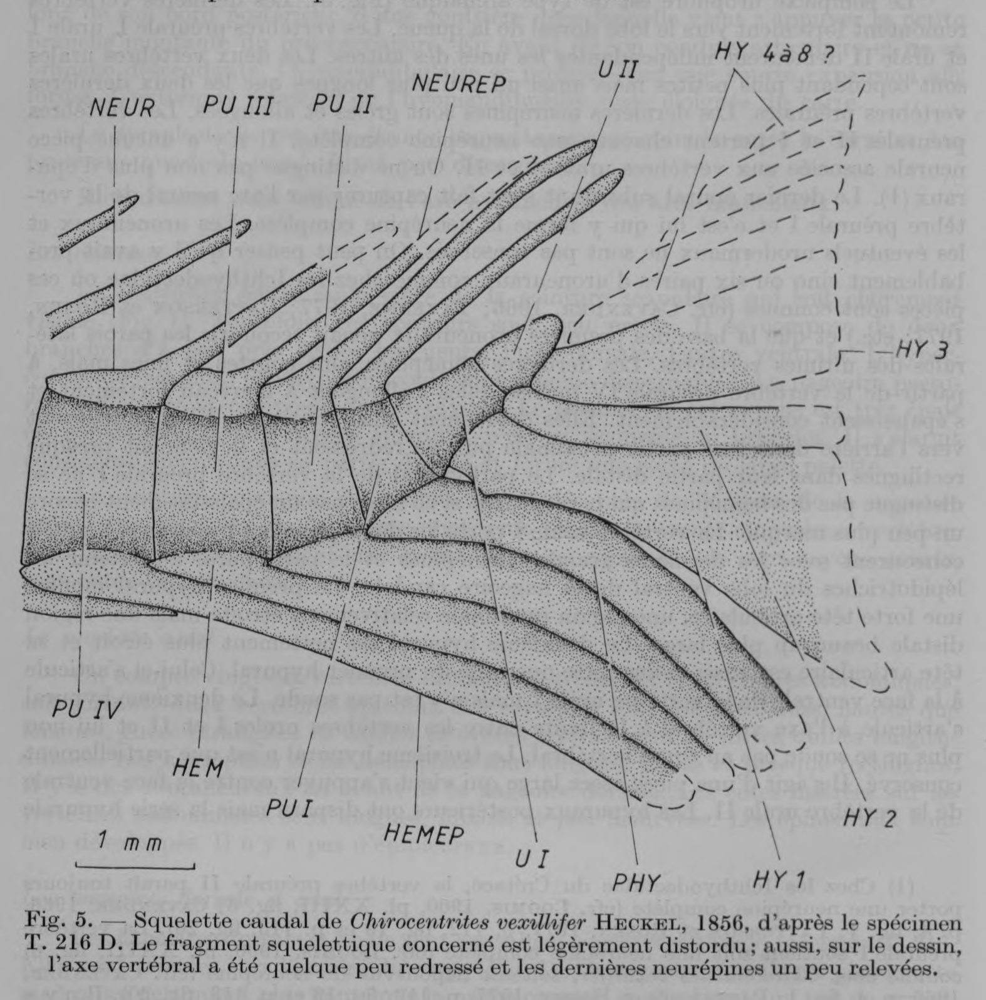

# Bài 03 - Bộ xương đuôi và vảy

**Loại:** Lesson  
**Module:** 03 - Thân, vây và bộ xương đuôi  
**Nguồn chính:** PDF, trang 9-10; Figure 5

## Mục tiêu học tập

Sau bài này, người học có thể:

- mô tả tổ chức của caudal skeleton;
- phân biệt preural vertebrae, ural vertebrae, hypurals và parhypural;
- giải thích hiện tượng "capture" epural trong lập luận của tác giả;
- mô tả hình thái caudal fin và vảy.

## Kiểu tổ chức caudal skeleton

Tác giả xem urophore complex là tương đối cổ. Preural I, ural I và ural II vẫn độc lập. Preural II và preural I mỗi đốt mang một neural spine hoàn chỉnh.

Không quan sát được epural tự do. Bài báo giải thích rằng epural cuối đã được "capture" vào neural arch của preural I để tạo neural spine hoàn chỉnh.

## Hemal elements và hypurals

Từ preural IV về sau, các hemal spines kéo dài và dày lên rõ. Parhypural ở preural I tương tự các hemal spines trước nó nhưng dày hơn.

Ural I mang hai hypurals đầu. Hypural 1 có đầu khớp lớn và phần xa mở rộng; hypural 2 hẹp hơn. Hypural 3 chỉ bảo tồn một phần. Các hypural sau không còn nhưng toàn bộ chuỗi được tác giả ước đoán có khoảng 7-8 phần.

## Vây đuôi

Caudal fin phát triển, chia hai thùy hẹp, dài và nhọn. Bảo tồn không đủ để đếm chắc chắn principal rays, nhưng tác giả ước tính khoảng 19 ray chính: 10 ở thùy trên và 9 ở thùy dưới.

## Vảy

Cơ thể phủ các vảy lớn hình oval. Khoảng 60 vảy nằm dọc lateral line và khoảng 10 vảy theo hàng ngang. Bề mặt có các circuli đồng tâm cùng một số ít radii.

## Điểm ghi nhớ

- Caudal skeleton cung cấp nhiều character hệ thống học hơn hình dạng vây đuôi bên ngoài.
- Quan hệ epural-neural arch là điểm tác giả dùng để thảo luận tiến hóa.
- Vảy được mô tả là kiểu nguyên thủy phổ biến trong Ichthyodectidae.
