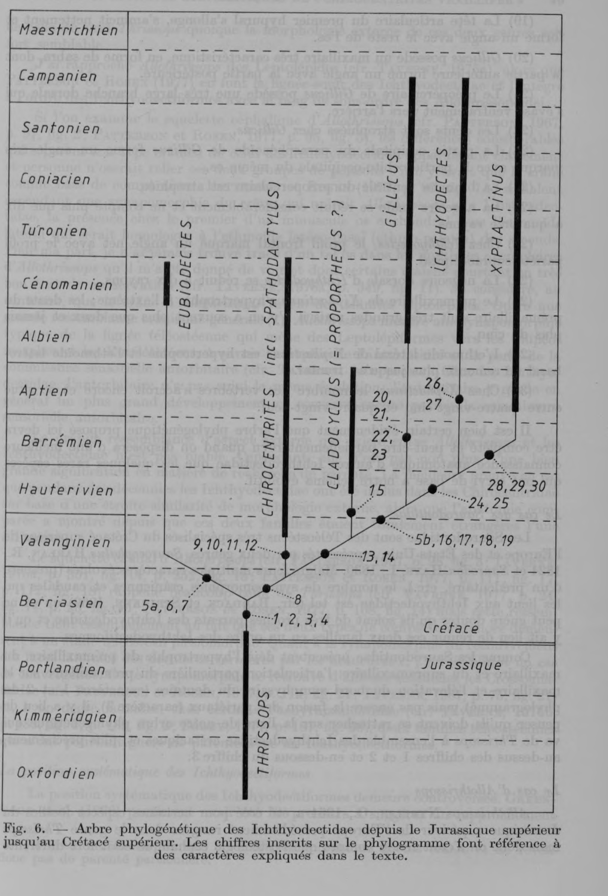
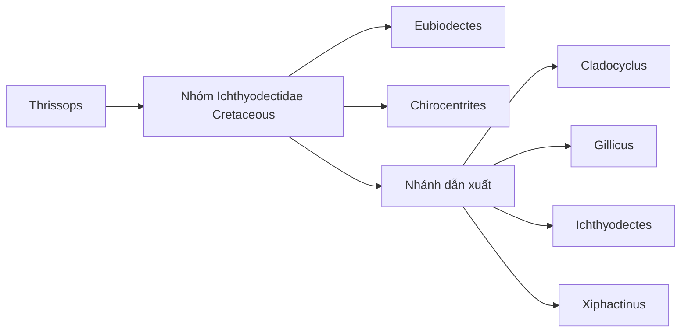

# Bài 02 - Phylogeny của Ichthyodectidae theo Taverne

**Loại:** Lesson  
**Module:** 04 - Hệ thống học và tiến hóa  
**Nguồn chính:** PDF, trang 13-16; Figure 6

## Mục tiêu học tập

Sau bài này, người học có thể:

- đọc phylogram trong Figure 6;
- hiểu cách character number được gắn lên nhánh;
- nhận diện các hướng biến đổi chính từ *Thrissops* đến các Ichthyodectidae Cretaceous;
- phân biệt giả thuyết phát sinh chủng loài của bài báo với dữ liệu quan sát trực tiếp.

## Cách đọc Figure 6

Figure 6 kết hợp trục thời gian địa tầng với các nhánh taxon. *Thrissops* nằm ở nền Jurassic muộn; các nhánh Cretaceous gồm *Eubiodectes*, *Chirocentrites* gồm *Spathodactylus*, *Cladocyclus*, *Gillicus*, *Ichthyodectes* và *Xiphactinus*.

Các số 1-30 trên cây không phải số specimen. Chúng là các character changes được tác giả liệt kê trong văn bản.

## Nhóm character nền của Ichthyodectidae Cretaceous

| Số | Biến đổi theo bài báo |
|---:|---|
| 1 | Maxilla và supramaxilla mở rộng; premaxilla ngắn và cao hơn, khớp chắc với maxilla. |
| 2 | Bờ symphysis của dentary cao hơn, làm hàm dưới chắc và sâu hơn. |
| 3 | Hai parietal hợp nhất thành một xương giữa. |
| 4 | Epurals giảm còn hai phần ngắn. |

## Các nhánh sớm

| Số | Biến đổi theo bài báo |
|---:|---|
| 5a | Ở *Eubiodectes*, uroneurals giảm còn khoảng 5 cặp. |
| 6 | Hemal spines cuối của *Eubiodectes* mảnh và không còn sát nhau. |
| 7 | Hypurostegy ở thùy đuôi dưới tăng ở *Eubiodectes*. |
| 8 | Epurals giảm còn một phần dài; đôi khi bị neural arch của preural I tiếp nhận. |
| 9 | Ở *Chirocentrites*, nhánh ventral preopercular phì đại, nhánh dorsal tiêu giảm. |
| 10 | Mất tiếp xúc quadrate-hyomandibular do metapterygoid kéo dài. |
| 11 | Opercular của *Chirocentrites* giảm kích thước. |
| 12 | Góc sau-dưới của circumorbital ring do infraorbital 2 tạo nên. |

## Các character ở các nhánh dẫn xuất

| Số | Biến đổi theo bài báo |
|---:|---|
| 13 | Xuất hiện notch ở đỉnh nhánh dorsal của preopercular. |
| 14 | Opercular trở nên rất lớn. |
| 15 | *Cladocyclus* giảm số vertebrae xuống khoảng 40-50. |
| 5b | Một lần giảm khác xuống 5 cặp uroneurals. |
| 16 | Vùng coronoid của dentary mở rộng mạnh. |
| 17 | Retroarticular bị loại khỏi articular facet cho quadrate. |
| 18 | Số vertebrae tăng, ít nhất 68, với tối thiểu 41 vertebrae bụng. |
| 19 | Đầu khớp của hypural 1 kéo dài, mảnh và tạo góc với thân xương. |
| 20 | *Gillicus* có maxilla dạng lưỡi kiếm. |
| 21 | Preopercular của *Gillicus* có nhánh dorsal rất rộng. |
| 22 | Răng ở *Gillicus* tiêu giảm. |
| 23 | Parasphenoid của *Gillicus* có góc gấp rõ giữa các phần. |
| 24 | Nhánh ventral của preopercular tiêu giảm. |
| 25 | Anal fin giảm còn khoảng 10-14 rays. |
| 26 | Ở *Ichthyodectes*, frontal profile tạo góc rõ với parietal-supraoccipital profile. |
| 27 | Dorsal fin của *Ichthyodectes* giảm còn 10 rays. |
| 28 | Premaxilla của *Xiphactinus* phì đại mạnh; răng premaxilla lớn nhưng ít. |
| 29 | Lateral ethmoid của *Xiphactinus* phì đại, lateral-basal ethmoid không còn vươn lên frontal. |
| 30 | *Xiphactinus* tăng số vertebrae lên khoảng 85-89. |

## Sơ đồ đọc nhanh

Sơ đồ Mermaid trên chỉ là bản hướng dẫn đọc khái niệm. Khi cần đối chiếu nhánh, tuổi địa tầng và character number, phải xem Figure 6 gốc.

## Giới hạn của cây

Tác giả tự lưu ý rằng phylogram cần được bổ sung và có thể sửa khi có thêm dữ liệu giải phẫu của các Ichthyodectidae khác. Vì vậy, Figure 6 nên được học như một giả thuyết dựa trên dataset hình thái của bài báo.

## Điểm ghi nhớ

- Character numbers là biến đổi hình thái, không phải mức độ "tiến hóa cao-thấp".
- Figure 6 kết hợp quan hệ nhánh với phân bố thời gian địa tầng.
- Phylogeny trong bài báo có tính giả thuyết và phụ thuộc dữ liệu bảo tồn.
