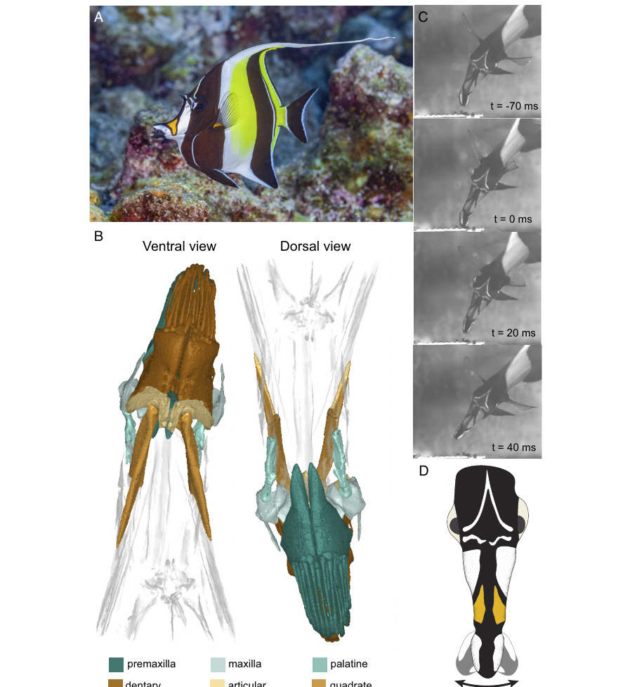

# Bài 02 - *Zanclus cornutus*: cấu trúc và biên độ chuyển động hàm

## 1. Mục tiêu bài học

- Xác định các xương chính tham gia cơ chế.
- Mô tả biên độ chuyển động hàm ngang.
- Giải thích vai trò của khớp và symphysis không hợp nhất.

## 2. Các xương chính

Hàm trên liên quan đến **premaxilla** và **maxilla**; hàm dưới liên quan đến **dentary** và **articular**. **Quadrate** tạo khớp với articular, còn **palatine** nằm trong hệ thống nâng đỡ vùng hàm trên.

## 3. Biên độ chuyển động

Video cho thấy tổng dải quay của hàm đạt khoảng **51,8°**, tương đương **25,9° về mỗi phía** so với đường giữa. Phần dịch chuyển theo phương ngang đóng góp khoảng **36% khoảng cách mà đầu hàm di chuyển trong một cú cắn**, khi so với thành phần mở - đóng dorsoventral.

Điểm quan trọng là *Z. cornutus* không chỉ quay hàm trên: cả hàm trên và hàm dưới có thể lệch sang một bên cùng lúc.

## 4. Symphysis hàm dưới không hợp nhất

Hai xương dentary không được hợp nhất cứng tại symphysis. Chúng được giữ với nhau bởi mô liên kết cho phép trượt tương đối. Khi hàm uốn sang một bên, một dentary có thể tiến ra trước so với dentary đối diện.

Cấu trúc này giúp hai nửa hàm dưới thay đổi vị trí tương đối mà không cần tách khớp articular-quadrate.

## 5. Khớp quadrate-articular

Ở nhiều cá vây tia, hai lồi cầu của quadrate chủ yếu định hướng chuyển động mở - đóng. Ở *Z. cornutus*, hai lồi cầu được mô tả là xoay khoảng **45°**, khiến hàm dưới có thành phần lệch khỏi đường giữa khi abduct.

## 6. Vai trò của maxilla

Hình dạng maxilla có một phần nhô ở đầu xa. Khi maxilla quay, cấu trúc này cùng hệ dây chằng có thể góp phần truyền chuyển động ngang giữa hàm trên và hàm dưới.

## 7. Ý nghĩa cơ học

Hệ thống không dựa vào một cấu trúc duy nhất. Khả năng quay hàm ngang xuất hiện từ sự phối hợp của:

- khớp có hướng chuyển động phù hợp;
- symphysis linh hoạt;
- hình dạng maxilla;
- các điểm bám cơ hàm được biến đổi;
- điều khiển co cơ bất đối xứng.

## 8. Bài tập

Hãy vẽ sơ đồ đơn giản gồm premaxilla, maxilla, dentary, articular và quadrate. Đánh dấu nơi bạn cho rằng cần có bậc tự do bổ sung để chuyển động lateral xảy ra.
