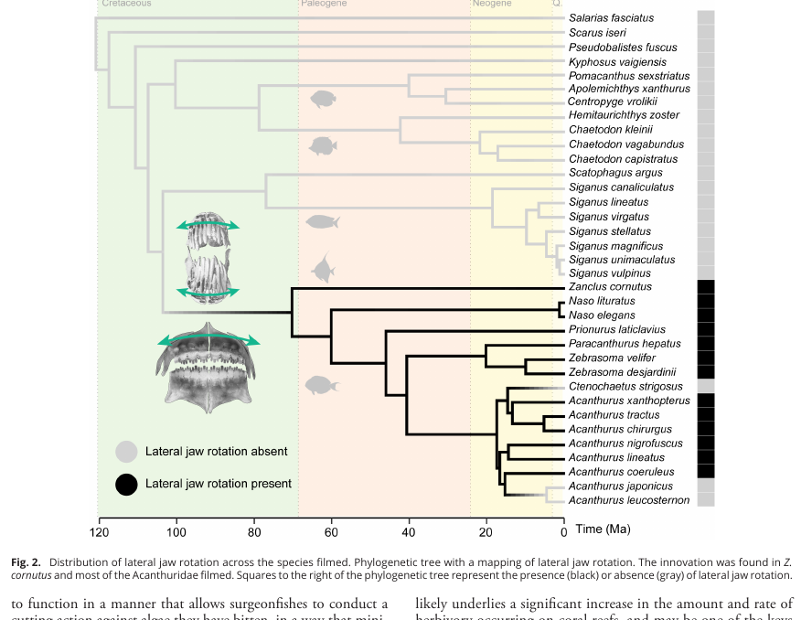

# Bài 03 - Acanthuridae: cơ chế hàm trên và hệ cơ adductor mandibulae

## 1. Mục tiêu bài học

- Phân biệt cơ chế surgeonfish với *Z. cornutus*.
- Mô tả các biến đổi ở cơ adductor mandibulae.
- Liên hệ hình thái răng với chức năng cắt tảo.

## 2. Mẫu phân bố của đặc điểm

Nghiên cứu cho thấy chuyển động hàm ngang hiện diện ở *Z. cornutus* và phần lớn các loài Acanthuridae được quay phim; nó không được phát hiện trong tám họ cá kiếm ăn đáy khác trong tập mẫu.

Ba ngoại lệ được nêu trong Acanthuridae gồm *Ctenochaetus strigosus*, *Acanthurus leucosternon* và *A. japonicus* trong các thử nghiệm của nghiên cứu.

## 3. Khác biệt chức năng với Zanclus

- *Zanclus*: quay đồng thời hàm trên và hàm dưới.
- Acanthuridae: chủ yếu quay **hàm trên**.

Surgeonfish thường thực hiện quay hàm trên sau khi cắn vào tảo sợi và khi bắt đầu chuyển động đầu sang bên. Đôi khi chuỗi này kết thúc bằng một cú hất đầu ngang.

## 4. Hệ cơ adductor mandibulae

Zanclidae và Acanthuridae có các biến đổi ở phức hợp cơ adductor mandibulae. Nghiên cứu chú ý đặc biệt tới phần **A1**, vì vị trí bám trên maxilla có thể tạo mô-men hiệu quả cho quay ngang.

Ở Acanthuridae, A1α có vùng bám rộng trên mặt trước-bên của maxilla. Ở một số taxon, A1α tách thành hai phần với vị trí bám riêng, làm tăng số điểm kiểm soát maxilla.

Một kết quả quan trọng là phần A1 liên quan chuyển động ngang bám ở **mặt bên** của maxilla trong nhánh Zanclidae + Acanthuridae, trong khi phần lớn các dòng họ gần đó có vị trí bám ở mặt trong.

## 5. Răng và tác động lên tảo

Nhiều surgeonfish có răng đa mấu. Khi cá giữ tảo và dịch hàm trên sang bên, tảo bị đưa qua các bề mặt cắt của nhiều mấu răng, tạo cơ chế **shear/cắt**.

Nghiên cứu gợi ý một đánh đổi hình thái:

- hàm dài của *Zanclus* hỗ trợ biên độ chuyển động ngang lớn;
- hàm ngắn của surgeonfish phù hợp hơn với lực ngang được kiểm soát để cắt tảo.

## 6. Câu hỏi tự kiểm tra

1. Vì sao nhiều điểm bám cơ trên maxilla có thể tăng độ linh hoạt điều khiển?
2. Tại sao chuyển động ngang hữu ích khi răng có nhiều mấu?
3. Khác biệt giữa “biên độ lớn” và “lực ngang được kiểm soát” là gì?
