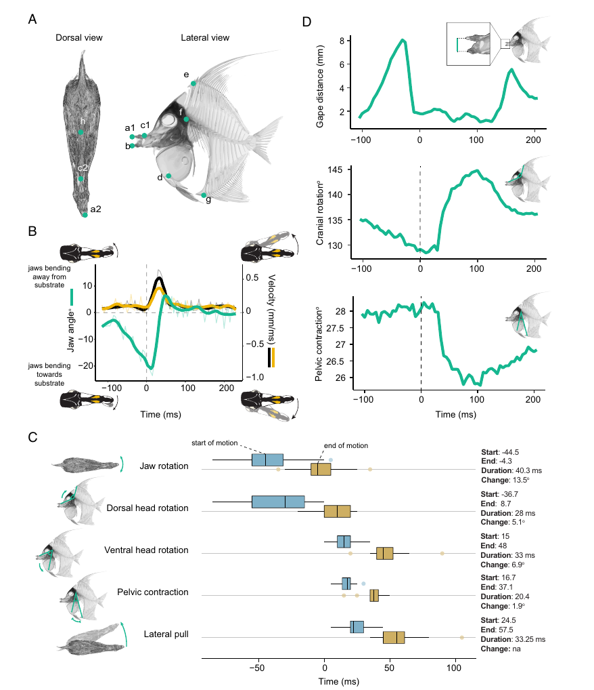

# Bài 04 - Chuỗi động học của một cú cắn ở *Zanclus cornutus*

## 1. Mục tiêu bài học

- Đọc timeline động học theo mốc thời gian tiếp xúc bề mặt.
- Phân biệt jaw rotation, cranial rotation, pelvic contraction và lateral pull.
- Hiểu cách landmark được dùng để đo chuyển động.

## 2. Quy ước thời gian

Trong phân tích, **t = 0 ms** là thời điểm hàm chạm bề mặt thức ăn/substrate. Các chuyển động trước thời điểm này có giá trị âm; các chuyển động sau tiếp xúc có giá trị dương.

## 3. Trình tự chính

### 3.1. Quay hàm trước tiếp xúc

Chuyển động lateral của hàm bắt đầu trung bình khoảng **46,6 ms trước khi chạm substrate**. Trong dữ liệu timeline tổng hợp ở Figure 3, jaw rotation có onset xấp xỉ -44,5 ms và kéo dài khoảng 40,3 ms trong pha được đánh dấu.

### 3.2. Tiếp xúc

Tại t = 0, góc giữa hàm và phần còn lại của đầu trung bình khoảng **6,8°**.

### 3.3. Kéo theo hướng bụng

Khoảng **10,2 ms sau tiếp xúc**, cá bắt đầu kéo con mồi bằng chuyển động quay theo hướng bụng của neurocranium. Pha này kéo dài khoảng 15 ms theo mô tả kết quả.

### 3.4. Chuyển sang kéo ngang

Khoảng **24,5 ms sau tiếp xúc**, chuỗi chuyển động chuyển sang lateral pull, kéo dài khoảng **33,25 ms**. Trong giai đoạn này, hàm quay trở về vị trí ban đầu và đôi khi vượt qua đường giữa một vài độ.

## 4. Landmarks và biến số

Figure 3 sử dụng landmark ở cả góc nhìn lưng và góc nhìn bên. Các biến số chính gồm:

- jaw angle;
- vận tốc điểm trước của neurocranium;
- vận tốc đầu hàm;
- gape distance;
- cranial rotation;
- pelvic contraction.

Các landmark được đặt theo chuỗi thời gian, cho phép biến chuyển động phức tạp thành các góc và khoảng cách có thể định lượng.

## 5. Diễn giải sinh cơ học

Điểm đặc biệt của *Zanclus* là jaw rotation không chỉ xảy ra sau khi cắn. Hàm đã lệch về phía substrate **trước tiếp xúc**, cho thấy đây là một phần của chiến lược định vị và tiếp cận thức ăn trong cấu trúc phức tạp.

## 6. Bài tập đọc đồ thị

Quan sát Figure 3 và trả lời:

1. Jaw rotation bắt đầu trước hay sau cranial rotation?
2. Lateral pull xuất hiện ở pha nào so với t = 0?
3. Vì sao cần đồng thời dữ liệu góc hàm và vận tốc landmark?
