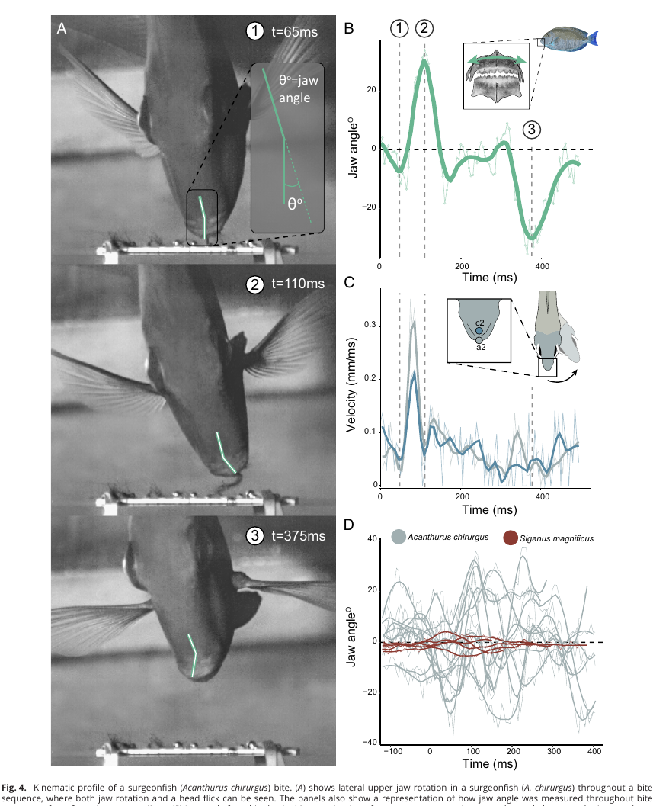

# Bài 05 - Surgeonfish: tách tảo, quay hàm và headflick

## 1. Mục tiêu bài học

- Mô tả profile động học của cú cắn surgeonfish.
- Giải thích quan hệ thời gian giữa jaw rotation và headflick.
- Phân biệt loài có và không có khả năng quay hàm ngang.

## 2. Profile của *Acanthurus chirurgus*

Ở *Acanthurus chirurgus*, video góc nhìn trước cho thấy hàm trên có thể quay rõ rệt sang hai bên trong cùng một chuỗi cắn.

Góc dương và âm được dùng để chỉ hai hướng quay đối diện của hàm so với đường giữa của đầu.

## 3. Biên độ

Góc lateral cực đại đo được từ video là khoảng **31,2° lệch khỏi đường giữa**, tương ứng dải toàn phần khoảng **62,4°** nếu xét hai phía. Đo trực tiếp trên ba mẫu vật cho giá trị dải chuyển động trung bình khoảng **57,7° ± 10,7 SE**.

## 4. Quan hệ với headflick

Khi có headflick, lateral jaw rotation bắt đầu trung bình khoảng **15,5 ms trước headflick**. Điều này củng cố lập luận rằng jaw rotation là một thành phần chủ động trong tách tảo chứ không chỉ là hệ quả thụ động của chuyển động đầu.

## 5. So sánh với loài không có chuyển động lateral

Figure 4 so sánh nhiều profile của *A. chirurgus* với *Siganus magnificus*. *A. chirurgus* có biến thiên jaw angle lớn hơn đáng kể, trong khi profile của *S. magnificus* tập trung gần đường không.

## 6. Không phải mọi lần sử dụng đều ở pha tách tảo

Một số surgeonfish không sử dụng lateral jaw rotation ở pha detachment ban đầu mà dùng sau khi tảo đã được tách để xử lý vật liệu đang giữ trong hàm. Vì vậy, cùng một đổi mới cơ học có thể phục vụ nhiều pha của hành vi ăn.

## 7. Câu hỏi tự kiểm tra

1. Việc jaw rotation bắt đầu trước headflick gợi ý điều gì về quan hệ nhân quả?
2. Tại sao phân tích nhiều bite profile quan trọng hơn chỉ xem một video điển hình?
3. Chuyển động sau detachment có thể đóng vai trò gì với tảo nằm giữa các mấu răng?
