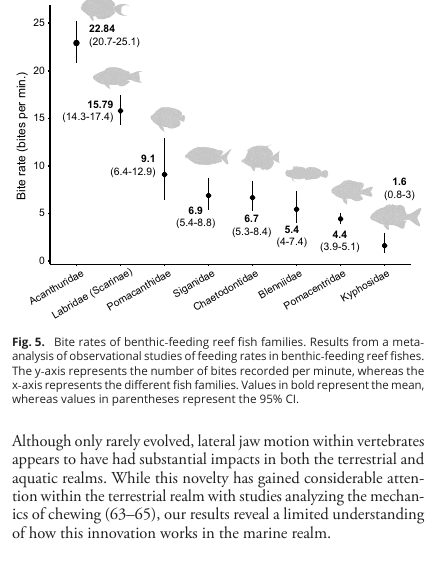

# Bài 06 - Tốc độ cắn và ý nghĩa sinh thái của chuyển động hàm ngang

## 1. Mục tiêu bài học

- Đọc kết quả meta-analysis tốc độ cắn.
- Liên hệ cơ học hàm với hiệu suất kiếm ăn.
- Giải thích giả thuyết về tác động lên hệ sinh thái rạn san hô.

## 2. Kết quả tốc độ cắn

Meta-analysis gồm **389 quan sát** từ tám họ cá ăn đáy bằng cách cắn. Acanthuridae có tốc độ trung bình cao nhất trong các họ được phân tích:

- Acanthuridae: **22,8 bites/min** (95% CI 20,7-25,1)
- Labridae (Scarinae): **15,8 bites/min** (95% CI 14,3-17,4)

Nói cách khác, mức trung bình của Acanthuridae cao khoảng **1,5 lần** parrotfishes - nhóm đứng thứ hai trong phân tích.

## 3. Cơ chế được đề xuất

Khi surgeonfish có thể tạo lực cắt ngang bằng chính hàm trên, cá có thể giảm nhu cầu thực hiện một headflick lớn bằng toàn thân. Điều này có thể giúp:

- tách tảo với chuyển động cơ thể nhỏ hơn;
- giữ vị trí tại cùng microhabitat;
- thực hiện nhiều cú cắn liên tiếp;
- giảm thời gian tái định hướng giữa các cú cắn.

Đây là cơ sở của giả thuyết cho rằng đổi mới hàm ngang góp phần làm tăng bite rate.

## 4. Từ cá thể đến hệ sinh thái

Surgeonfishes loại bỏ turf algae và do đó tác động đến bề mặt rạn, cạnh tranh giữa tảo và san hô, cũng như dòng năng lượng - dinh dưỡng trong hệ sinh thái.

Nghiên cứu lập luận rằng một đổi mới giúp tăng quyền truy cập và hiệu suất khai thác turf algae có thể làm thay đổi cường độ herbivory trên rạn san hô. Qua thời gian tiến hóa, điều này có thể góp phần vào thành công sinh thái và đa dạng hóa của Acanthuridae.

## 5. Không đồng nhất giữa tương quan và nguyên nhân

Meta-analysis cho thấy Acanthuridae có bite rate cao và nghiên cứu đưa ra cơ chế sinh học hợp lý để liên hệ jaw rotation với hiệu suất. Tuy nhiên, đây là một giả thuyết chức năng - tiến hóa được hỗ trợ bởi nhiều loại bằng chứng, không phải một thí nghiệm duy nhất chứng minh jaw rotation là nguyên nhân duy nhất của tốc độ cắn cao.

## 6. Bài tập

Viết một chuỗi lập luận 4 bước theo mẫu:

**hình thái -> chuyển động -> hiệu suất kiếm ăn -> ảnh hưởng hệ sinh thái**.
