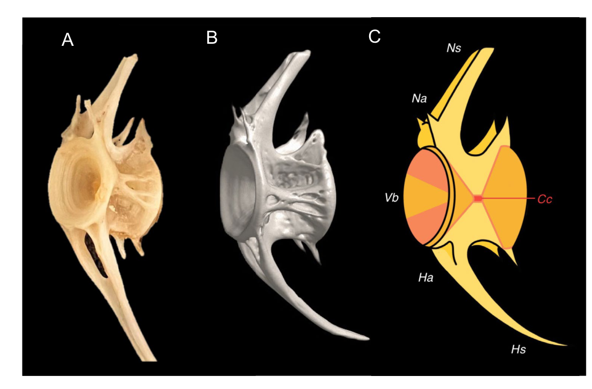

# Bài 02 - Từ vựng giải phẫu của một đốt sống cá chép

## Mục tiêu học tập

Người học có thể nhận diện các bộ phận chính của đốt sống và đọc ký hiệu trong Figure 1.

## 1. Centrum / vertebral body

**Centrum** là thân đốt sống. Trong cá chép của nghiên cứu, centrum có dạng **amphicoelous**: hai đầu lõm, tạo hình gần giống đồng hồ cát hoặc “diabolo”. Đây là mô típ hình thái lặp lại ở phần lớn các đốt sống khảo sát.

## 2. Neural arch và neural spine

- **Neural arch (Na)**: cung thần kinh, bao quanh vùng chứa tủy sống.
- **Neural spine (Ns)**: mỏm xương kéo dài từ cung thần kinh, góp phần tạo điểm bám và truyền lực cho mô mềm quanh cột sống.

## 3. Hemal arch và hemal spine

- **Hemal arch (Ha)**: cung huyết, xuất hiện rõ hơn ở các vùng phía sau.
- **Hemal spine (Hs)**: mỏm huyết kéo dài theo phía bụng.

Các cấu trúc này liên quan tới bảo vệ mô mềm và hỗ trợ cơ học cho vùng đuôi.

## 4. Canal cord

Trong hình minh họa, **Cc** chỉ vùng kênh trung tâm. Hình micro-CT cho thấy cấu trúc quanh centrum không phải khối xương đặc đồng nhất mà gồm mạng trabeculae và các khoảng rỗng.

*Figure 1 của bài báo: mẫu xương thật, tái tạo micro-CT và sơ đồ ký hiệu của một đốt sống điển hình.*

## 5. Ghi nhớ nhanh

| Ký hiệu | Thuật ngữ | Vai trò mô tả chính |
|---|---|---|
| Vb | Vertebral body / centrum | thân đốt sống, cấu trúc chịu lực trung tâm |
| Na | Neural arch | cung thần kinh |
| Ns | Neural spine | mỏm thần kinh |
| Ha | Hemal arch | cung huyết |
| Hs | Hemal spine | mỏm huyết |
| Cc | Canal cord | vùng kênh trung tâm theo Figure 1 |

## Nguồn học liệu trong PDF

- Trang 2: hệ thuật ngữ giải phẫu.
- Trang 4, Figure 1: cấu trúc đốt sống điển hình.
