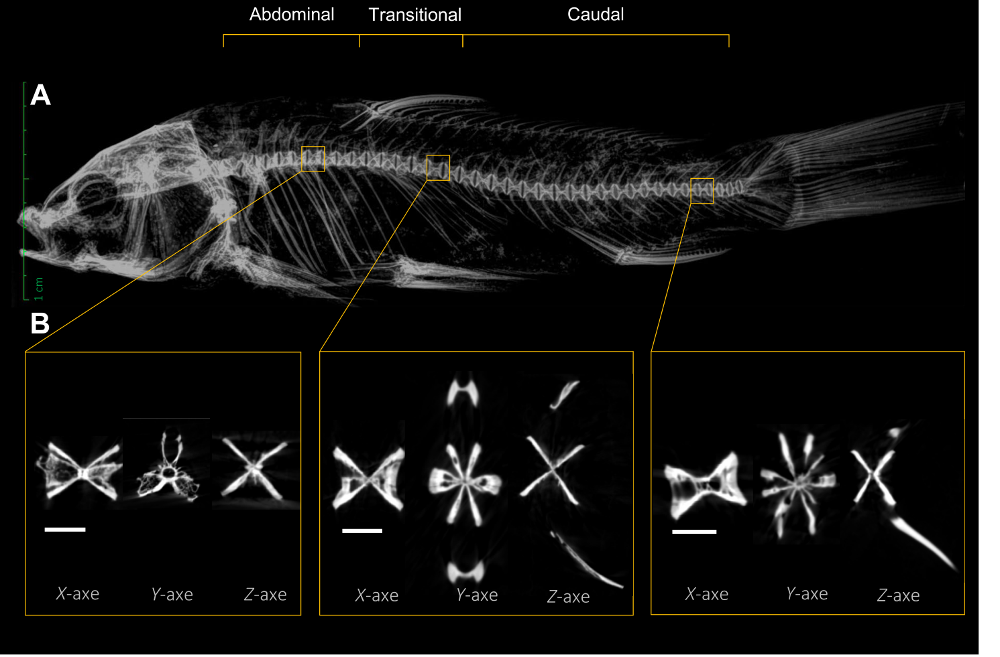

# Bài 03 - Thiết kế mẫu, X-quang và micro-CT

## Mục tiêu học tập

Người học hiểu cách nghiên cứu chuyển từ bộ xương thật sang dữ liệu hình ảnh và mô hình 3D.

## 1. Mẫu nghiên cứu

Nghiên cứu sử dụng bộ xương của **6 cá chép thường** thu từ Lago Peñuelas National Reserve, Chile. Các mẫu đã chết và đã skeletonized trước khi thu, vì vậy nghiên cứu không sử dụng động vật sống cho quy trình mô tả này.

## 2. Phân vùng trước khi quét

Tác giả chia cột sống thành ba vùng chính:

- **abdominal**;
- **transition / transitional**;
- **caudal**.

Việc phân vùng dựa vào vị trí tương đối với vây và đặc điểm của từng đốt sống.

## 3. Micro-CT

Micro-CT được dùng để tạo dữ liệu ba chiều của đốt sống. Các tham số được báo cáo gồm:

- điện áp nguồn: 59 kV;
- dòng nguồn: 692 µA;
- kích thước voxel: 51.489 µm;
- thời gian phơi mỗi ảnh: 23 ms;
- thời gian quét tổng khoảng 57 phút 53 giây.

Dữ liệu được xử lý bằng 3D Slicer và SlicerMorph; ảnh minh họa được xử lý với CTvox.

## 4. X-quang số

X-quang giúp quan sát toàn bộ cột sống và bộ xương đuôi trong một trường nhìn rộng, trong khi micro-CT cung cấp chi tiết 3D của từng đốt sống và vi kiến trúc khoáng hóa.

*Figure 2: toàn bộ bộ xương trên X-quang và các lát cắt theo ba trục ở vùng abdominal, transitional và caudal.*

## 5. Hai kỹ thuật bổ sung cho nhau

| Kỹ thuật | Điểm mạnh trong nghiên cứu |
|---|---|
| X-quang | quan sát tổ chức cột sống toàn cục và tương quan vị trí |
| Micro-CT | tái tạo 3D, quan sát trabeculae, khoảng rỗng và hình thái vùng |

## Nguồn học liệu trong PDF

- Trang 3-4: Materials and methods.
- Trang 5, Figure 2: X-quang và micro-CT của ba vùng đốt sống.
