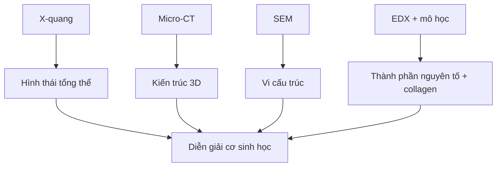

# Bài 04 - SEM, EDX và mô học collagen

## Mục tiêu học tập

Người học phân biệt được mục đích của SEM, EDX, H&E và Picrosirius trong nghiên cứu.

## 1. Scanning Electron Microscopy

SEM được sử dụng để quan sát bề mặt và vi cấu trúc xương với độ chi tiết cao. Hệ Hitachi SU3500 được vận hành ở 20 kV; detector backscatter hỗ trợ quan sát tương phản hóa học.

## 2. EDX

**Energy-dispersive X-ray spectroscopy (EDX)** được ghép với SEM để nhận diện và ước lượng bán định lượng các nguyên tố trong mô xương đốt sống.

Những vùng phân tích gồm khu vực khớp gian đốt và centrum.

## 3. Mô học

Mẫu được cố định, khử khoáng, đúc paraffin và cắt lát 5 µm. Hai hướng quan sát chính:

- **Hematoxylin & eosin (H&E)**: mô tả cấu trúc mô cơ bản.
- **Picrosirius** dưới ánh sáng phân cực: tăng khả năng đánh giá hướng và mật độ sợi collagen.

## 4. Tại sao cần phối hợp nhiều kỹ thuật?

## Nguồn học liệu trong PDF

- Trang 3-4: phương pháp SEM-EDX và Histology.
- Trang 9-10: Figure 5, Figure 6 và Table 1.
