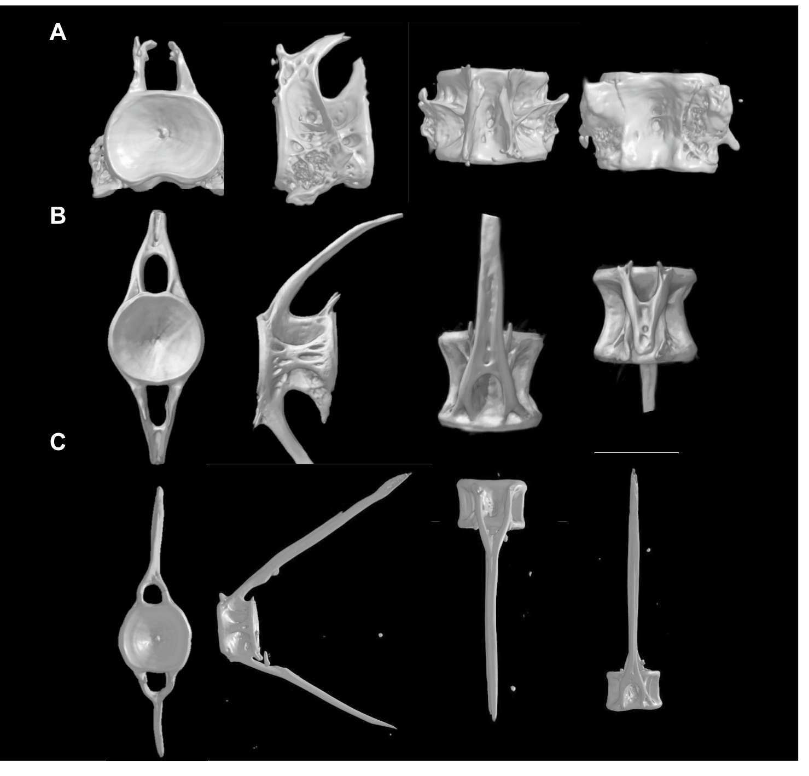

# Bài 06 - So sánh hình thái abdominal, transitional và caudal

## Mục tiêu học tập

Người học so sánh được hình dạng centrum, trabeculae, cung xương và spinous processes ở ba vùng.

## 1. Điểm chung

Phần lớn đốt sống có centrum **amphicoelous**, gồm hai đầu lõm tạo dạng đồng hồ cát. Bên trong không đồng nhất mà gồm các thanh/phiến xương và khoảng rỗng.

## 2. Vùng abdominal

Đốt sống abdominal được mô tả là **robust** hơn vùng caudal. Mạng trabeculae gồm cả hướng dọc và ngang, tạo cấu trúc xốp phức tạp với lỗ, rãnh và gờ.

## 3. Vùng transitional

Đốt sống transitional vẫn giữ dạng amphicoelous nhưng có:

- trabeculae dọc phân nhánh;
- một hoặc hai trabeculae ngang ở vùng giữa;
- neural và hemal arches nổi bật, chắc;
- spinous processes cong theo hướng caudal.

## 4. Vùng caudal

Vùng caudal có:

- trabeculae chủ yếu theo hướng dọc;
- neural và hemal arches nhỏ hơn;
- spinous processes thẳng và dài hơn vùng transitional;
- pre- và post-zygapophyses nhỏ, sắc, định hướng gần 90°, liên quan tới ổn định khớp.

## 5. Bảng so sánh

| Đặc điểm | Abdominal | Transitional | Caudal |
|---|---|---|---|
| Centrum | amphicoelous | amphicoelous | amphicoelous |
| Độ robust | cao hơn | trung gian | thấp hơn ở mô tả trực tiếp của Results |
| Trabeculae | dọc + ngang, mạng phức tạp | dọc phân nhánh + ít ngang | chủ yếu dọc |
| Arches | rõ | prominent và robust | nhỏ hơn |
| Spinous processes | thay đổi theo vị trí | cong về phía caudal | dài và thẳng hơn |

> Lưu ý: phần Discussion có diễn giải về khả năng chịu lực của vùng caudal. Khi học, cần phân biệt giữa **mô tả hình thái quan sát trực tiếp** và **diễn giải cơ sinh học** của tác giả.

## Nguồn học liệu trong PDF

- Trang 5-8, Figure 3 và phần Structural diversity.
