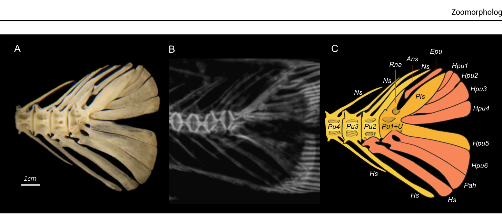

# Bài 07 - Urostyle complex và các xương đầu mút

## Mục tiêu học tập

Người học nhận diện được các thành phần chính của bộ xương đuôi trong Figure 4 và hiểu quan hệ khớp của chúng.

## 1. Bốn preural vertebrae

Phức hợp caudal trong nghiên cứu gồm các preural vertebrae **Pu4 đến Pu1**. Chúng ngắn hơn những đốt phía trước và có hình dạng amphicoelous.

## 2. Pu1+U

Đốt preural thứ nhất kết hợp với thành phần urostyle được ký hiệu **Pu1+U**. Trên mặt lưng có rudimentary neural arch (Rna) và các cấu trúc khớp liên quan tới epural và pleurostyle.

## 3. Các thành phần chính

- **Epu**: epural;
- **Pls**: pleurostyle;
- **Hpu1-Hpu6**: hypurals;
- **Pah**: parhypural;
- **Ns / Hs**: neural spine / hemal spine;
- **Rna**: rudimentary neural arch;
- **Ans**: accessory neural spine.

## 4. Quan hệ chức năng được nghiên cứu nhấn mạnh

Vùng đuôi không phải một “đốt cuối” đơn giản mà là một cụm xương liên kết. Hình học của các hypural và parhypural tạo nền nâng đỡ cho hệ tia vây đuôi, trong khi các đốt preural truyền tải lực từ cột sống ra vùng đuôi.

## 5. Bài tập quan sát

Dựa vào Figure 4, hãy tìm lần lượt:

1. Pu4 -> Pu1+U;
2. Epu và Pls ở phía lưng;
3. Pah ở phía bụng;
4. nhóm Hpu1-Hpu6 tỏa về phía tia vây.

## Nguồn học liệu trong PDF

- Trang 6 và trang 8, Figure 4.
