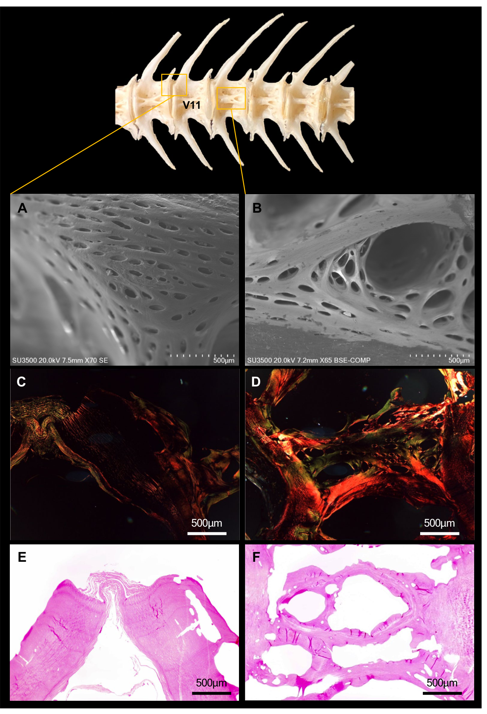

# Bài 08 - Trabeculae và các khoang rỗng bên trong đốt sống

## Mục tiêu học tập

Người học giải thích được vì sao centrum không thể xem như một khối xương đặc đồng nhất.

## 1. Hai đơn vị cấu trúc nổi bật

Micro-CT cho thấy hai đặc điểm lặp lại:

- **lamellar trabeculae**;
- **internal hollow spaces**.

Trabeculae tạo mạng thanh và phiến liên kết, góp phần truyền tải lực và phân tán năng lượng.

## 2. Khác biệt abdominal và caudal

Ở vùng abdominal, trabeculae được mô tả dày đặc hơn và có sự sắp xếp tỏa quanh lõi trung tâm. Vùng caudal có trabeculae dày hơn nhưng thưa hơn trong mô tả mô học của nghiên cứu.

## 3. Ý nghĩa của cấu trúc xốp

Cấu trúc xốp cho phép xương đạt sự cân bằng giữa:

- khối lượng;
- khả năng chịu tải;
- phân bố ứng suất;
- không gian cho các thành phần mô bên trong.

## 4. Dấu hiệu remodeling

Tác giả mô tả các vùng có dạng alveolar và Howship lacunae, từ đó đưa ra giả thuyết về hoạt động osteoclast và quá trình turnover xương đang diễn ra. Đây là **diễn giải của nghiên cứu**, không phải phép đo trực tiếp tốc độ remodeling.

## Nguồn học liệu trong PDF

- Trang 6, 9, 11-12: microarchitecture, Figure 5 và phần Micro-CT analysis of trabecular architecture and bone resorption.
