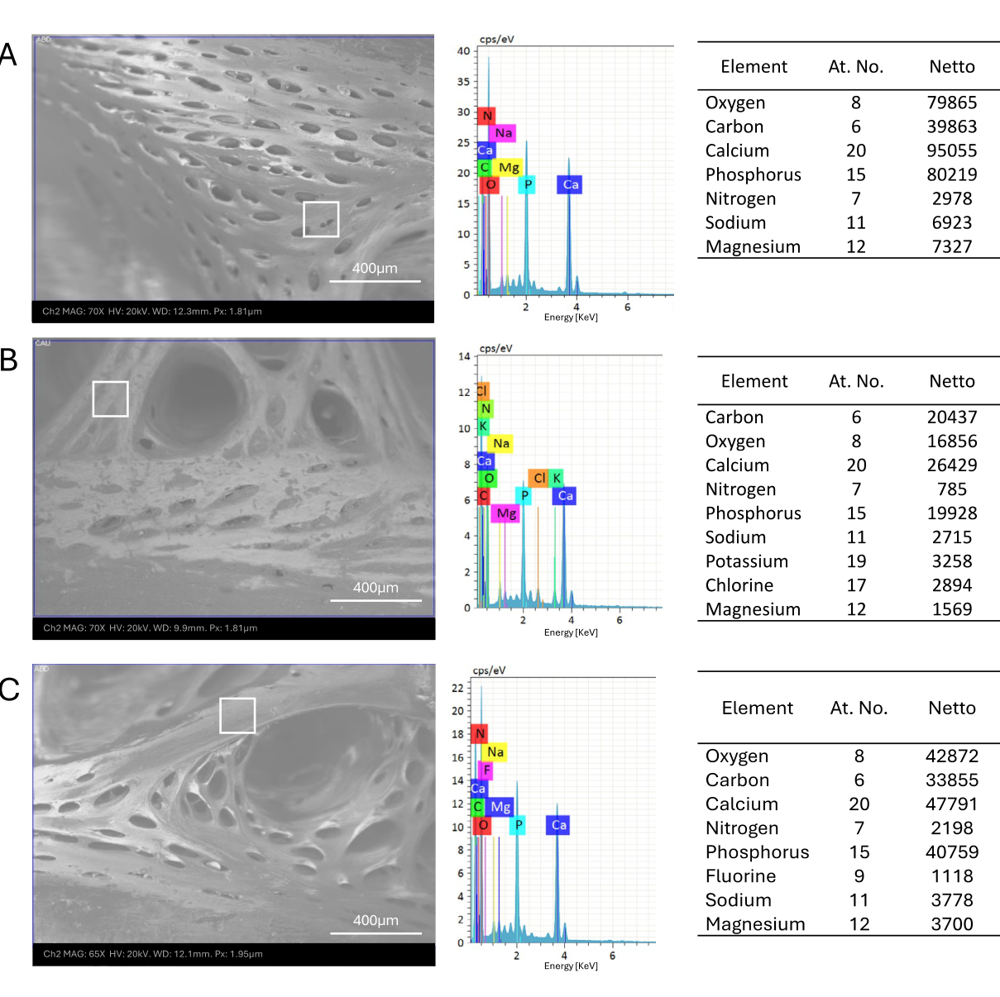
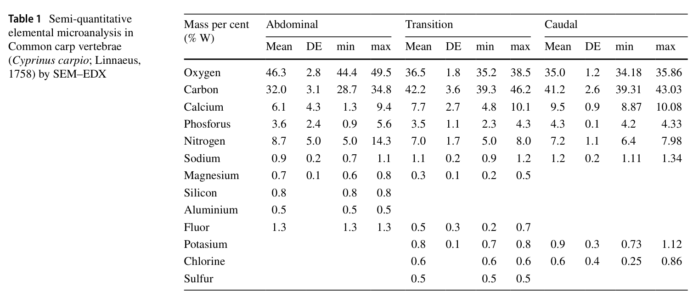

# Bài 10 - Đọc kết quả SEM-EDX

## Mục tiêu học tập

Người học hiểu EDX cho biết điều gì, đọc được xu hướng nguyên tố chính và tránh diễn giải quá mức dữ liệu bán định lượng.

## 1. Các nguyên tố chính

EDX phát hiện nhiều nguyên tố trong mô xương, nổi bật gồm:

- oxygen;
- carbon;
- calcium;
- phosphorus;
- nitrogen;
- sodium;
- magnesium;
- cùng một số nguyên tố vi lượng khác trong một số vùng.

## 2. Xu hướng giữa ba vùng

Theo Table 1, giá trị trung bình của calcium tăng từ abdominal sang transitional rồi caudal trong bộ dữ liệu báo cáo, trong khi oxygen cao hơn ở abdominal. Các giá trị này là **mass percent** bán định lượng của phép đo EDX tại các vùng khảo sát.

## 3. Tỷ lệ calcium : phosphorus

Phần Discussion mô tả tỷ lệ calcium : phosphorus xấp xỉ **2:1**, được tác giả xem là phù hợp với mức khoáng hóa của xương trưởng thành và hoạt động chức năng.

## 4. Những gì EDX không tự chứng minh

EDX trong nghiên cứu này không trực tiếp đo:

- độ bền cơ học của xương;
- tốc độ tạo xương;
- tốc độ hủy xương;
- toàn bộ tình trạng dinh dưỡng của cá.

Các liên hệ với sức khỏe xương là diễn giải kết hợp giữa thành phần nguyên tố, hình thái và kiến thức nền được tác giả viện dẫn.

## Nguồn học liệu trong PDF

- Trang 10, Figure 6 và Table 1.
- Trang 12-13, phần Elemental composition and bone health in Common carp via EDX.
