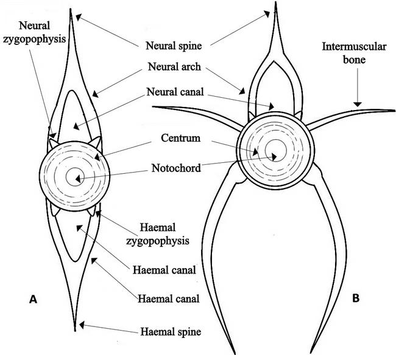
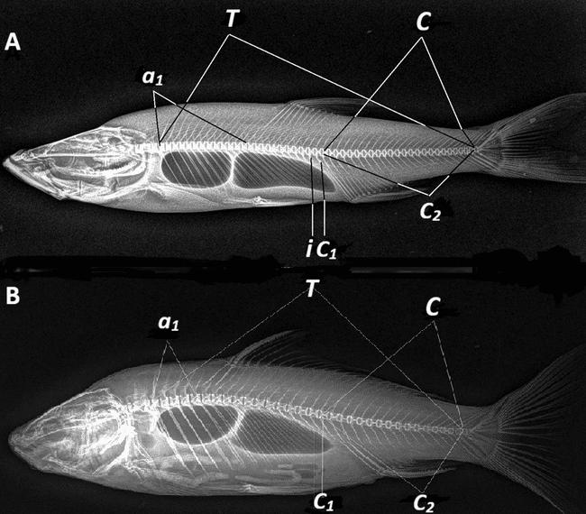

# Thuật ngữ nền tảng để đọc bộ xương trục và vây cá

- **Module:** 01. Tổng quan
- **Bài:** 2/2
- **Nguồn chính:** PDF trang 6-9
- **Loại:** Lesson độc lập

## Mục tiêu học tập

- Phân biệt đốt sống thân và đốt sống đuôi trong cách dùng của bài báo.
- Nhận biết các thuật ngữ neural spine, haemal spine, pterygiophore, hypural và procurrent ray.
- Đọc được sơ đồ đốt sống minh họa trong Figure 1.

## 1. Đốt sống thân và đốt sống đuôi

Figure 1 phân biệt hai kiểu đốt sống được dùng xuyên suốt bài báo. Đốt sống thân (trunk/abdominal vertebra) gắn với vùng thân; đốt sống đuôi (caudal vertebra) có hệ haemal arch/haemal spine phát triển ở phía bụng. Hai nhóm này là nền tảng để chia vùng cột sống và xây dựng công thức số đốt sống.

## 2. Cấu trúc liên quan đến vây

**Pterygiophore** là các phần tử xương nâng đỡ tia vây và được bài báo phân tích theo vị trí xen kẽ với **neural spines** ở vây lưng hoặc **haemal spines** ở vây hậu môn. Ở vùng đuôi, bài báo theo dõi các đốt **preural (PU)**, neural spine của preural (**NSPU**), haemal spine của preural (**HSPU**), **epural**, **pleurostyle**, **uroneural**, **hypural**, **parhypural** và các **procurrent rays**.

## 3. Cách học thuật ngữ trong khóa này

Không cần học thuộc ngay toàn bộ ký hiệu. Hãy dùng Figure 1 để hiểu đốt sống cơ bản, Plate 2 để hiểu các biến số của cột sống, rồi Plate 4 để nối các ký hiệu vùng đuôi vào hình X-quang. Glossary ở phụ lục cung cấp bảng tra nhanh cho các viết tắt.

## Hình và bảng cần đọc

*Figure 1: đốt sống đuôi (A) và đốt sống thân/abdominal (B).*

*Plate 2: vị trí T, A, C, a1, c1/c2 trên ảnh X-quang.*

## Điểm cần nhớ

- Neural spine nằm phía lưng; haemal spine là đặc trưng quan trọng của vùng đuôi.
- Pterygiophore được mô tả bằng quan hệ vị trí với gai đốt sống.
- Vùng caudal skeleton dùng hệ ký hiệu PU/NSPU/HSPU cùng epural, hypural, parhypural và pleurostyle.

## Câu hỏi tự kiểm tra

1. Figure 1 giúp phân biệt đốt sống thân và đốt sống đuôi như thế nào?
2. Pterygiophore được liên hệ với neural spine ở vây nào?
3. NSPU và HSPU khác nhau ở thành phần nào của đốt preural?

## Ghi chú nguồn

Nội dung bài học được biên soạn lại từ bài báo gốc, giữ nguyên thuật ngữ và phạm vi lập luận của nguồn.
