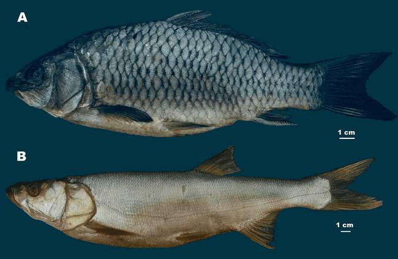
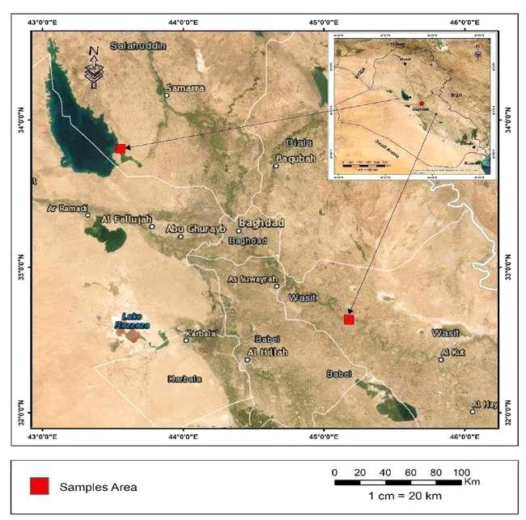

# Thu mẫu, X-quang và chuẩn hóa kích thước cá

- **Module:** 02. Phương pháp
- **Bài:** 1/3
- **Nguồn chính:** PDF trang 4-5
- **Loại:** Lesson độc lập

## Mục tiêu học tập

- Mô tả được nguồn mẫu và cách đo SL/TL.
- Nêu được vai trò của X-quang trong nghiên cứu.
- Xác định hai địa điểm thu mẫu trên bản đồ.

## 1. Mẫu nghiên cứu

Phần Materials and Methods ghi nhận **20 mẫu mỗi loài**. C. carpio được thu ở hồ nhân tạo Al-Tharthar; L. vorax được thu ở sông Tigris tại Az Zubaydiyah City. Mẫu được nhận diện theo tài liệu phân loại được tác giả dẫn nguồn.

## 2. Hai đại lượng chiều dài

**Standard length (SL)** được đo từ mút mõm đến đầu sau của phức hợp hypural. **Total length (TL)** được đo từ mút mõm đến tận cùng vây đuôi. Các phép đo được lấy đến milimét và dùng để mô tả kích thước mẫu cũng như chuẩn hóa một số phép đo đốt sống.

## 3. Chụp X-quang

Mẫu cá được chụp X-quang bằng thiết bị thú y kỹ thuật số Vetix P8 với thời gian chụp được báo cáo là 2,1 giây. Ảnh X-quang là nguồn dữ liệu chính để quan sát cột sống, bộ xương đuôi và xương liên cơ.

## Hình và bảng cần đọc

*Plate 1: ví dụ cá được nghiên cứu.*

*Map 1: các địa điểm thu C. carpio và L. vorax.*

## Điểm cần nhớ

- SL và TL không giống nhau; SL dừng ở phức hợp hypural, TL kéo đến tận cùng vây đuôi.
- X-quang cho phép quan sát đồng thời cột sống và nhiều cấu trúc xương nhỏ.
- Nguồn ghi 20 mẫu mỗi loài ở phần phương pháp; xem phụ lục về mâu thuẫn số mẫu trong phần kết quả.

## Câu hỏi tự kiểm tra

1. SL kết thúc ở mốc giải phẫu nào?
2. Hai loài được thu ở hai hệ thủy vực nào?
3. Tại sao X-quang phù hợp với mục tiêu nghiên cứu này?

## Ghi chú nguồn

Nội dung bài học được biên soạn lại từ bài báo gốc, giữ nguyên thuật ngữ và phạm vi lập luận của nguồn.
