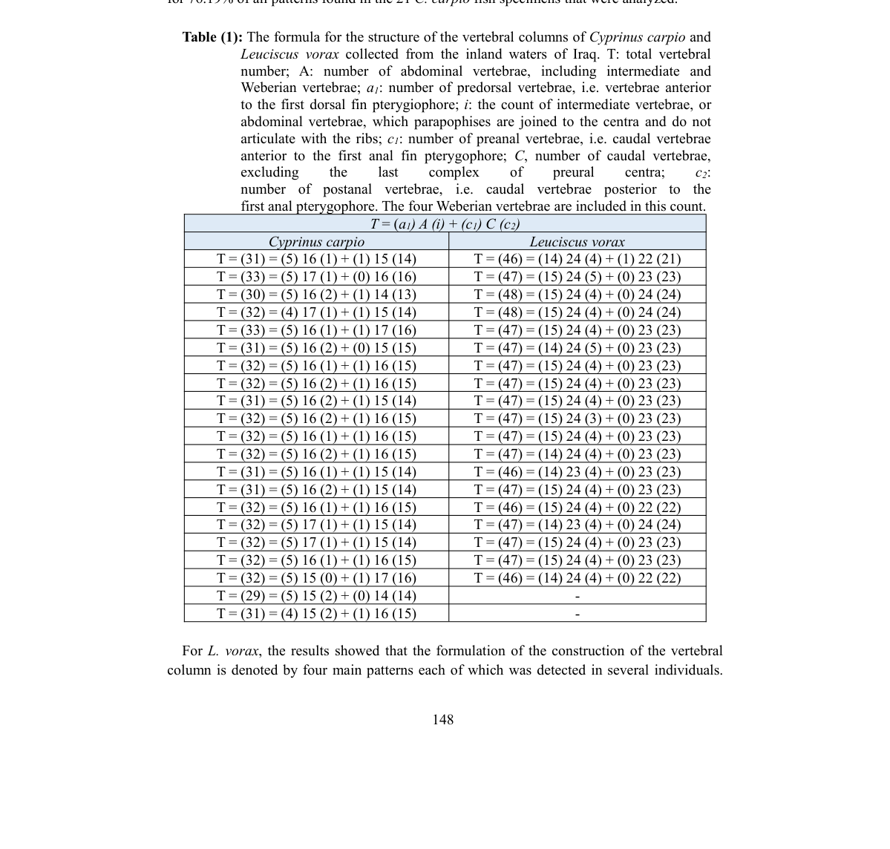

# Kết quả kiến trúc cột sống

- **Module:** 03. Cột sống
- **Bài:** 1/2
- **Nguồn chính:** PDF trang 10-11
- **Loại:** Lesson độc lập

## Mục tiêu học tập

- So sánh phạm vi số đốt sống và các mẫu công thức giữa hai loài.
- Hiểu mức biến thiên cá thể trong công thức cột sống.
- Biết khi nào cần quay lại Table 1 để đọc dữ liệu gốc.

## 1. Biến thiên công thức ở C. carpio

Nguồn báo cáo nhiều mẫu công thức cột sống khác nhau ở **C. carpio**, với một số mẫu lặp lại và phần lớn mẫu còn lại biến thiên theo một hoặc nhiều thành phần của công thức. Điều này cho thấy kiến trúc cột sống không hoàn toàn cố định giữa các cá thể trong tập mẫu.

## 2. Biến thiên công thức ở L. vorax

Ở **L. vorax**, nguồn cũng ghi nhận nhiều mẫu công thức và một số mẫu xuất hiện lặp lại. Các thành phần như predorsal, intermediate, caudal và postanal được dùng để so sánh mức độ khác biệt giữa hai loài.

## 3. Cách đọc Table 1 an toàn

Table 1 là nơi lưu toàn bộ chuỗi công thức từng mẫu. Vì phần văn bản xung quanh Table 1 có một số điểm không nhất quán về số mẫu và một vài nhãn số đốt, khóa học **không tự sửa dữ liệu**. Khi cần số chính xác cho từng cá thể, hãy đọc trực tiếp ảnh Table 1 và đối chiếu với PDF gốc.

## Hình và bảng cần đọc

*Ảnh tách từ PDF trang 10; giữ nguyên bảng dữ liệu gốc.*

## Điểm cần nhớ

- Cả hai loài đều thể hiện biến thiên cá thể trong công thức cột sống.
- Không nên rút một công thức duy nhất làm đại diện tuyệt đối cho cả loài từ tập mẫu này.
- Table 1 là nguồn ưu tiên khi cần kiểm tra chuỗi công thức cụ thể.

## Câu hỏi tự kiểm tra

1. Vì sao biến thiên cá thể quan trọng khi dùng đặc điểm xương cho phân loại?
2. Những thành phần nào trong công thức có thể thay đổi giữa mẫu?
3. Khi văn bản và bảng không thống nhất, khóa học xử lý như thế nào?

## Ghi chú nguồn

Nội dung bài học được biên soạn lại từ bài báo gốc, giữ nguyên thuật ngữ và phạm vi lập luận của nguồn.
