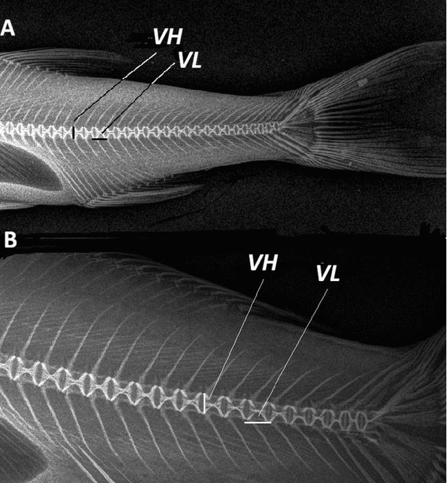
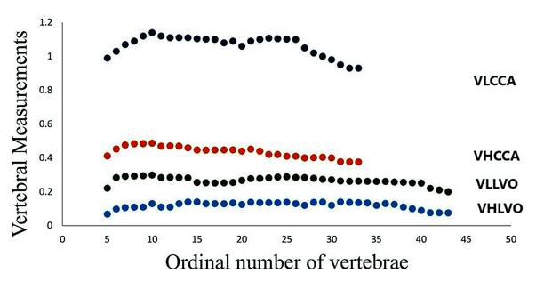

# Phân vùng cột sống bằng VH và VL

- **Module:** 03. Cột sống
- **Bài:** 2/2
- **Nguồn chính:** PDF trang 11-14
- **Loại:** Lesson độc lập

## Mục tiêu học tập

- Nhận biết bốn vùng cột sống mà nghiên cứu phân biệt.
- Theo dõi xu hướng VH/VL theo vị trí đốt sống.
- Liên hệ Diagram 1 với cách tác giả phân vùng.

## 1. Bốn vùng được nhận dạng

Từ biến thiên kích thước centrum, nghiên cứu nhận dạng **postcranial**, **anterior abdominal**, **posterior abdominal** và **caudal region**. Sáu đốt V5-V10 ngay sau Weberian apparatus được mô tả là có hình thái/kích thước khác các đốt abdominal còn lại và đóng vai trò vùng postcranial.

## 2. Xu hướng theo vùng

Trong vùng postcranial, các giá trị VH/VL tăng đến quanh V10 theo những mức độ khác nhau giữa hai loài. Qua các vùng abdominal, đường biểu diễn thay đổi theo vị trí đốt; đến caudal region, cả hai phép đo có xu hướng giảm dần về phía đuôi.

## 3. Ý nghĩa của Diagram 1

Diagram 1 không chỉ là đồ thị kích thước; nó là bằng chứng để tác giả lập luận rằng cột sống có cấu trúc vùng phức tạp hơn cách chia đơn giản thành thân và đuôi. Vì các đường VH/VL của hai loài khác nhau về mức và hình dạng, chúng trở thành dữ liệu so sánh hình thái.

## Hình và bảng cần đọc

*Plate 3: cách đặt hai đại lượng đo trên X-quang.*

*Diagram 1: hồ sơ VH và VL theo số thứ tự đốt sống.*

## Điểm cần nhớ

- Bốn vùng được xác định từ biến đổi hình học của centrum.
- V5-V10 là vùng postcranial gắn với ảnh hưởng của Weberian apparatus.
- Caudal region có xu hướng giảm VH và VL về phía cuối cột sống.

## Câu hỏi tự kiểm tra

1. Bốn vùng cột sống trong nghiên cứu là gì?
2. Vì sao V5-V10 được tách thành vùng riêng?
3. Đường VH/VL đóng vai trò gì trong lập luận về regionalization?

## Ghi chú nguồn

Nội dung bài học được biên soạn lại từ bài báo gốc, giữ nguyên thuật ngữ và phạm vi lập luận của nguồn.
