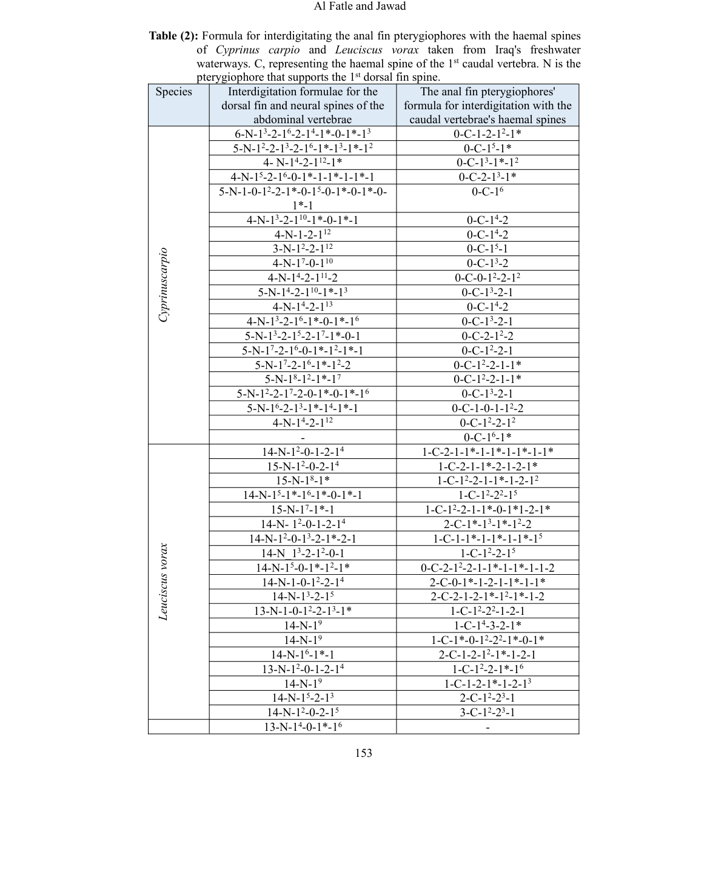

# Pterygiophore của vây lưng và vây hậu môn

- **Module:** 04. Vây và pterygiophore
- **Bài:** 1/2
- **Nguồn chính:** PDF trang 15-16
- **Loại:** Lesson độc lập

## Mục tiêu học tập

- So sánh độ dài interdigitation của pterygiophore giữa hai loài.
- Nêu được khác biệt về số đốt sống tham gia nâng đỡ vây lưng.
- Hiểu các kết quả chính của vây hậu môn.

## 1. Vây lưng

Ở **C. carpio**, số khoảng interneural có pterygiophore nâng đỡ tia vây lưng được báo cáo trong khoảng **3-9**; ở **L. vorax** là **1-6**. Pterygiophore của tia vây lưng đầu tiên không được quan sát nằm đối diện neural spine của đốt abdominal, trong khi các pterygiophore khác có thể nằm đối diện neural spines.

Nguồn cũng báo cáo khác biệt về số đốt sống tham gia nâng đỡ vây lưng: **9 đốt abdominal** ở L. vorax, còn C. carpio có **11 đốt abdominal và 7 đốt caudal** tham gia theo mô tả của bài báo.

## 2. Vây hậu môn

Sự xen kẽ giữa pterygiophore vây hậu môn và haemal spines cũng biến thiên theo cá thể. Nguồn báo cáo số khoảng được lấp bởi pterygiophore khoảng **4-7** ở C. carpio và **7-12** ở L. vorax. Vị trí ngay sau haemal spine của đốt caudal đầu tiên luôn có pterygiophore ở C. carpio, còn L. vorax có thể có hoặc không.

## 3. Vai trò của Table 2

Table 2 chứa toàn bộ các chuỗi công thức riêng lẻ cho vây lưng và vây hậu môn. Vì ký hiệu dày đặc và có chỉ số/dấu sao, ảnh bảng gốc được giữ lại trong assets để tránh mất thông tin khi chuyển sang Markdown.

## Hình và bảng cần đọc

*Bảng công thức pterygiophore vây lưng/vây hậu môn từ PDF trang 15.*

## Điểm cần nhớ

- C. carpio có khoảng interdigitation vây lưng dài hơn theo phạm vi được báo cáo.
- L. vorax có phạm vi interdigitation vây hậu môn dài hơn.
- Các mẫu công thức có biến thiên cá thể đáng kể.

## Câu hỏi tự kiểm tra

1. Phạm vi interneural spaces ở hai loài khác nhau thế nào?
2. Vị trí ngay sau haemal spine của đốt caudal đầu tiên khác nhau ra sao giữa hai loài?
3. Vì sao Table 2 nên được xem dưới dạng ảnh gốc thay vì chỉ chép text?

## Ghi chú nguồn

Nội dung bài học được biên soạn lại từ bài báo gốc, giữ nguyên thuật ngữ và phạm vi lập luận của nguồn.
