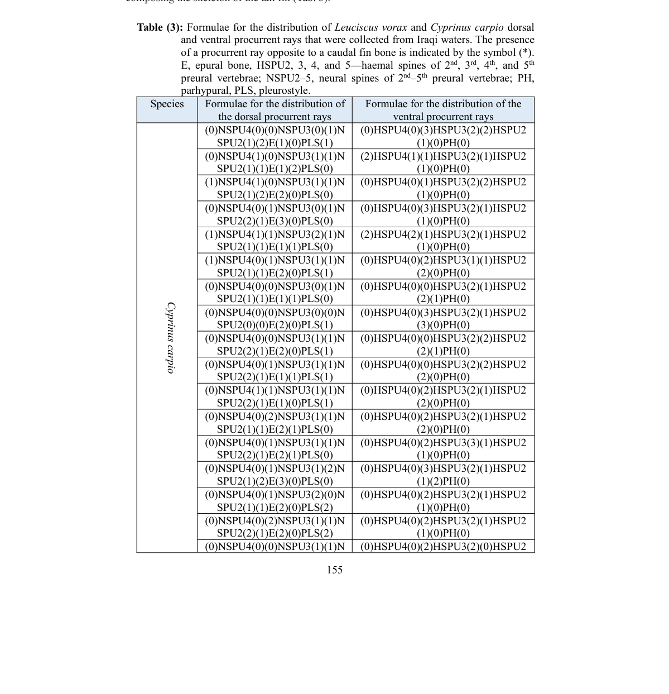
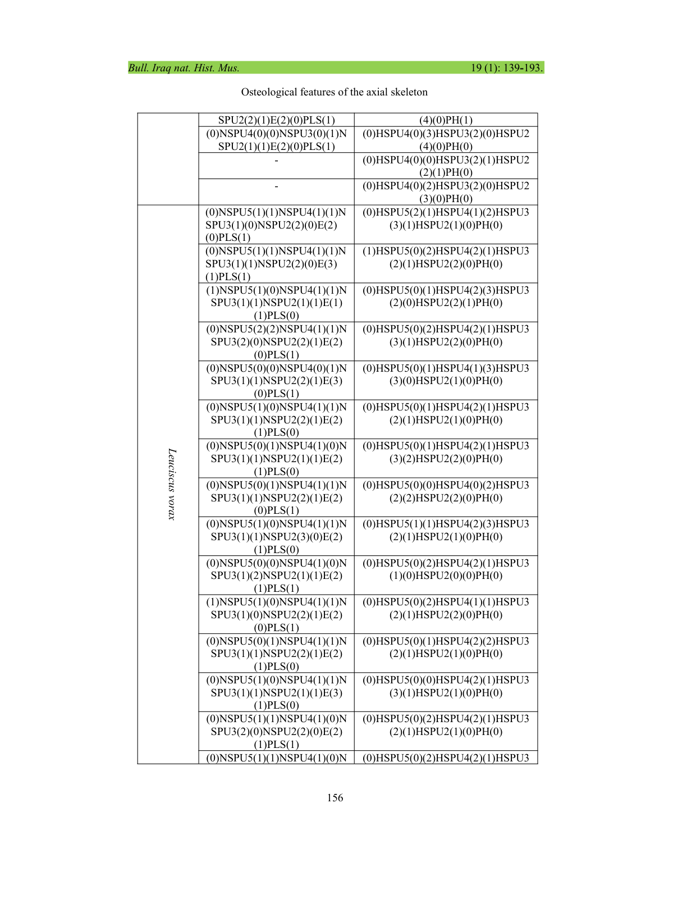
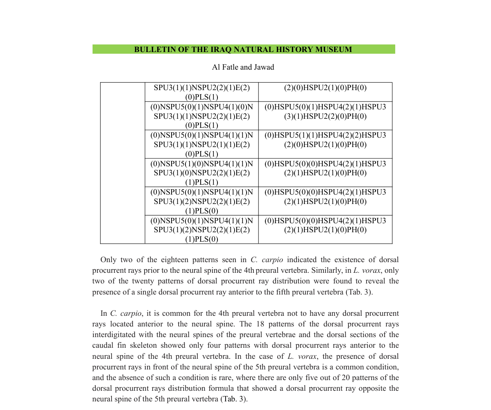

# Phân bố dorsal và ventral procurrent rays

- **Module:** 04. Vây và pterygiophore
- **Bài:** 2/2
- **Nguồn chính:** PDF trang 16-20
- **Loại:** Lesson độc lập

## Mục tiêu học tập

- Phân biệt dorsal procurrent và ventral procurrent theo cấu trúc xương liên quan.
- So sánh số đốt preural tham gia ở hai loài.
- Đọc Table 3 theo từng phần ảnh.

## 1. Dorsal procurrent rays

Dorsal procurrent rays được phân tích theo quan hệ với neural spines của các preural vertebrae và các phần tử xương phía lưng của bộ xương đuôi. **C. carpio** dùng các preural thứ 2-4 trong interdigitation; **L. vorax** dùng thứ 2-5 theo mô tả kết quả.

## 2. Ventral procurrent rays

Ventral procurrent rays được mô tả theo quan hệ với haemal spines và các phần tử phía bụng. C. carpio liên quan chủ yếu đến HSPU2-HSPU4; L. vorax kéo đến HSPU5. Nghiên cứu ghi nhận nhiều mẫu phân bố cá thể và chỉ một số mẫu lặp lại.

## 3. Cách đọc Table 3

Table 3 kéo dài qua nhiều trang và chứa hàng loạt công thức. Khóa học tách nó thành ba ảnh. Khi đọc, hãy xác định loài trước, sau đó tách cột dorsal và ventral, rồi lần theo các mốc NSPU/HSPU, E, PLS hoặc PH. Dấu sao cho biết tia procurrent nằm đối diện phần tử xương tương ứng theo quy ước nguồn.

## Hình và bảng cần đọc

*Plate 4: bản đồ hình học để giải mã các ký hiệu trong Table 3.*

*Table 3 - phần đầu.*

*Table 3 - phần tiếp theo.*

*Table 3 - phần cuối trước phần phân tích văn bản.*

## Điểm cần nhớ

- Dorsal procurrent gắn với neural side; ventral procurrent gắn với haemal side.
- L. vorax đưa thêm preural thứ 5 vào nhiều quan hệ mà C. carpio dừng ở thứ 4.
- Table 3 thể hiện biến thiên cá thể lớn, không chỉ một mẫu chuẩn duy nhất.

## Câu hỏi tự kiểm tra

1. Dorsal procurrent formula dùng NSPU hay HSPU?
2. Hai loài khác nhau ở số preural tham gia như thế nào?
3. Các ký hiệu E, PLS và PH lần lượt là gì?

## Ghi chú nguồn

Nội dung bài học được biên soạn lại từ bài báo gốc, giữ nguyên thuật ngữ và phạm vi lập luận của nguồn.
