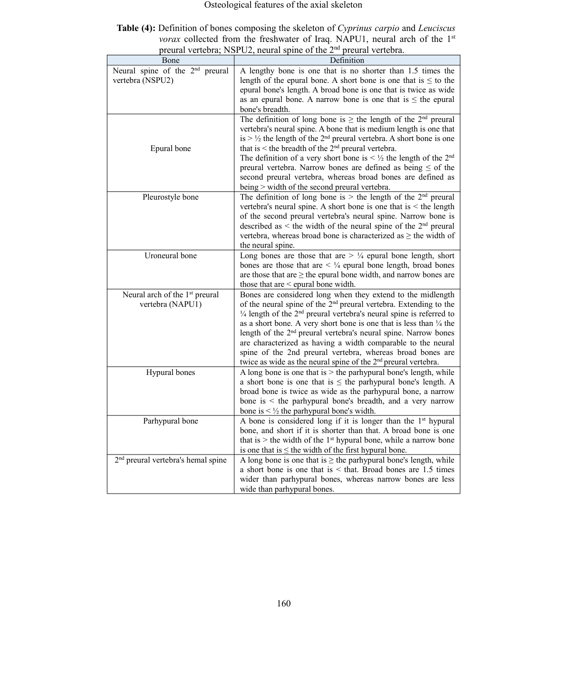
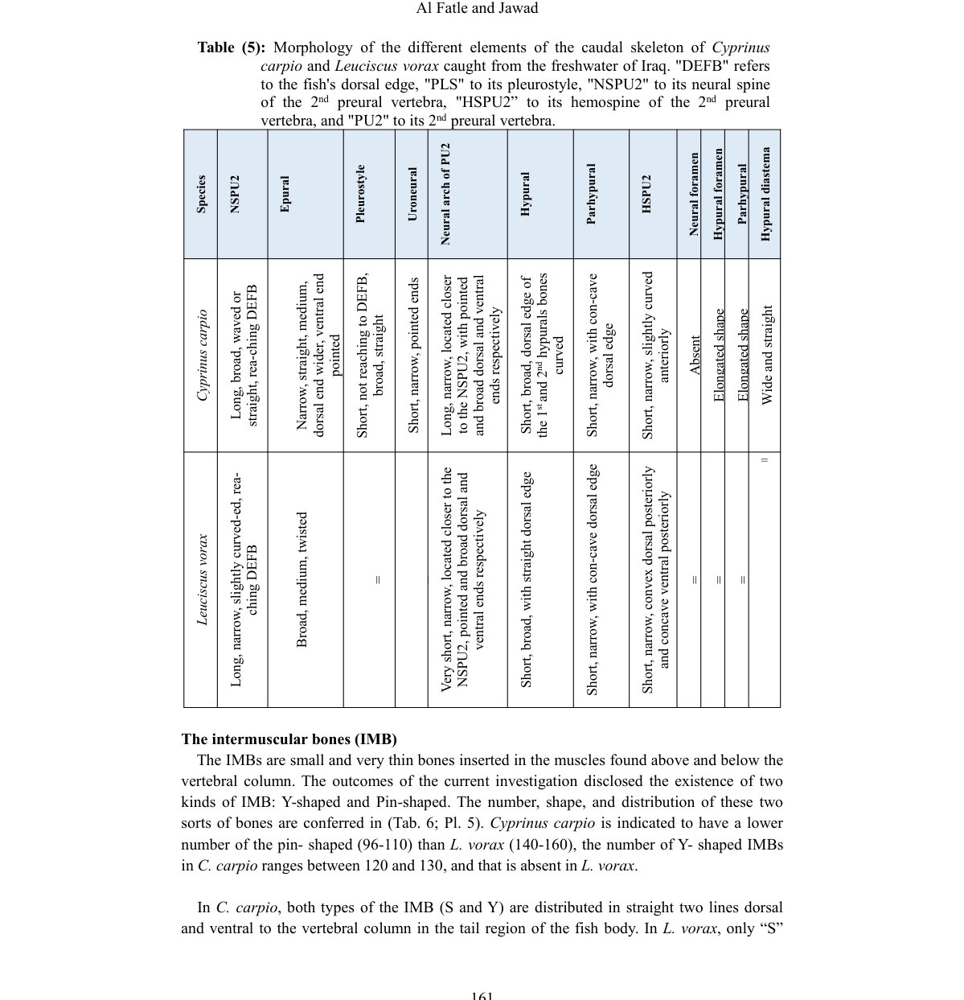

# Công thức vây đuôi và kiến trúc caudal skeleton

- **Module:** 05. Xương đuôi và IMB
- **Bài:** 1/2
- **Nguồn chính:** PDF trang 20-23
- **Loại:** Lesson độc lập

## Mục tiêu học tập

- Mô tả hai thùy vây đuôi theo các hypural.
- Nêu được số tia branched/unbranched được báo cáo.
- Nhận biết vai trò của preural centra, hypural, parhypural, epural, uroneural và pleurostyle.

## 1. Hai thùy của vây đuôi

Nguồn mô tả vây đuôi gồm thùy trên và thùy dưới. Hypural thứ 3-6 góp vào thùy trên; hypural thứ 1-2 cùng parhypural góp vào thùy dưới. Ở cả hai loài, số tia chính được báo cáo ổn định trong tập mẫu: thùy trên có **1 tia không phân nhánh + 9 tia phân nhánh**, thùy dưới có **1 tia không phân nhánh + 8 tia phân nhánh**.

## 2. Hệ xương nâng đỡ thùy trên

Phần tử trung tâm của vùng cuối cột sống là centrum hợp nhất của preural đầu tiên, liên hệ với epural, uroneural, pleurostyle, sáu hypural và parhypural. Các neural spines, epural, pleurostyle, uroneural và hypural 3-6 cùng tham gia nâng đỡ thùy trên và các tia procurrent phía lưng.

## 3. Hệ xương nâng đỡ thùy dưới

Thùy dưới nhận hỗ trợ từ haemal spines của các preural phía sau, parhypural và hypural 1-2. Bài báo cũng mô tả **hypural diastema** giữa hypural thứ 2 và 3 là rộng và thẳng ở cả hai loài.

## 4. Hình thái chi tiết

Table 4 đưa ra quy ước định nghĩa dài/ngắn, rộng/hẹp cho từng xương; Table 5 so sánh hình thái cụ thể giữa hai loài. Hai bảng này được giữ dưới dạng ảnh để bảo toàn bố cục và thuật ngữ nguồn.

## Hình và bảng cần đọc

*Ảnh X-quang gắn nhãn các phần tử chính của bộ xương đuôi.*

*Tiêu chí mô tả các xương caudal.*

*So sánh hình thái phần tử caudal skeleton giữa hai loài.*

## Điểm cần nhớ

- Hypural 3-6 liên hệ thùy trên; hypural 1-2 + parhypural liên hệ thùy dưới.
- Số tia chính của hai loài được báo cáo là bảo thủ/ổn định trong tập mẫu.
- Caudal skeleton là mạng các phần tử xương chứ không chỉ là các đốt cuối cột sống.

## Câu hỏi tự kiểm tra

1. Những hypural nào tạo nền cho thùy trên?
2. Công thức số tia chính của thùy trên và dưới là gì?
3. Hypural diastema nằm giữa những hypural nào?

## Ghi chú nguồn

Nội dung bài học được biên soạn lại từ bài báo gốc, giữ nguyên thuật ngữ và phạm vi lập luận của nguồn.
